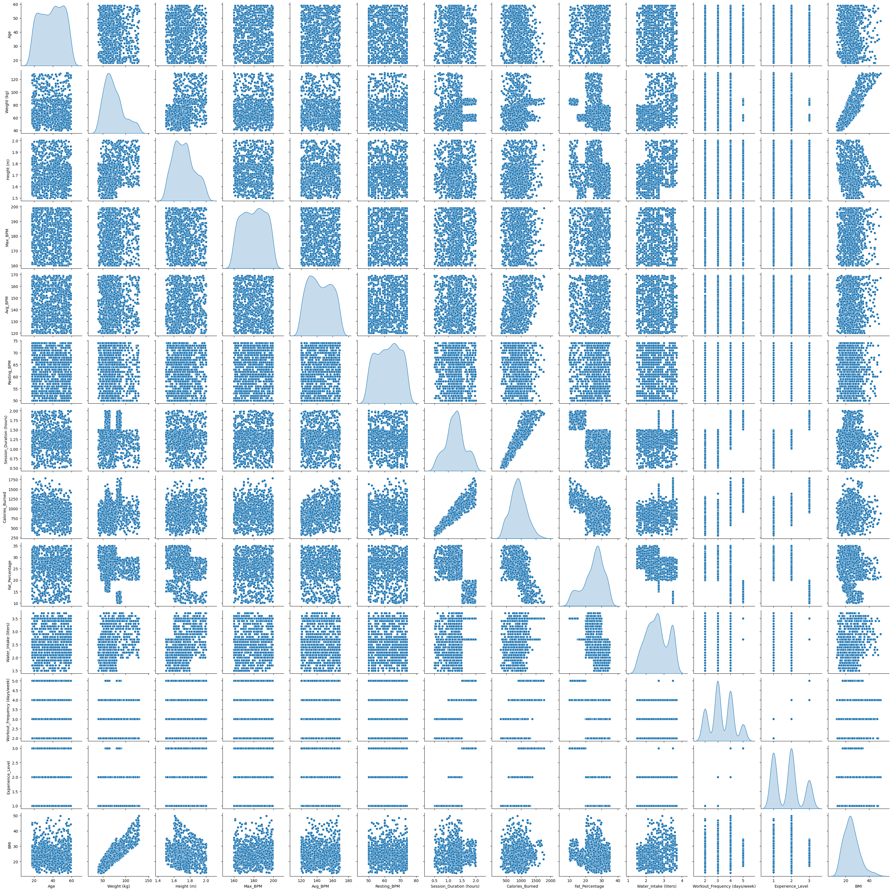

# Mengimpor Library

Semua *Library* diimpor terlebih dahulu untuk digunakan pada tahap selanjutnya.


```python
import textwrap
import numpy as np
import pandas as pd
import seaborn as sns
import matplotlib.pyplot as plt
import xgboost as xgb

from xgboost import XGBClassifier
from sklearn.svm import SVC
from sklearn.tree import DecisionTreeClassifier
from sklearn.neighbors import KNeighborsClassifier
from sklearn.linear_model import LogisticRegression
from sklearn.ensemble import RandomForestClassifier
from sklearn.model_selection import GridSearchCV, RandomizedSearchCV, train_test_split
from sklearn.preprocessing import LabelEncoder, OrdinalEncoder, OneHotEncoder, StandardScaler
from sklearn.metrics import (
    ConfusionMatrixDisplay,
    accuracy_score,
    classification_report,
    mean_absolute_error,
    mean_squared_error,
    r2_score,
    explained_variance_score
)

from sklearn.ensemble import RandomForestRegressor
from sklearn.svm import SVR
from sklearn.neighbors import KNeighborsRegressor
from xgboost import XGBRegressor
import kagglehub
import shutil
```

# **Pemahaman Data**


## Pemuatan Data

Data diambil dari kaggle pada tautan berikut "valakhorasani/gym-members-exercise-dataset" dan diunduh ke dalam root sistem Google Colab.


```python
path = kagglehub.dataset_download("valakhorasani/gym-members-exercise-dataset")
print("Path to dataset files:" , path)
```

    Downloading from https://www.kaggle.com/api/v1/datasets/download/valakhorasani/gym-members-exercise-dataset?dataset_version_number=1...


    100%|██████████| 21.6k/21.6k [00:00<00:00, 8.17MB/s]

    Extracting files...
    Path to dataset files: /root/.cache/kagglehub/datasets/valakhorasani/gym-members-exercise-dataset/versions/1


    


Data dipindahkan ke dalam drive agar dapat memudahkan penggunaan di Google Colab.


```python
source_path = '/root/.cache/kagglehub/datasets/valakhorasani/gym-members-exercise-dataset/versions/1/gym_members_exercise_tracking.csv'
destination_path = '/content/drive/MyDrive/Predictive/'
shutil.copy(source_path, destination_path)
```


    '/content/drive/MyDrive/Predictive/gym_members_exercise_tracking.csv'


Data dibuka melalui dataframe dan ditampilkan sekilas menggunakan fungsi .head() dan .shape


```python
data = pd.read_csv("/content/drive/MyDrive/Predictive/gym_members_exercise_tracking.csv")
# Menampilkan ukuran data
print(data.shape)
# Melihat 5 baris pertama data
data.head()
```

    (973, 15)


  <div id="df-e818e37c-11ab-4d5e-8a34-0a1707041347" class="colab-df-container">
    <div>
<style scoped>
    .dataframe tbody tr th:only-of-type {
        vertical-align: middle;
    }

    .dataframe tbody tr th {
        vertical-align: top;
    }

    .dataframe thead th {
        text-align: right;
    }
</style>
<table border="1" class="dataframe">
  <thead>
    <tr style="text-align: right;">
      <th></th>
      <th>Age</th>
      <th>Gender</th>
      <th>Weight (kg)</th>
      <th>Height (m)</th>
      <th>Max_BPM</th>
      <th>Avg_BPM</th>
      <th>Resting_BPM</th>
      <th>Session_Duration (hours)</th>
      <th>Calories_Burned</th>
      <th>Workout_Type</th>
      <th>Fat_Percentage</th>
      <th>Water_Intake (liters)</th>
      <th>Workout_Frequency (days/week)</th>
      <th>Experience_Level</th>
      <th>BMI</th>
    </tr>
  </thead>
  <tbody>
    <tr>
      <th>0</th>
      <td>56</td>
      <td>Male</td>
      <td>88.3</td>
      <td>1.71</td>
      <td>180</td>
      <td>157</td>
      <td>60</td>
      <td>1.69</td>
      <td>1313.0</td>
      <td>Yoga</td>
      <td>12.6</td>
      <td>3.5</td>
      <td>4</td>
      <td>3</td>
      <td>30.20</td>
    </tr>
    <tr>
      <th>1</th>
      <td>46</td>
      <td>Female</td>
      <td>74.9</td>
      <td>1.53</td>
      <td>179</td>
      <td>151</td>
      <td>66</td>
      <td>1.30</td>
      <td>883.0</td>
      <td>HIIT</td>
      <td>33.9</td>
      <td>2.1</td>
      <td>4</td>
      <td>2</td>
      <td>32.00</td>
    </tr>
    <tr>
      <th>2</th>
      <td>32</td>
      <td>Female</td>
      <td>68.1</td>
      <td>1.66</td>
      <td>167</td>
      <td>122</td>
      <td>54</td>
      <td>1.11</td>
      <td>677.0</td>
      <td>Cardio</td>
      <td>33.4</td>
      <td>2.3</td>
      <td>4</td>
      <td>2</td>
      <td>24.71</td>
    </tr>
    <tr>
      <th>3</th>
      <td>25</td>
      <td>Male</td>
      <td>53.2</td>
      <td>1.70</td>
      <td>190</td>
      <td>164</td>
      <td>56</td>
      <td>0.59</td>
      <td>532.0</td>
      <td>Strength</td>
      <td>28.8</td>
      <td>2.1</td>
      <td>3</td>
      <td>1</td>
      <td>18.41</td>
    </tr>
    <tr>
      <th>4</th>
      <td>38</td>
      <td>Male</td>
      <td>46.1</td>
      <td>1.79</td>
      <td>188</td>
      <td>158</td>
      <td>68</td>
      <td>0.64</td>
      <td>556.0</td>
      <td>Strength</td>
      <td>29.2</td>
      <td>2.8</td>
      <td>3</td>
      <td>1</td>
      <td>14.39</td>
    </tr>
  </tbody>
</table>
</div>
    <div class="colab-df-buttons">

  <div class="colab-df-container">
    <button class="colab-df-convert" onclick="convertToInteractive('df-e818e37c-11ab-4d5e-8a34-0a1707041347')"
            title="Convert this dataframe to an interactive table."
            style="display:none;">

  <svg xmlns="http://www.w3.org/2000/svg" height="24px" viewBox="0 -960 960 960">
    <path d="M120-120v-720h720v720H120Zm60-500h600v-160H180v160Zm220 220h160v-160H400v160Zm0 220h160v-160H400v160ZM180-400h160v-160H180v160Zm440 0h160v-160H620v160ZM180-180h160v-160H180v160Zm440 0h160v-160H620v160Z"/>
  </svg>
    </button>

  <style>
    .colab-df-container {
      display:flex;
      gap: 12px;
    }

    .colab-df-convert {
      background-color: #E8F0FE;
      border: none;
      border-radius: 50%;
      cursor: pointer;
      display: none;
      fill: #1967D2;
      height: 32px;
      padding: 0 0 0 0;
      width: 32px;
    }

    .colab-df-convert:hover {
      background-color: #E2EBFA;
      box-shadow: 0px 1px 2px rgba(60, 64, 67, 0.3), 0px 1px 3px 1px rgba(60, 64, 67, 0.15);
      fill: #174EA6;
    }

    .colab-df-buttons div {
      margin-bottom: 4px;
    }

    [theme=dark] .colab-df-convert {
      background-color: #3B4455;
      fill: #D2E3FC;
    }

    [theme=dark] .colab-df-convert:hover {
      background-color: #434B5C;
      box-shadow: 0px 1px 3px 1px rgba(0, 0, 0, 0.15);
      filter: drop-shadow(0px 1px 2px rgba(0, 0, 0, 0.3));
      fill: #FFFFFF;
    }
  </style>

    <script>
      const buttonEl =
        document.querySelector('#df-e818e37c-11ab-4d5e-8a34-0a1707041347 button.colab-df-convert');
      buttonEl.style.display =
        google.colab.kernel.accessAllowed ? 'block' : 'none';

      async function convertToInteractive(key) {
        const element = document.querySelector('#df-e818e37c-11ab-4d5e-8a34-0a1707041347');
        const dataTable =
          await google.colab.kernel.invokeFunction('convertToInteractive',
                                                    [key], {});
        if (!dataTable) return;

        const docLinkHtml = 'Like what you see? Visit the ' +
          '<a target="_blank" href=https://colab.research.google.com/notebooks/data_table.ipynb>data table notebook</a>'
          + ' to learn more about interactive tables.';
        element.innerHTML = '';
        dataTable['output_type'] = 'display_data';
        await google.colab.output.renderOutput(dataTable, element);
        const docLink = document.createElement('div');
        docLink.innerHTML = docLinkHtml;
        element.appendChild(docLink);
      }
    </script>
  </div>


<div id="df-3189f3cf-5ffa-417f-966c-c6297012679b">
  <button class="colab-df-quickchart" onclick="quickchart('df-3189f3cf-5ffa-417f-966c-c6297012679b')"
            title="Suggest charts"
            style="display:none;">

<svg xmlns="http://www.w3.org/2000/svg" height="24px"viewBox="0 0 24 24"
     width="24px">
    <g>
        <path d="M19 3H5c-1.1 0-2 .9-2 2v14c0 1.1.9 2 2 2h14c1.1 0 2-.9 2-2V5c0-1.1-.9-2-2-2zM9 17H7v-7h2v7zm4 0h-2V7h2v10zm4 0h-2v-4h2v4z"/>
    </g>
</svg>
  </button>

<style>
  .colab-df-quickchart {
      --bg-color: #E8F0FE;
      --fill-color: #1967D2;
      --hover-bg-color: #E2EBFA;
      --hover-fill-color: #174EA6;
      --disabled-fill-color: #AAA;
      --disabled-bg-color: #DDD;
  }

  [theme=dark] .colab-df-quickchart {
      --bg-color: #3B4455;
      --fill-color: #D2E3FC;
      --hover-bg-color: #434B5C;
      --hover-fill-color: #FFFFFF;
      --disabled-bg-color: #3B4455;
      --disabled-fill-color: #666;
  }

  .colab-df-quickchart {
    background-color: var(--bg-color);
    border: none;
    border-radius: 50%;
    cursor: pointer;
    display: none;
    fill: var(--fill-color);
    height: 32px;
    padding: 0;
    width: 32px;
  }

  .colab-df-quickchart:hover {
    background-color: var(--hover-bg-color);
    box-shadow: 0 1px 2px rgba(60, 64, 67, 0.3), 0 1px 3px 1px rgba(60, 64, 67, 0.15);
    fill: var(--button-hover-fill-color);
  }

  .colab-df-quickchart-complete:disabled,
  .colab-df-quickchart-complete:disabled:hover {
    background-color: var(--disabled-bg-color);
    fill: var(--disabled-fill-color);
    box-shadow: none;
  }

  .colab-df-spinner {
    border: 2px solid var(--fill-color);
    border-color: transparent;
    border-bottom-color: var(--fill-color);
    animation:
      spin 1s steps(1) infinite;
  }

  @keyframes spin {
    0% {
      border-color: transparent;
      border-bottom-color: var(--fill-color);
      border-left-color: var(--fill-color);
    }
    20% {
      border-color: transparent;
      border-left-color: var(--fill-color);
      border-top-color: var(--fill-color);
    }
    30% {
      border-color: transparent;
      border-left-color: var(--fill-color);
      border-top-color: var(--fill-color);
      border-right-color: var(--fill-color);
    }
    40% {
      border-color: transparent;
      border-right-color: var(--fill-color);
      border-top-color: var(--fill-color);
    }
    60% {
      border-color: transparent;
      border-right-color: var(--fill-color);
    }
    80% {
      border-color: transparent;
      border-right-color: var(--fill-color);
      border-bottom-color: var(--fill-color);
    }
    90% {
      border-color: transparent;
      border-bottom-color: var(--fill-color);
    }
  }
</style>

  <script>
    async function quickchart(key) {
      const quickchartButtonEl =
        document.querySelector('#' + key + ' button');
      quickchartButtonEl.disabled = true;  // To prevent multiple clicks.
      quickchartButtonEl.classList.add('colab-df-spinner');
      try {
        const charts = await google.colab.kernel.invokeFunction(
            'suggestCharts', [key], {});
      } catch (error) {
        console.error('Error during call to suggestCharts:', error);
      }
      quickchartButtonEl.classList.remove('colab-df-spinner');
      quickchartButtonEl.classList.add('colab-df-quickchart-complete');
    }
    (() => {
      let quickchartButtonEl =
        document.querySelector('#df-3189f3cf-5ffa-417f-966c-c6297012679b button');
      quickchartButtonEl.style.display =
        google.colab.kernel.accessAllowed ? 'block' : 'none';
    })();
  </script>
</div>

    </div>
  </div>


Tampilan diatas menunjukkan ada 973 rekod data dengan 15 jenis informasi yang dapat dianalisis.

## Analisis Data Eksploratif (*EDA*)


### Deskripsi Variabel

#### Arti Variabel

Berikut ini adalah arti dari setiap variabel yang akan digunakan.

| Variabel                           | Keterangan |
|-------------------------------------|-------------------|
| Age                                  | Umur dari pengunjung pusat kebugaran dalam Tahun|
| Gender                               |Jenis kelamin dari pengunjung pusat kebugaran (Pria, Wanita) |
| Weight (kg)                          | Berat badan pengunjung pusat kebugaran dalam Kilogram |
| Height (m)                           |Tinggi pengunjung pusat kebugaran dalam Centimeter|
| Max_BPM                              | Laju maksimal detak jantung permenit peserta|
| Avg_BPM                              |Laju rata-rata detak jantung permenit peserta  |
| Resting_BPM                          | Laju detak jantung istirahat permenit peserta|
| Session_Duration (hours)            | Durasi penggunaan pusat kebugaran dalam Jam|
| Calories_Burned                      | Jumlah kalori yang terbakar dalam Kal|
| Workout_Type                         | Jenis Latihan yang dilakukan pelanggan (HIIT, Strength, Cardio, Yoga)|
| Fat_Percentage                       | Kadar lemak tubuh dari pengunjung dalam persen (%) |
| Water_Intake (liters)               | Jumlah air yang diminum selama latihan dalam Liter |
| Workout_Frequency (days/week)       | Frekuensi kunjungan ke pusat kebugaran dalam seminggu |
| Experience_Level                     | Tingkat kemahiran dalam melakukan latihan dalam tiga tingkatan (1, 2, 3) |
| BMI                                  | Indeks massa tubuh dari pengunjung pusat kebugaran                 |


Beberapa variabel merupakan variabel kategorik, dan sisanya adalah variabel numerik. Penjelasan lebih lanjut mengenai nilai variabel sebagai berikut.

Variabel `Workout_Type` yang berarti Jenis Latihan memiliki penjelasan nilai variabel seperti berikut

| Variabel                           | Keterangan |
|-------------------------------------|-------------------|
| HIIT| *High-Intensity Interval Training* yaitu latihan intensitas tinggi yang dilakukan dengan durasi cepat disertai istirahat dan pergantian gerakan|
| Strength| Olahraga latihan untuk meningkatkan kekuatan fisik seperti angkat beban atau *bench-press* |
| Yoga| Olahraga yang menggabungkan gerakan, pernapasan, dan meditasi untuk meningkatkan kesehatan fisik dan keseimbangan mental.|
|Cardio|Olahraga yang meningkatkan laju detak jantung dan laju nafas dengan berbagai intensitas seperti bersepeda, lari, olahraga *treadmill*|


#### Tipe Variabel


```python
data.info()
```

    <class 'pandas.core.frame.DataFrame'>
    RangeIndex: 973 entries, 0 to 972
    Data columns (total 17 columns):
     #   Column                         Non-Null Count  Dtype  
    ---  ------                         --------------  -----  
     0   Age                            973 non-null    int64  
     1   Gender                         973 non-null    object 
     2   Weight (kg)                    973 non-null    float64
     3   Height (m)                     973 non-null    float64
     4   Max_BPM                        973 non-null    int64  
     5   Avg_BPM                        973 non-null    int64  
     6   Resting_BPM                    973 non-null    int64  
     7   Session_Duration (hours)       973 non-null    float64
     8   Calories_Burned                973 non-null    float64
     9   Workout_Type                   973 non-null    object 
     10  Fat_Percentage                 973 non-null    float64
     11  Water_Intake (liters)          973 non-null    float64
     12  Workout_Frequency (days/week)  973 non-null    int64  
     13  Experience_Level               973 non-null    int64  
     14  BMI                            973 non-null    float64
     15  Workout_Frequency_cat          973 non-null    object 
     16  Experience_Level_cat           973 non-null    object 
    dtypes: float64(7), int64(6), object(4)
    memory usage: 129.4+ KB


Ditemukan ada enam variabel bertipe int64, dua variabel bertipe object dan tujuh variabel bertipe float64. Selanjutnya dapat dilihat bahwa seluruh data bertipe float64 adalah variabel numerik dan seluruh data bertipe object adalah variabel kategorik. Sedangkan data bertipe int64, dua diantaranya bisa digunakan sebagai variabel kategorik dan empat diantaranya adalah variabel numerik.

#### Deskripsi statistik dari data


```python
data.describe()
```


  <div id="df-db0bc425-f5d0-439b-8b7e-ebab0c8b1075" class="colab-df-container">
    <div>
<style scoped>
    .dataframe tbody tr th:only-of-type {
        vertical-align: middle;
    }

    .dataframe tbody tr th {
        vertical-align: top;
    }

    .dataframe thead th {
        text-align: right;
    }
</style>
<table border="1" class="dataframe">
  <thead>
    <tr style="text-align: right;">
      <th></th>
      <th>Age</th>
      <th>Weight (kg)</th>
      <th>Height (m)</th>
      <th>Max_BPM</th>
      <th>Avg_BPM</th>
      <th>Resting_BPM</th>
      <th>Session_Duration (hours)</th>
      <th>Calories_Burned</th>
      <th>Fat_Percentage</th>
      <th>Water_Intake (liters)</th>
      <th>BMI</th>
    </tr>
  </thead>
  <tbody>
    <tr>
      <th>count</th>
      <td>973.000000</td>
      <td>973.000000</td>
      <td>973.00000</td>
      <td>973.000000</td>
      <td>973.000000</td>
      <td>973.000000</td>
      <td>973.000000</td>
      <td>973.000000</td>
      <td>973.000000</td>
      <td>973.000000</td>
      <td>973.000000</td>
    </tr>
    <tr>
      <th>mean</th>
      <td>38.683453</td>
      <td>73.854676</td>
      <td>1.72258</td>
      <td>179.883864</td>
      <td>143.766701</td>
      <td>62.223022</td>
      <td>1.256423</td>
      <td>905.422405</td>
      <td>24.976773</td>
      <td>2.626619</td>
      <td>24.912127</td>
    </tr>
    <tr>
      <th>std</th>
      <td>12.180928</td>
      <td>21.207500</td>
      <td>0.12772</td>
      <td>11.525686</td>
      <td>14.345101</td>
      <td>7.327060</td>
      <td>0.343033</td>
      <td>272.641516</td>
      <td>6.259419</td>
      <td>0.600172</td>
      <td>6.660879</td>
    </tr>
    <tr>
      <th>min</th>
      <td>18.000000</td>
      <td>40.000000</td>
      <td>1.50000</td>
      <td>160.000000</td>
      <td>120.000000</td>
      <td>50.000000</td>
      <td>0.500000</td>
      <td>303.000000</td>
      <td>10.000000</td>
      <td>1.500000</td>
      <td>12.320000</td>
    </tr>
    <tr>
      <th>25%</th>
      <td>28.000000</td>
      <td>58.100000</td>
      <td>1.62000</td>
      <td>170.000000</td>
      <td>131.000000</td>
      <td>56.000000</td>
      <td>1.040000</td>
      <td>720.000000</td>
      <td>21.300000</td>
      <td>2.200000</td>
      <td>20.110000</td>
    </tr>
    <tr>
      <th>50%</th>
      <td>40.000000</td>
      <td>70.000000</td>
      <td>1.71000</td>
      <td>180.000000</td>
      <td>143.000000</td>
      <td>62.000000</td>
      <td>1.260000</td>
      <td>893.000000</td>
      <td>26.200000</td>
      <td>2.600000</td>
      <td>24.160000</td>
    </tr>
    <tr>
      <th>75%</th>
      <td>49.000000</td>
      <td>86.000000</td>
      <td>1.80000</td>
      <td>190.000000</td>
      <td>156.000000</td>
      <td>68.000000</td>
      <td>1.460000</td>
      <td>1076.000000</td>
      <td>29.300000</td>
      <td>3.100000</td>
      <td>28.560000</td>
    </tr>
    <tr>
      <th>max</th>
      <td>59.000000</td>
      <td>129.900000</td>
      <td>2.00000</td>
      <td>199.000000</td>
      <td>169.000000</td>
      <td>74.000000</td>
      <td>2.000000</td>
      <td>1783.000000</td>
      <td>35.000000</td>
      <td>3.700000</td>
      <td>49.840000</td>
    </tr>
  </tbody>
</table>
</div>
    <div class="colab-df-buttons">

  <div class="colab-df-container">
    <button class="colab-df-convert" onclick="convertToInteractive('df-db0bc425-f5d0-439b-8b7e-ebab0c8b1075')"
            title="Convert this dataframe to an interactive table."
            style="display:none;">

  <svg xmlns="http://www.w3.org/2000/svg" height="24px" viewBox="0 -960 960 960">
    <path d="M120-120v-720h720v720H120Zm60-500h600v-160H180v160Zm220 220h160v-160H400v160Zm0 220h160v-160H400v160ZM180-400h160v-160H180v160Zm440 0h160v-160H620v160ZM180-180h160v-160H180v160Zm440 0h160v-160H620v160Z"/>
  </svg>
    </button>

  <style>
    .colab-df-container {
      display:flex;
      gap: 12px;
    }

    .colab-df-convert {
      background-color: #E8F0FE;
      border: none;
      border-radius: 50%;
      cursor: pointer;
      display: none;
      fill: #1967D2;
      height: 32px;
      padding: 0 0 0 0;
      width: 32px;
    }

    .colab-df-convert:hover {
      background-color: #E2EBFA;
      box-shadow: 0px 1px 2px rgba(60, 64, 67, 0.3), 0px 1px 3px 1px rgba(60, 64, 67, 0.15);
      fill: #174EA6;
    }

    .colab-df-buttons div {
      margin-bottom: 4px;
    }

    [theme=dark] .colab-df-convert {
      background-color: #3B4455;
      fill: #D2E3FC;
    }

    [theme=dark] .colab-df-convert:hover {
      background-color: #434B5C;
      box-shadow: 0px 1px 3px 1px rgba(0, 0, 0, 0.15);
      filter: drop-shadow(0px 1px 2px rgba(0, 0, 0, 0.3));
      fill: #FFFFFF;
    }
  </style>

    <script>
      const buttonEl =
        document.querySelector('#df-db0bc425-f5d0-439b-8b7e-ebab0c8b1075 button.colab-df-convert');
      buttonEl.style.display =
        google.colab.kernel.accessAllowed ? 'block' : 'none';

      async function convertToInteractive(key) {
        const element = document.querySelector('#df-db0bc425-f5d0-439b-8b7e-ebab0c8b1075');
        const dataTable =
          await google.colab.kernel.invokeFunction('convertToInteractive',
                                                    [key], {});
        if (!dataTable) return;

        const docLinkHtml = 'Like what you see? Visit the ' +
          '<a target="_blank" href=https://colab.research.google.com/notebooks/data_table.ipynb>data table notebook</a>'
          + ' to learn more about interactive tables.';
        element.innerHTML = '';
        dataTable['output_type'] = 'display_data';
        await google.colab.output.renderOutput(dataTable, element);
        const docLink = document.createElement('div');
        docLink.innerHTML = docLinkHtml;
        element.appendChild(docLink);
      }
    </script>
  </div>


<div id="df-8063bc74-f5ac-470c-b2a8-da158e587f84">
  <button class="colab-df-quickchart" onclick="quickchart('df-8063bc74-f5ac-470c-b2a8-da158e587f84')"
            title="Suggest charts"
            style="display:none;">

<svg xmlns="http://www.w3.org/2000/svg" height="24px"viewBox="0 0 24 24"
     width="24px">
    <g>
        <path d="M19 3H5c-1.1 0-2 .9-2 2v14c0 1.1.9 2 2 2h14c1.1 0 2-.9 2-2V5c0-1.1-.9-2-2-2zM9 17H7v-7h2v7zm4 0h-2V7h2v10zm4 0h-2v-4h2v4z"/>
    </g>
</svg>
  </button>

<style>
  .colab-df-quickchart {
      --bg-color: #E8F0FE;
      --fill-color: #1967D2;
      --hover-bg-color: #E2EBFA;
      --hover-fill-color: #174EA6;
      --disabled-fill-color: #AAA;
      --disabled-bg-color: #DDD;
  }

  [theme=dark] .colab-df-quickchart {
      --bg-color: #3B4455;
      --fill-color: #D2E3FC;
      --hover-bg-color: #434B5C;
      --hover-fill-color: #FFFFFF;
      --disabled-bg-color: #3B4455;
      --disabled-fill-color: #666;
  }

  .colab-df-quickchart {
    background-color: var(--bg-color);
    border: none;
    border-radius: 50%;
    cursor: pointer;
    display: none;
    fill: var(--fill-color);
    height: 32px;
    padding: 0;
    width: 32px;
  }

  .colab-df-quickchart:hover {
    background-color: var(--hover-bg-color);
    box-shadow: 0 1px 2px rgba(60, 64, 67, 0.3), 0 1px 3px 1px rgba(60, 64, 67, 0.15);
    fill: var(--button-hover-fill-color);
  }

  .colab-df-quickchart-complete:disabled,
  .colab-df-quickchart-complete:disabled:hover {
    background-color: var(--disabled-bg-color);
    fill: var(--disabled-fill-color);
    box-shadow: none;
  }

  .colab-df-spinner {
    border: 2px solid var(--fill-color);
    border-color: transparent;
    border-bottom-color: var(--fill-color);
    animation:
      spin 1s steps(1) infinite;
  }

  @keyframes spin {
    0% {
      border-color: transparent;
      border-bottom-color: var(--fill-color);
      border-left-color: var(--fill-color);
    }
    20% {
      border-color: transparent;
      border-left-color: var(--fill-color);
      border-top-color: var(--fill-color);
    }
    30% {
      border-color: transparent;
      border-left-color: var(--fill-color);
      border-top-color: var(--fill-color);
      border-right-color: var(--fill-color);
    }
    40% {
      border-color: transparent;
      border-right-color: var(--fill-color);
      border-top-color: var(--fill-color);
    }
    60% {
      border-color: transparent;
      border-right-color: var(--fill-color);
    }
    80% {
      border-color: transparent;
      border-right-color: var(--fill-color);
      border-bottom-color: var(--fill-color);
    }
    90% {
      border-color: transparent;
      border-bottom-color: var(--fill-color);
    }
  }
</style>

  <script>
    async function quickchart(key) {
      const quickchartButtonEl =
        document.querySelector('#' + key + ' button');
      quickchartButtonEl.disabled = true;  // To prevent multiple clicks.
      quickchartButtonEl.classList.add('colab-df-spinner');
      try {
        const charts = await google.colab.kernel.invokeFunction(
            'suggestCharts', [key], {});
      } catch (error) {
        console.error('Error during call to suggestCharts:', error);
      }
      quickchartButtonEl.classList.remove('colab-df-spinner');
      quickchartButtonEl.classList.add('colab-df-quickchart-complete');
    }
    (() => {
      let quickchartButtonEl =
        document.querySelector('#df-8063bc74-f5ac-470c-b2a8-da158e587f84 button');
      quickchartButtonEl.style.display =
        google.colab.kernel.accessAllowed ? 'block' : 'none';
    })();
  </script>
</div>

    </div>
  </div>


Informasi statistik tersebut menunjukkan simpangan baku yang cukup tinggi yang menandakan perbedaan profil yang cukup signifikan antar responden. Beragam profil dalam data bisa berarti adanya berbagai demografi yang tercangkup dari data tersebut yang dapat dianalisis.

#### Pembersihan Data


```python
pd.DataFrame({'Nilai yang Kosong':data.isnull().sum()})
```


  <div id="df-2fafd89d-e0ee-4713-a226-e3eb8cd4cd6e" class="colab-df-container">
    <div>
<style scoped>
    .dataframe tbody tr th:only-of-type {
        vertical-align: middle;
    }

    .dataframe tbody tr th {
        vertical-align: top;
    }

    .dataframe thead th {
        text-align: right;
    }
</style>
<table border="1" class="dataframe">
  <thead>
    <tr style="text-align: right;">
      <th></th>
      <th>Nilai yang Kosong</th>
    </tr>
  </thead>
  <tbody>
    <tr>
      <th>Age</th>
      <td>0</td>
    </tr>
    <tr>
      <th>Gender</th>
      <td>0</td>
    </tr>
    <tr>
      <th>Weight (kg)</th>
      <td>0</td>
    </tr>
    <tr>
      <th>Height (m)</th>
      <td>0</td>
    </tr>
    <tr>
      <th>Max_BPM</th>
      <td>0</td>
    </tr>
    <tr>
      <th>Avg_BPM</th>
      <td>0</td>
    </tr>
    <tr>
      <th>Resting_BPM</th>
      <td>0</td>
    </tr>
    <tr>
      <th>Session_Duration (hours)</th>
      <td>0</td>
    </tr>
    <tr>
      <th>Calories_Burned</th>
      <td>0</td>
    </tr>
    <tr>
      <th>Workout_Type</th>
      <td>0</td>
    </tr>
    <tr>
      <th>Fat_Percentage</th>
      <td>0</td>
    </tr>
    <tr>
      <th>Water_Intake (liters)</th>
      <td>0</td>
    </tr>
    <tr>
      <th>Workout_Frequency (days/week)</th>
      <td>0</td>
    </tr>
    <tr>
      <th>Experience_Level</th>
      <td>0</td>
    </tr>
    <tr>
      <th>BMI</th>
      <td>0</td>
    </tr>
  </tbody>
</table>
</div>
    <div class="colab-df-buttons">

  <div class="colab-df-container">
    <button class="colab-df-convert" onclick="convertToInteractive('df-2fafd89d-e0ee-4713-a226-e3eb8cd4cd6e')"
            title="Convert this dataframe to an interactive table."
            style="display:none;">

  <svg xmlns="http://www.w3.org/2000/svg" height="24px" viewBox="0 -960 960 960">
    <path d="M120-120v-720h720v720H120Zm60-500h600v-160H180v160Zm220 220h160v-160H400v160Zm0 220h160v-160H400v160ZM180-400h160v-160H180v160Zm440 0h160v-160H620v160ZM180-180h160v-160H180v160Zm440 0h160v-160H620v160Z"/>
  </svg>
    </button>

  <style>
    .colab-df-container {
      display:flex;
      gap: 12px;
    }

    .colab-df-convert {
      background-color: #E8F0FE;
      border: none;
      border-radius: 50%;
      cursor: pointer;
      display: none;
      fill: #1967D2;
      height: 32px;
      padding: 0 0 0 0;
      width: 32px;
    }

    .colab-df-convert:hover {
      background-color: #E2EBFA;
      box-shadow: 0px 1px 2px rgba(60, 64, 67, 0.3), 0px 1px 3px 1px rgba(60, 64, 67, 0.15);
      fill: #174EA6;
    }

    .colab-df-buttons div {
      margin-bottom: 4px;
    }

    [theme=dark] .colab-df-convert {
      background-color: #3B4455;
      fill: #D2E3FC;
    }

    [theme=dark] .colab-df-convert:hover {
      background-color: #434B5C;
      box-shadow: 0px 1px 3px 1px rgba(0, 0, 0, 0.15);
      filter: drop-shadow(0px 1px 2px rgba(0, 0, 0, 0.3));
      fill: #FFFFFF;
    }
  </style>

    <script>
      const buttonEl =
        document.querySelector('#df-2fafd89d-e0ee-4713-a226-e3eb8cd4cd6e button.colab-df-convert');
      buttonEl.style.display =
        google.colab.kernel.accessAllowed ? 'block' : 'none';

      async function convertToInteractive(key) {
        const element = document.querySelector('#df-2fafd89d-e0ee-4713-a226-e3eb8cd4cd6e');
        const dataTable =
          await google.colab.kernel.invokeFunction('convertToInteractive',
                                                    [key], {});
        if (!dataTable) return;

        const docLinkHtml = 'Like what you see? Visit the ' +
          '<a target="_blank" href=https://colab.research.google.com/notebooks/data_table.ipynb>data table notebook</a>'
          + ' to learn more about interactive tables.';
        element.innerHTML = '';
        dataTable['output_type'] = 'display_data';
        await google.colab.output.renderOutput(dataTable, element);
        const docLink = document.createElement('div');
        docLink.innerHTML = docLinkHtml;
        element.appendChild(docLink);
      }
    </script>
  </div>


<div id="df-24c01274-050c-4686-9619-3018831c99c5">
  <button class="colab-df-quickchart" onclick="quickchart('df-24c01274-050c-4686-9619-3018831c99c5')"
            title="Suggest charts"
            style="display:none;">

<svg xmlns="http://www.w3.org/2000/svg" height="24px"viewBox="0 0 24 24"
     width="24px">
    <g>
        <path d="M19 3H5c-1.1 0-2 .9-2 2v14c0 1.1.9 2 2 2h14c1.1 0 2-.9 2-2V5c0-1.1-.9-2-2-2zM9 17H7v-7h2v7zm4 0h-2V7h2v10zm4 0h-2v-4h2v4z"/>
    </g>
</svg>
  </button>

<style>
  .colab-df-quickchart {
      --bg-color: #E8F0FE;
      --fill-color: #1967D2;
      --hover-bg-color: #E2EBFA;
      --hover-fill-color: #174EA6;
      --disabled-fill-color: #AAA;
      --disabled-bg-color: #DDD;
  }

  [theme=dark] .colab-df-quickchart {
      --bg-color: #3B4455;
      --fill-color: #D2E3FC;
      --hover-bg-color: #434B5C;
      --hover-fill-color: #FFFFFF;
      --disabled-bg-color: #3B4455;
      --disabled-fill-color: #666;
  }

  .colab-df-quickchart {
    background-color: var(--bg-color);
    border: none;
    border-radius: 50%;
    cursor: pointer;
    display: none;
    fill: var(--fill-color);
    height: 32px;
    padding: 0;
    width: 32px;
  }

  .colab-df-quickchart:hover {
    background-color: var(--hover-bg-color);
    box-shadow: 0 1px 2px rgba(60, 64, 67, 0.3), 0 1px 3px 1px rgba(60, 64, 67, 0.15);
    fill: var(--button-hover-fill-color);
  }

  .colab-df-quickchart-complete:disabled,
  .colab-df-quickchart-complete:disabled:hover {
    background-color: var(--disabled-bg-color);
    fill: var(--disabled-fill-color);
    box-shadow: none;
  }

  .colab-df-spinner {
    border: 2px solid var(--fill-color);
    border-color: transparent;
    border-bottom-color: var(--fill-color);
    animation:
      spin 1s steps(1) infinite;
  }

  @keyframes spin {
    0% {
      border-color: transparent;
      border-bottom-color: var(--fill-color);
      border-left-color: var(--fill-color);
    }
    20% {
      border-color: transparent;
      border-left-color: var(--fill-color);
      border-top-color: var(--fill-color);
    }
    30% {
      border-color: transparent;
      border-left-color: var(--fill-color);
      border-top-color: var(--fill-color);
      border-right-color: var(--fill-color);
    }
    40% {
      border-color: transparent;
      border-right-color: var(--fill-color);
      border-top-color: var(--fill-color);
    }
    60% {
      border-color: transparent;
      border-right-color: var(--fill-color);
    }
    80% {
      border-color: transparent;
      border-right-color: var(--fill-color);
      border-bottom-color: var(--fill-color);
    }
    90% {
      border-color: transparent;
      border-bottom-color: var(--fill-color);
    }
  }
</style>

  <script>
    async function quickchart(key) {
      const quickchartButtonEl =
        document.querySelector('#' + key + ' button');
      quickchartButtonEl.disabled = true;  // To prevent multiple clicks.
      quickchartButtonEl.classList.add('colab-df-spinner');
      try {
        const charts = await google.colab.kernel.invokeFunction(
            'suggestCharts', [key], {});
      } catch (error) {
        console.error('Error during call to suggestCharts:', error);
      }
      quickchartButtonEl.classList.remove('colab-df-spinner');
      quickchartButtonEl.classList.add('colab-df-quickchart-complete');
    }
    (() => {
      let quickchartButtonEl =
        document.querySelector('#df-24c01274-050c-4686-9619-3018831c99c5 button');
      quickchartButtonEl.style.display =
        google.colab.kernel.accessAllowed ? 'block' : 'none';
    })();
  </script>
</div>

    </div>
  </div>


Tidak ditemukan adanya data yang kosong.


```python
data.duplicated().sum()
```


    0


Tidak ditemukan adanya data ganda.

#### Pencilan

*Boxplot* digunakan untuk melihat penyebaran data.


```python
kolom=["Age",
       "Weight (kg)",
       "Height (m)",
       "Max_BPM",
       "Avg_BPM",
       "Resting_BPM",
       "Session_Duration (hours)",
       "Calories_Burned",
       "Fat_Percentage",
       "Water_Intake (liters)",
       "Workout_Frequency (days/week)",
       "Experience_Level",
       "BMI"]

# Membentuk plot berukuran 24 x 12
plt.figure(figsize = (24, 12))

# Membentuk plot berisi 8 subplot, dengan setiap subplot merupakan boxplot
for i in range(len(kolom)):

    # Membentuk plot dengan subplot berukuran 4 x 2
    plt.subplot(7, 2, i + 1)
    sns.boxplot(x = data[kolom[i]])
    plt.title('Boxplot dari {}'.format(kolom[i]))
    plt.tight_layout()

```


    

    


Tampilan diatas menunjukkan tiga kolom informasi yang mempunyai nilai datum diluar batas kuartil. Kolom berat badan dan BMI mempunyai beberapa potensi pencilan yaitu beberapa datum yang berada diatas nilai kuartil atas. Namun data ini masih terbilang wajar mengingat pusat kebugaran merupakan tempat yang mengakomodasi program penurunan berat badan jadi memiliki berat badan tinggi bukan merupakan anomali. Data kalori terbakar juga memiliki beberapa datum yang berada diluar kuartil atas. Ini bukan merupakan pencilan yang harus dihilangkan karena sangat memungkinkan untuk seseorang mahir dalam latihan kebugaran sehingga dapat membakar kalori lebih banyak dalam satu waktu.

#### Koreksi tipe data

Dua kolom informasi bertipe int64 dapat diperlakukan sebagai data kategorik. Oleh karena itu dibuatlah kolom baru mengunakan data tersebut dengan mengubah jenis data menjadi string. Selanjutnya string tersebut diubah menjadi tipe data object agar bisa dikenali filter tipe object seperti data kategorik lainnya.


```python
# Membuat kolom baru sebagai kategori bukan numerik
data['Workout_Frequency_cat'] = data['Workout_Frequency (days/week)'].astype("str")
data['Experience_Level_cat'] = data['Experience_Level'].astype("str")

# Menjadikan tipe data sebagai object agar bisa dikelompokkan sebagai kategorik
data['Workout_Frequency_cat'] = data['Workout_Frequency_cat'].astype("object")
data['Experience_Level_cat'] = data['Experience_Level_cat'].astype("object")

```

### Analisis Univariat


```python
# Membentuk list berisi kolom-kolom numerik
kolom_numerik = ['Age',
                 'Weight (kg)',
                 'Height (m)',
                 'Max_BPM',
                 'Avg_BPM',
                 'Resting_BPM',
                 'Session_Duration (hours)',
                 'Calories_Burned',
                 'Fat_Percentage',
                 'Water_Intake (liters)',
                 'Workout_Frequency (days/week)',
                 'Experience_Level',
                 'BMI']

# Membentuk list berisi kolom-kolom kategorik
kolom_kategorik = ['Gender', 'Workout_Type', 'Workout_Frequency_cat', 'Experience_Level_cat']

# Menampilkan list kolom numerik dan kolom kategorik
print("Kolom-kolom numerik: ", kolom_numerik)
print("Kolom-kolom kategorik: ", kolom_kategorik)
```

    Kolom-kolom numerik:  ['Age', 'Weight (kg)', 'Height (m)', 'Max_BPM', 'Avg_BPM', 'Resting_BPM', 'Session_Duration (hours)', 'Calories_Burned', 'Fat_Percentage', 'Water_Intake (liters)', 'Workout_Frequency (days/week)', 'Experience_Level', 'BMI']
    Kolom-kolom kategorik:  ['Gender', 'Workout_Type', 'Workout_Frequency_cat', 'Experience_Level_cat']


```python
# Menghitung jumlah nilai yang unik/berbeda dari masing-masing variabel pada kolom kategorik
jumlah_unik = data[kolom_kategorik].nunique()

# Menampilkan nilai yang unik/berbeda dari masing-masing variabel pada kolom kategorik
nilai_unik = data[kolom_kategorik].apply(lambda x: x.unique())

# Menampilkan hasil dalam bentuk DataFrame
pd.DataFrame({"Total Nilai Berbeda": jumlah_unik, "Nilai-Nilai": nilai_unik})
```


  <div id="df-ec4283d7-af1a-41ca-8871-f2cc50f7fa3f" class="colab-df-container">
    <div>
<style scoped>
    .dataframe tbody tr th:only-of-type {
        vertical-align: middle;
    }

    .dataframe tbody tr th {
        vertical-align: top;
    }

    .dataframe thead th {
        text-align: right;
    }
</style>
<table border="1" class="dataframe">
  <thead>
    <tr style="text-align: right;">
      <th></th>
      <th>Total Nilai Berbeda</th>
      <th>Nilai-Nilai</th>
    </tr>
  </thead>
  <tbody>
    <tr>
      <th>Gender</th>
      <td>2</td>
      <td>[Male, Female]</td>
    </tr>
    <tr>
      <th>Workout_Type</th>
      <td>4</td>
      <td>[Yoga, HIIT, Cardio, Strength]</td>
    </tr>
    <tr>
      <th>Workout_Frequency_cat</th>
      <td>4</td>
      <td>[4, 3, 5, 2]</td>
    </tr>
    <tr>
      <th>Experience_Level_cat</th>
      <td>3</td>
      <td>[3, 2, 1]</td>
    </tr>
  </tbody>
</table>
</div>
    <div class="colab-df-buttons">

  <div class="colab-df-container">
    <button class="colab-df-convert" onclick="convertToInteractive('df-ec4283d7-af1a-41ca-8871-f2cc50f7fa3f')"
            title="Convert this dataframe to an interactive table."
            style="display:none;">

  <svg xmlns="http://www.w3.org/2000/svg" height="24px" viewBox="0 -960 960 960">
    <path d="M120-120v-720h720v720H120Zm60-500h600v-160H180v160Zm220 220h160v-160H400v160Zm0 220h160v-160H400v160ZM180-400h160v-160H180v160Zm440 0h160v-160H620v160ZM180-180h160v-160H180v160Zm440 0h160v-160H620v160Z"/>
  </svg>
    </button>

  <style>
    .colab-df-container {
      display:flex;
      gap: 12px;
    }

    .colab-df-convert {
      background-color: #E8F0FE;
      border: none;
      border-radius: 50%;
      cursor: pointer;
      display: none;
      fill: #1967D2;
      height: 32px;
      padding: 0 0 0 0;
      width: 32px;
    }

    .colab-df-convert:hover {
      background-color: #E2EBFA;
      box-shadow: 0px 1px 2px rgba(60, 64, 67, 0.3), 0px 1px 3px 1px rgba(60, 64, 67, 0.15);
      fill: #174EA6;
    }

    .colab-df-buttons div {
      margin-bottom: 4px;
    }

    [theme=dark] .colab-df-convert {
      background-color: #3B4455;
      fill: #D2E3FC;
    }

    [theme=dark] .colab-df-convert:hover {
      background-color: #434B5C;
      box-shadow: 0px 1px 3px 1px rgba(0, 0, 0, 0.15);
      filter: drop-shadow(0px 1px 2px rgba(0, 0, 0, 0.3));
      fill: #FFFFFF;
    }
  </style>

    <script>
      const buttonEl =
        document.querySelector('#df-ec4283d7-af1a-41ca-8871-f2cc50f7fa3f button.colab-df-convert');
      buttonEl.style.display =
        google.colab.kernel.accessAllowed ? 'block' : 'none';

      async function convertToInteractive(key) {
        const element = document.querySelector('#df-ec4283d7-af1a-41ca-8871-f2cc50f7fa3f');
        const dataTable =
          await google.colab.kernel.invokeFunction('convertToInteractive',
                                                    [key], {});
        if (!dataTable) return;

        const docLinkHtml = 'Like what you see? Visit the ' +
          '<a target="_blank" href=https://colab.research.google.com/notebooks/data_table.ipynb>data table notebook</a>'
          + ' to learn more about interactive tables.';
        element.innerHTML = '';
        dataTable['output_type'] = 'display_data';
        await google.colab.output.renderOutput(dataTable, element);
        const docLink = document.createElement('div');
        docLink.innerHTML = docLinkHtml;
        element.appendChild(docLink);
      }
    </script>
  </div>


<div id="df-7fb9f828-2940-4cc1-b89f-383b59ba302a">
  <button class="colab-df-quickchart" onclick="quickchart('df-7fb9f828-2940-4cc1-b89f-383b59ba302a')"
            title="Suggest charts"
            style="display:none;">

<svg xmlns="http://www.w3.org/2000/svg" height="24px"viewBox="0 0 24 24"
     width="24px">
    <g>
        <path d="M19 3H5c-1.1 0-2 .9-2 2v14c0 1.1.9 2 2 2h14c1.1 0 2-.9 2-2V5c0-1.1-.9-2-2-2zM9 17H7v-7h2v7zm4 0h-2V7h2v10zm4 0h-2v-4h2v4z"/>
    </g>
</svg>
  </button>

<style>
  .colab-df-quickchart {
      --bg-color: #E8F0FE;
      --fill-color: #1967D2;
      --hover-bg-color: #E2EBFA;
      --hover-fill-color: #174EA6;
      --disabled-fill-color: #AAA;
      --disabled-bg-color: #DDD;
  }

  [theme=dark] .colab-df-quickchart {
      --bg-color: #3B4455;
      --fill-color: #D2E3FC;
      --hover-bg-color: #434B5C;
      --hover-fill-color: #FFFFFF;
      --disabled-bg-color: #3B4455;
      --disabled-fill-color: #666;
  }

  .colab-df-quickchart {
    background-color: var(--bg-color);
    border: none;
    border-radius: 50%;
    cursor: pointer;
    display: none;
    fill: var(--fill-color);
    height: 32px;
    padding: 0;
    width: 32px;
  }

  .colab-df-quickchart:hover {
    background-color: var(--hover-bg-color);
    box-shadow: 0 1px 2px rgba(60, 64, 67, 0.3), 0 1px 3px 1px rgba(60, 64, 67, 0.15);
    fill: var(--button-hover-fill-color);
  }

  .colab-df-quickchart-complete:disabled,
  .colab-df-quickchart-complete:disabled:hover {
    background-color: var(--disabled-bg-color);
    fill: var(--disabled-fill-color);
    box-shadow: none;
  }

  .colab-df-spinner {
    border: 2px solid var(--fill-color);
    border-color: transparent;
    border-bottom-color: var(--fill-color);
    animation:
      spin 1s steps(1) infinite;
  }

  @keyframes spin {
    0% {
      border-color: transparent;
      border-bottom-color: var(--fill-color);
      border-left-color: var(--fill-color);
    }
    20% {
      border-color: transparent;
      border-left-color: var(--fill-color);
      border-top-color: var(--fill-color);
    }
    30% {
      border-color: transparent;
      border-left-color: var(--fill-color);
      border-top-color: var(--fill-color);
      border-right-color: var(--fill-color);
    }
    40% {
      border-color: transparent;
      border-right-color: var(--fill-color);
      border-top-color: var(--fill-color);
    }
    60% {
      border-color: transparent;
      border-right-color: var(--fill-color);
    }
    80% {
      border-color: transparent;
      border-right-color: var(--fill-color);
      border-bottom-color: var(--fill-color);
    }
    90% {
      border-color: transparent;
      border-bottom-color: var(--fill-color);
    }
  }
</style>

  <script>
    async function quickchart(key) {
      const quickchartButtonEl =
        document.querySelector('#' + key + ' button');
      quickchartButtonEl.disabled = true;  // To prevent multiple clicks.
      quickchartButtonEl.classList.add('colab-df-spinner');
      try {
        const charts = await google.colab.kernel.invokeFunction(
            'suggestCharts', [key], {});
      } catch (error) {
        console.error('Error during call to suggestCharts:', error);
      }
      quickchartButtonEl.classList.remove('colab-df-spinner');
      quickchartButtonEl.classList.add('colab-df-quickchart-complete');
    }
    (() => {
      let quickchartButtonEl =
        document.querySelector('#df-7fb9f828-2940-4cc1-b89f-383b59ba302a button');
      quickchartButtonEl.style.display =
        google.colab.kernel.accessAllowed ? 'block' : 'none';
    })();
  </script>
</div>

    </div>
  </div>


Ada 4 variabel kategorik yang bisa digunakan untuk mengelompokkan data.


```python

tipe_olahraga = data.Workout_Type.value_counts()
tipe_olahraga

```


<div>
<style scoped>
    .dataframe tbody tr th:only-of-type {
        vertical-align: middle;
    }

    .dataframe tbody tr th {
        vertical-align: top;
    }

    .dataframe thead th {
        text-align: right;
    }
</style>
<table border="1" class="dataframe">
  <thead>
    <tr style="text-align: right;">
      <th></th>
      <th>count</th>
    </tr>
    <tr>
      <th>Workout_Type</th>
      <th></th>
    </tr>
  </thead>
  <tbody>
    <tr>
      <th>Strength</th>
      <td>258</td>
    </tr>
    <tr>
      <th>Cardio</th>
      <td>255</td>
    </tr>
    <tr>
      <th>Yoga</th>
      <td>239</td>
    </tr>
    <tr>
      <th>HIIT</th>
      <td>221</td>
    </tr>
  </tbody>
</table>
</div><br><label><b>dtype:</b> int64</label>


```python
# Membuat variabel label dan size
label = tipe_olahraga.index.tolist()
size = tipe_olahraga.values.tolist()

# Membentuk pie chart untuk melihat penyebaran data dari masing-masing tingkat berat badan
plt.figure(figsize = (8, 8))
plt.pie(size, labels = label, autopct = "%1.1f%%", startangle = 120, radius = 0.75)

# Menambahkan legend pada pie chart
plt.legend(loc = "upper left", bbox_to_anchor = (1, 1))

# Menambahkan judul pada plot
plt.title("Distribusi Tipe Olahraga")

# Menampilkan plot
plt.show()
```


    

    


Distribusi jumlah pelanggan sesuai jenis latihan yang dilakukan cukup tersebar merata dengan latihan Strength sebagai latihan yang paling banyak dilakukan meskipun tidak jauh berbeda dengan jenis latihan lainnya.


```python
data['Workout_Frequency_cat'] = data['Workout_Frequency_cat'].astype('category')
data['Experience_Level_cat'] = data['Experience_Level_cat'].astype('category')

# Membentuk plot dengan subplot sejumlah 4 berukuran 2 x 2
fig, axes = plt.subplots(2, 2, figsize=(9, 9))
axes = axes.flatten()

# Mendeskripsikan kolom-kolom kategorik yang akan digunakan
kolom_kategorik = ["Gender", "Workout_Type", "Workout_Frequency_cat", "Experience_Level_cat"]
deskripsi_kolom_kategorik = ["Jenis Kelamin", "Jenis Latihan", "Frekuensi Latihan", "Tingkat Kemahiran"]

# Membentuk plot jumlah dalam bentuk bar plot untuk masing-masing kolom
for i, kolom in enumerate(kolom_kategorik):
    sns.countplot(x=kolom, data=data, ax=axes[i], hue=kolom)

    # Menambahkan judul untuk masing-masing plot
    judul = "\n".join(textwrap.wrap(f"Plot Jumlah dari {deskripsi_kolom_kategorik[i]}", width=40))
    axes[i].set_title(judul, size=12)

    # Mengatur label
    axes[i].tick_params(axis="x", labelrotation=0)
    axes[i].tick_params(axis="both", which="major", labelsize=12)
    axes[i].set_xlabel("")
    axes[i].set_ylabel("Jumlah")

# Mengatur susunan agar tidak berhimpitan
plt.tight_layout()

# Menampilkan plot
plt.show()

```


    

    


Pengunjung pusat kebugaran lebih banyak laki-laki meskipun bedanya tidak banyak dengan pengunjung perempuan. Pengunjung yang paling banyak datang ke pusat kebugaran adalah yang datang dua kali seminggu. Jumlah anggota variabel `Tingkat Kemahiran` cukup timpang dengan `Tingkat Kemahiran` 3 mempunyai anggota paling sedikit dibanding yang lain.


```python
# Membentuk plot dengan subplot sejumlah 8 berukuran 15 x 8
fig, axes = plt.subplots(3, 5, figsize = (15, 9))

# Mengubah array multi dimensi menjadi array 1 dimensi
axes = axes.flatten()

# Menambahkan satuan dari masing-masing kolom
labels = ["Tahun","Kilogram", "Meter", "", "", "", "Jam", "Kalori", "Persen", "Liter", "","","Index"]

# Mendeskripsikan kolom-kolom numerik yang akan digunakan
deskripsi_kolom_numerik =  ['Usia',
                            'Berat Badan',
                            'Tinggi Badan',
                            'Max_BPM',
                            'Avg_BPM',
                            'Resting_BPM',
                            'Durasi Latihan',
                            'Kalori Terbakar',
                            'Kadar Lemak Tubuh',
                            'Asupan Air',
                            'Frekuensi Latihan',
                            'Tingkat Kemahiran',
                            'BMI']

# Membentuk plot jumlah dalam bentuk histogram plot untuk masing-masing kolom
for i, kolom in enumerate(data[kolom_numerik].columns):
    sns.histplot(data = data, x = kolom, kde = True, ax = axes[i])

    # Menambahkan judul untuk masing-masing plot
    judul = "\n".join(textwrap.wrap(f"Plot Histogram dari {deskripsi_kolom_numerik[i]}", width = 30))
    axes[i].set_title(judul)
    axes[i].title.set_size(12)

    # Mengatur label x
    axes[i].set_xlabel(labels[i])
    axes[i].set_ylabel("Total")

# Mengatur susunan agar tidak berhimpitan
plt.tight_layout()

# Menampilkan plot
plt.show()
```


    

    


Variabel `Durasi Latihan` dan `Kalori Terbakar` memiliki data yang terdistribusi cukup normal. Variabel `Berat Badan`,`Tinggi Badan`, dan `BMI` memiliki distribusi yang miring ke kanan yang berarti kebanyakan anggotanya berada di bawah rata-rata. Sedangkan variabel `Kadar Lemak Tubuh` dan `Asupan Air` memiliki distribusi yang miring ke kiri yaitu anggotanya lebih banyak yang memiliki nilai diatas rata-rata. Lalu sisanya yaitu `Usia`, `Max BPM`, `Resting BPM`, `Avg BPM`, `Frekuensi Latihan` dan `Tingkat Kemahiran` tidak berdistribusi normal.


### Analisis Multivariat

#### 1. Analisis Berbagai Distribusi Kategori Berdasarkan Jenis Kelamin


```python
import pandas as pd
import matplotlib.pyplot as plt
import seaborn as sns

# Mengatur ukuran keseluruhan untuk semua subplots
fig, axes = plt.subplots(3, 2, figsize=(8, 12))  # 4 rows, 2 columns (laki-laki dan perempuan)
fig.suptitle("Analisis Berbagai Distribusi Kategori Berdasarkan Jenis Kelamin")

# Membuat subset data untuk setiap jenis kelamin
data_male = data.query("Gender == 'Male'")
data_female = data.query("Gender == 'Female'")

# Subplot untuk Workout Type
order = sorted(data['Workout_Type'].unique())
sns.countplot(x="Workout_Type", data=data_male, ax=axes[0, 0], color="#1f77b4", order=order)
axes[0, 0].set_title("Tipe Latihan untuk Laki-laki")
axes[0, 0].set_xlabel("Jenis Latihan")
axes[0, 0].set_ylabel("Jumlah")
axes[0, 0].tick_params(axis='x', rotation=45)

sns.countplot(x="Workout_Type", data=data_female, ax=axes[0, 1], color="#ff7f0e", order=order)
axes[0, 1].set_title("Tipe Latihan untuk Perempuan")
axes[0, 1].set_xlabel("Jenis Latihan")
axes[0, 1].set_ylabel("Jumlah")
axes[0, 1].tick_params(axis='x', rotation=45)

# Subplot untuk Workout Frequency
sns.countplot(x="Workout_Frequency_cat", data=data_male, ax=axes[1, 0], color="#1f77b4")
axes[1, 0].set_title("Frekuensi Latihan untuk Laki-laki")
axes[1, 0].set_xlabel("Frekuensi per minggu")
axes[1, 0].set_ylabel("Jumlah")
axes[1, 0].tick_params(axis='x')

sns.countplot(x="Workout_Frequency_cat", data=data_female, ax=axes[1, 1], color="#ff7f0e")
axes[1, 1].set_title("Frekuensi Latihan untuk Perempuan")
axes[1, 1].set_xlabel("Frekuensi per minggu")
axes[1, 1].set_ylabel("Jumlah")
axes[1, 1].tick_params(axis='x')

# Subplot untuk Tingkat Kemahiran
sns.countplot(x="Experience_Level_cat", data=data_male, ax=axes[2, 0], color="#1f77b4")
axes[2, 0].set_title("Tingkat Kemahiran untuk Laki-laki")
axes[2, 0].set_xlabel("Tingkat Kemahiran")
axes[2, 0].set_ylabel("Jumlah")
axes[2, 0].tick_params(axis='x')

sns.countplot(x="Experience_Level_cat", data=data_female, ax=axes[2, 1], color="#ff7f0e")
axes[2, 1].set_title("Tingkat Kemahiran untuk Perempuan")
axes[2, 1].set_xlabel("Tingkat Kemahiran")
axes[2, 1].set_ylabel("Jumlah")
axes[2, 1].tick_params(axis='x')

# Mengatur layout agar tidak tumpang tindih
plt.tight_layout(rect=[0, 0, 1, 0.96])
plt.show()

```


    

    


Distribusi penyebaran data antara laki-laki dan perempuan memiliki penyebaran yang hampir sama pada setiap kategori. Perbedaan hanya terlihat pada kategori `Jenis Latihan` yaitu perempuan lebih terdistribusi ke `Kardio` sedangkan laki-laki surplus distribusi pada jenis latihan `Yoga`.

#### 2. Distribusi Jenis Latihan Berdasarkan Level Kemahiran


```python
# Group by Experience_Level and Workout_Type, then get counts
workout_counts = data.groupby(['Experience_Level', 'Workout_Type'], observed=False).size().unstack(fill_value=0)

# Normalize to get percentages
workout_percentages = workout_counts.divide(workout_counts.sum(axis=1), axis=0) * 100

# Create a figure with two subplots (side by side)
fig, axes = plt.subplots(1, 2, figsize=(14, 6))  # 1 row, 2 columns

# Plot the bar chart with counts on the first subplot
workout_counts.plot(kind='bar', stacked=True, ax=axes[0], figsize=(12, 6))
axes[0].set_title("Distribusi Jenis Latihan Berdasarkan Tingkat Kemahiran")
axes[0].set_xlabel("Tingkat Kemahiran")
axes[0].set_ylabel("Jumlah")
axes[0].tick_params(axis='x', rotation=0)
axes[0].legend(title='Jenis Latihan', bbox_to_anchor=(1.05, 1), loc='upper left')

# Plot the bar chart with percentages on the second subplot
workout_percentages.plot(kind='bar', stacked=True, ax=axes[1], figsize=(12, 6))
axes[1].set_title("Distribusi Jenis Latihan Berdasarkan Tingkat Kemahiran (%)")
axes[1].set_xlabel("Tingkat Kemahiran")
axes[1].set_ylabel("Persentase (%)")
axes[1].tick_params(axis='x', rotation=0)
axes[1].legend(title='Jenis Latihan', bbox_to_anchor=(1.05, 1), loc='upper left')

# Adjust layout to avoid overlap
plt.tight_layout()

# Show the plots
plt.show()

```


    

    


`Tingkat Kemahiran` tidak memengaruhi preferensi jenis latihan yang dilakukan karena secara persentase distribusinya serupa. Namun terlihat dari jumlah total `Tingkat Kemahiran` 1 dan 2 mayoritas melakukan latihan `Strength` sedangkan pada `Tingkat Kemahiran` 3 lebih banyak yang melakukan `Yoga`.

#### 3. Distribusi Nilai Kadar Lemak Tubuh dari berbagai Kategori


```python
# Create a figure with three subplots (side by side)
fig, axes = plt.subplots(1, 3, figsize=(18, 6))  # 1 row, 3 columns

# Strip plot of fat percentage against Experience_Level on the first subplot
sns.stripplot(y="Experience_Level_cat",
              x="Fat_Percentage",
              data=data,
              ax=axes[0])

axes[0].set_title("Distribusi Nilai Kadar Lemak Tubuh dari Tingkat Kemahiran")
axes[0].set_xlabel("Kadar Lemak Tubuh (%)")
axes[0].set_ylabel("Tingkat Kemahiran")

# Strip plot of fat percentage against Workout Frequency on the second subplot
sns.stripplot(y="Workout_Frequency_cat",
              x="Fat_Percentage",
              data=data,
              ax=axes[1])

axes[1].set_title("Distribusi Nilai Kadar Lemak Tubuh dari Frekuensi latihan")
axes[1].set_xlabel("Kadar Lemak Tubuh (%)")
axes[1].set_ylabel("Frekuensi Latihan")

# Strip plot of fat percentage against Workout Type on the third subplot
sns.stripplot(y="Workout_Type",
              x="Fat_Percentage",
              data=data,
              ax=axes[2])

axes[2].set_title("Distribusi Nilai Kadar Lemak Tubuh dari Jenis Latihan")
axes[2].set_xlabel("Kadar Lemak Tubuh (%)")
axes[2].set_ylabel("Jenis Latihan")


# Adjust layout to avoid overlap
plt.tight_layout()

# Show the plot
plt.show()

```


    

    


`Tingkat Kemahiran` 3 mempunyai `Kadar Lemak Tubuh` antara 10-15% sedangkan Tingkat Kemahiran 1 dan 2 antara 20-35%. `Kadar Lemak Tubuh` yang relatif tinggi ditemukan pada pengunjung yang datang dua sampai tiga kali seminggu yaitu antara 20-35%. Pengunjung yang datang lima kali dalam seminggu mempunyai rentang `Kadar Lemak Tubuh` relatif rendah antar 10-20% sedangkan pada kelompok pengunjung yang datang empat kali dalam seminggu tersebar antara 10-35% `Kadar Lemak Tubuh`.

#### 4. Distribusi Kalori Terbakar dari berbagai Kategori


```python
import seaborn as sns
import matplotlib.pyplot as plt

# Create a figure with three subplots (side by side)
fig, axes = plt.subplots(1, 3, figsize=(18, 6))  # 1 row, 3 columns

# Strip plot of fat percentage against Experience_Level on the first subplot
sns.stripplot(y="Experience_Level_cat",
              x="Calories_Burned",
              data=data,
              ax=axes[0],
              # jitter=True,  # Uncomment if you want to add jitter to the points
              # dodge=False,
              # hue="Experience_Level",  # Uncomment for color coding by experience level
              # palette="Set2",  # Optional palette
              # alpha=0.6
              )

axes[0].set_title("Distribusi Nilai Kalori Terbakar dari Tingkat Kemahiran")
axes[0].set_xlabel("Kalori Terbakar")
axes[0].set_ylabel("Tingkat Kemahiran")

# Strip plot of fat percentage against Workout Frequency on the second subplot
sns.stripplot(y="Workout_Frequency_cat",
              x="Calories_Burned",
              data=data,
              ax=axes[1],
              # jitter=True,  # Uncomment if you want to add jitter to the points
              # dodge=False,
              # hue="Experience_Level",  # Optional: add hue if you want different colors for Experience Level
              # palette="Set2",  # Optional: specify palette for different hues
              # alpha=0.6
              )

axes[1].set_title("Distribusi Nilai Kalori Terbakar dari Frekuensi Latihan")
axes[1].set_xlabel("Kalori Terbakar")
axes[1].set_ylabel("Frekuensi Latihan")

# Strip plot of fat percentage against Workout Type on the third subplot
sns.stripplot(y="Workout_Type",
              x="Calories_Burned",
              data=data,
              ax=axes[2],
              # jitter=True,  # Uncomment if you want to add jitter to the points
              # dodge=False,
              # hue="Experience_Level",  # Optional: add hue if you want different colors for Experience Level
              # palette="Set2",  # Optional: specify palette for different hues
              # alpha=0.6
              )

axes[2].set_title("Distribusi Nilai Kalori Terbakar dari Jenis Latihan")
axes[2].set_xlabel("Kalori Terbakar")
axes[2].set_ylabel("Jenis Latihan")


# Adjust layout to avoid overlap
plt.tight_layout()

# Show the plot
plt.show()

```


    

    


Tingkat Kemahiran 1 memiliki sebaran luas, 400-1300 kalori terbakar per latihan. Tingkat Kemahiran 2 lebih terfokus, 600-1400 kalori. Tingkat Kemahiran 3 memiliki sebaran jarang dengan rentang tinggi, 900-1800 kalori.
Orang yang datang 2-3 kali seminggu memiliki sebaran 400-1400 kalori terbakar per latihan. Pengunjung dengan kehadiran 4 kali seminggu lebih tersebar, 600-1800 kalori. Pengunjung yang datang 5 kali seminggu memiliki nilai rentang tinggi, 900-1800 kalori.

#### 5. Distribusi Indeks Massa Tubuh dari berbagai Kategori


```python
# Create a figure with three subplots (side by side)
fig, axes = plt.subplots(1, 3, figsize=(18, 6))  # 1 row, 3 columns

# Strip plot of fat percentage against Experience_Level on the first subplot
sns.stripplot(y="Experience_Level_cat",
              x="BMI",
              data=data,
              ax=axes[0])

axes[0].set_title("Distribusi Nilai Indeks Masa Tubuh dari Tingkat Kemahiran")
axes[0].set_xlabel("Indeks Massa Tubuh")
axes[0].set_ylabel("Tingkat Kemahiran")

# Strip plot of fat percentage against Workout Frequency on the second subplot
sns.stripplot(y="Workout_Frequency_cat",
              x="BMI",
              data=data,
              ax=axes[1])

axes[1].set_title("Distribusi Nilai Indeks Masa Tubuh dari Frekuensi latihan")
axes[1].set_xlabel("Indeks Massa Tubuh")
axes[1].set_ylabel("Frekuensi Latihan")

# Strip plot of fat percentage against Workout Type on the third subplot
sns.stripplot(y="Workout_Type",
              x="BMI",
              data=data,
              ax=axes[2])

axes[2].set_title("Distribusi Nilai Indeks Masa Tubuhh dari Jenis Latihan")
axes[2].set_xlabel("Indeks Massa Tubuh")
axes[2].set_ylabel("Jenis Latihan")


# Adjust layout to avoid overlap
plt.tight_layout()

# Show the plot
plt.show()

```


    

    


Tingkat kemahiran 1, nilai IMT tersebar luas dari sekitar 15 hingga 50. Pada tingkat kemahiran 2, distribusi menjadi lebih sempit dengan lebih sedikit pencilan pada IMT yang tinggi. Sementara itu, pada tingkat kemahiran 3, nilai IMT lebih terkonsentrasi dalam rentang 25-35.

Peserta yang berlatih 2-3 kali seminggu memiliki nilai IMT yang tersebar luas, termasuk beberapa pencilan dengan IMT di atas 40. Namun, ketika frekuensi latihan meningkat menjadi 4-5 kali seminggu, distribusi IMT lebih terkonsentrasi pada rentang 20-35.

Peserta Yoga dan HIIT memiliki distribusi IMT yang cukup luas, termasuk beberapa dengan IMT di atas 40. Sebaliknya, peserta yang memilih latihan Kardio dan Latihan Kekuatan cenderung lebih terkonsentrasi dalam rentang IMT 25-35.

#### 6. *Heat Map*


```python
# Mencari korelasi antara masing-masing variabel numerik dengan korelasi pearson
corr = data.corr(method = "pearson", numeric_only = True)

# Membentuk heatmap antara masing-masing variabel numerik dan ditampilkan dalam bentuk desimal 2 angka di belakang koma
plt.figure(figsize = (8, 6))
sns.heatmap(corr, annot = True, fmt = ".2f", annot_kws = {"size": 10})

# Menambahkan judul pada plot
plt.title("Heatmap dari Korelasi Antara Masing-Masing Variabel Numerik")

# Menampilkan plot
plt.show()

```


    

    


Berdasarkan heatmap korelasi, BMI memiliki korelasi positif yang sangat kuat dengan berat badan (0.85), karena memang merupakan faktor utama dalam perhitungan BMI. Frekuensi latihan berhubungan positif dengan durasi sesi latihan (0.64) dan pembakaran kalori (0.36), yang juga mencerminkan bahwa tingkat kemahiran meningkat seiring dengan lebih banyaknya frekuensi dan durasi latihan (korelasi dengan tingkat kemahiran adalah 0.69 dan 0.76). Selain itu, asupan air memiliki hubungan positif dengan frekuensi latihan (0.44) dan durasi latihan (0.28), menunjukkan bahwa peserta yang lebih aktif cenderung mengonsumsi lebih banyak air. Di sisi lain, persentase lemak tubuh memiliki korelasi negatif dengan pembakaran kalori (-0.60) dan frekuensi latihan (-0.54), mengindikasikan bahwa aktivitas fisik yang lebih sering dan pembakaran kalori yang lebih tinggi cenderung berhubungan dengan lemak tubuh yang lebih rendah. Secara keseluruhan, aktivitas fisik yang teratur dan intens berkontribusi pada tingkat kebugaran yang lebih baik, asupan air yang lebih tinggi, dan lemak tubuh yang lebih rendah.

#### 7. *Pair Plot*


```python
# Mengamati hubungan antar fitur numerik dengan fungsi pairplot()
sns.pairplot(data, diag_kind = 'kde')
```


    <seaborn.axisgrid.PairGrid at 0x7c6375e8d930>


    

    


Berdasarkan pairplot, variabel numerik seperti berat badan, tinggi badan, dan durasi sesi latihan menunjukkan distribusi yang mendekati normal, sementara variabel seperti frekuensi latihan dan tingkat kemahiran bersifat kategorikal. Hubungan positif yang kuat terlihat antara BMI dan berat badan, serta antara kalori terbakar dan durasi sesi latihan, menunjukkan bahwa berat badan memengaruhi BMI dan durasi sesi yang lebih lama menghasilkan pembakaran kalori yang lebih banyak. Selain itu, asupan air cenderung meningkat seiring dengan frekuensi latihan yang lebih tinggi. Di sisi lain, variabel seperti detak jantung (Max_BPM dan Resting_BPM) tidak menunjukkan hubungan yang jelas dengan variabel lain. Beberapa pencilan teridentifikasi pada variabel seperti BMI dan kalori terbakar, yang dapat mencerminkan pola unik pada peserta tertentu. Secara keseluruhan, pairplot ini menunjukkan beberapa hubungan signifikan antarvariabel, meskipun beberapa variabel lain memiliki korelasi yang lemah atau tidak jelas, mencerminkan keragaman data peserta.

#### 8. Perbandingan Kalori Terbakar dengan Kadar Lemak Tubuh


```python
# Membentuk plot jumlah dalam bentuk bar plot antara tingkat berat badan dengan jenis kelamin
plt.figure(figsize = (8, 6))
sns.regplot(x = "Fat_Percentage", data = data, y = "Calories_Burned")

# Menambahkan judul pada plot
plt.title("Perbandingan Kalori Terbakar dengan Kadar Lemak Tubuh")

# Menambahkan label sumbu x dan y pada plot
plt.xticks(rotation = 90)
# plt.yticks([1,2,3])
plt.xlabel("Kadar Lemak Tubuh (%)")
plt.ylabel("Kalori Terbakar")


# plt.xticks(np.arange(9, 50+ 1, 1))
# ax.set_xticks(np.arange(9, 50+ 1, 1))
# plt.xticks(range(1, 238, 10), [str(i) for i in range(12, 36, 1)])

# print(plt.xticks())

# Menampilkan plot
plt.show()
```


    

    


Terdapat korelasi negatif antara kedua variabel antara Kalori Terbakar saat latihan dengan Kadar Lemak Tubuh. Semakin banyak seseorang memiliki kalori terbakar saat latihan mengindikasikan bahwa orang tersebut Kadar Lemak Tubuhnya semakin rendah.

#### 9. Perbandingan Antara Kadar Lemak Tubuh dengan Berbagai Variabel Numerik


```python
# Create a figure with six plots (2 rows, 3 columns)
plt.figure(figsize=(14, 8))
plt.suptitle("Perbandingan Antara Kadar Lemak Tubuh dengan Berbagai Variabel Numerik", y=1.01)

# First plot: Fat Percentage vs. Water Intake
plt.subplot(2, 3, 1)  # 2 rows, 3 columns, first subplot
sns.regplot(x="Fat_Percentage", y="Water_Intake (liters)", data=data)
plt.title("Fat Percentage vs. Water Intake (liters)")
plt.xlabel("Fat Percentage (%)")
plt.ylabel("Water Intake (liters)")
plt.xticks(rotation=90)
plt.xticks(np.arange(9, data["Fat_Percentage"].max() + 1, 5))

# Second plot: Fat Percentage vs. Session Duration
plt.subplot(2, 3, 2)  # 2 rows, 3 columns, second subplot
sns.regplot(x="Fat_Percentage", y="Session_Duration (hours)", data=data)
plt.title("Fat Percentage vs. Session Duration (hours)")
plt.xlabel("Fat Percentage (%)")
plt.ylabel("Session Duration (hours)")
plt.xticks(rotation=90)
plt.xticks(np.arange(9, data["Fat_Percentage"].max() + 1, 5))

# Third plot: Fat Percentage vs. Max BPM
plt.subplot(2, 3, 3)  # 2 rows, 3 columns, third subplot
sns.regplot(x="Fat_Percentage", y="Max_BPM", data=data)
plt.title("Fat Percentage vs. Max BPM")
plt.xlabel("Fat Percentage (%)")
plt.ylabel("Max BPM")
plt.xticks(rotation=90)
plt.xticks(np.arange(9, data["Fat_Percentage"].max() + 1, 5))

# Fourth plot: Fat Percentage vs. Avg BPM
plt.subplot(2, 3, 4)  # 2 rows, 3 columns, fourth subplot
sns.regplot(x="Fat_Percentage", y="Avg_BPM", data=data)
plt.title("Fat Percentage vs. Avg BPM")
plt.xlabel("Fat Percentage (%)")
plt.ylabel("Avg BPM")
plt.xticks(rotation=90)
plt.xticks(np.arange(9, data["Fat_Percentage"].max() + 1, 5))

# Fifth plot: Fat Percentage vs. Resting BPM
plt.subplot(2, 3, 5)  # 2 rows, 3 columns, fifth subplot
sns.regplot(x="Fat_Percentage", y="Resting_BPM", data=data)
plt.title("Fat Percentage vs. Resting BPM")
plt.xlabel("Fat Percentage (%)")
plt.ylabel("Resting BPM")
plt.xticks(rotation=90)
plt.xticks(np.arange(9, data["Fat_Percentage"].max() + 1, 5))

# Sixth plot: Fat Percentage vs. Age
plt.subplot(2, 3, 6)  # 2 rows, 3 columns, sixth subplot
sns.regplot(x="Fat_Percentage", y="Age", data=data)
plt.title("Fat Percentage vs. Age")
plt.xlabel("Fat Percentage (%)")
plt.ylabel("Age")
plt.xticks(rotation=90)
plt.xticks(np.arange(9, data["Fat_Percentage"].max() + 1, 5))

# Adjust layout to avoid overlap
plt.tight_layout()

# Show the plot
plt.show()

```


    

    


Grafik ini menunjukkan hubungan antara persentase lemak tubuh dengan beberapa variabel numerik lainnya. Pada hubungan antara **persentase lemak tubuh dan asupan air (Water Intake)** terlihat adanya korelasi negatif, di mana semakin tinggi persentase lemak tubuh, rata-rata asupan air cenderung menurun. Pola serupa juga terlihat pada hubungan dengan **durasi latihan (Session Duration)**, yang menunjukkan bahwa individu dengan persentase lemak tubuh lebih tinggi cenderung memiliki durasi olahraga yang lebih pendek. Namun, untuk hubungan dengan variabel seperti **denyut jantung maksimum (Max BPM)**, **denyut jantung rata-rata (Avg BPM)**, dan **denyut jantung istirahat (Resting BPM)**, tidak ditemukan korelasi yang signifikan, karena data tampak tersebar secara acak. Begitu pula untuk **usia**, grafik menunjukkan bahwa persentase lemak tubuh tidak memiliki hubungan yang jelas dengan umur. Secara keseluruhan, hubungan paling menonjol adalah antara lemak tubuh dengan asupan air dan durasi olahraga, sedangkan variabel lain tidak menunjukkan pola yang jelas.

#### 10. Perbandingan Antara Kalori Terbakar dengan Berbagai Variabel Numerik


```python
# Create a figure with six plots (2 rows, 3 columns)
plt.figure(figsize=(14, 8))
plt.suptitle("Perbandingan Antara Kalori Terbakar dengan Berbagai Variabel Numerik", y=1.01)

# First plot: Calories Burned vs. Water Intake
plt.subplot(2, 3, 1)  # 2 rows, 3 columns, first subplot
sns.regplot(x="Calories_Burned", y="Water_Intake (liters)", data=data)
plt.title("Calories Burned vs. Water Intake (liters)")
plt.xlabel("Calories Burned")
plt.ylabel("Water Intake (liters)")
plt.xticks(rotation=90)
plt.xticks(np.arange(9, data["Calories_Burned"].max() + 1, 500))

# Second plot: Calories Burned vs. Session Duration
plt.subplot(2, 3, 2)  # 2 rows, 3 columns, second subplot
sns.regplot(x="Calories_Burned", y="Session_Duration (hours)", data=data)
plt.title("Calories Burned vs. Session Duration (hours)")
plt.xlabel("Calories Burned")
plt.ylabel("Session Duration (hours)")
plt.xticks(rotation=90)
plt.xticks(np.arange(9, data["Calories_Burned"].max() + 1, 500))

# Third plot: Calories Burned vs. Max BPM
plt.subplot(2, 3, 3)  # 2 rows, 3 columns, third subplot
sns.regplot(x="Calories_Burned", y="Max_BPM", data=data)
plt.title("Calories Burned vs. Max BPM")
plt.xlabel("Calories Burned")
plt.ylabel("Max BPM")
plt.xticks(rotation=90)
plt.xticks(np.arange(9, data["Calories_Burned"].max() + 1, 500))

# Fourth plot: Calories Burned vs. Avg BPM
plt.subplot(2, 3, 4)  # 2 rows, 3 columns, fourth subplot
sns.regplot(x="Calories_Burned", y="Avg_BPM", data=data)
plt.title("Calories Burned vs. Avg BPM")
plt.xlabel("Calories Burned")
plt.ylabel("Avg BPM")
plt.xticks(rotation=90)
plt.xticks(np.arange(9, data["Calories_Burned"].max() + 1, 500))

# Fifth plot: Calories Burned vs. Resting BPM
plt.subplot(2, 3, 5)  # 2 rows, 3 columns, fifth subplot
sns.regplot(x="Calories_Burned", y="Resting_BPM", data=data)
plt.title("Calories Burned vs. Resting BPM")
plt.xlabel("Calories Burned")
plt.ylabel("Resting BPM")
plt.xticks(rotation=90)
plt.xticks(np.arange(9, data["Calories_Burned"].max() + 1, 500))

# Sixth plot: Calories Burned vs. Age
plt.subplot(2, 3, 6)  # 2 rows, 3 columns, sixth subplot
sns.regplot(x="Calories_Burned", y="Age", data=data)
plt.title("Calories Burned vs. Age")
plt.xlabel("Calories Burned")
plt.ylabel("Age")
plt.xticks(rotation=90)
plt.xticks(np.arange(9, data["Calories_Burned"].max() + 1, 500))

# Adjust layout to avoid overlap
plt.tight_layout()

# Show the plot
plt.show()

```


    

    


Grafik ini menunjukkan hubungan antara jumlah kalori yang terbakar dengan berbagai variabel numerik lainnya. Hubungan yang paling kuat terlihat pada grafik **Calories Burned vs. Session Duration**, di mana semakin lama durasi sesi olahraga, semakin banyak kalori yang terbakar, menunjukkan korelasi linear yang jelas. Pada hubungan dengan **water intake**, terdapat korelasi positif ringan, di mana asupan air cenderung meningkat seiring dengan kalori yang terbakar, meskipun data tersebar cukup luas. Korelasi positif juga terlihat pada hubungan dengan **Average BPM (denyut jantung rata-rata)**, di mana kalori yang terbakar cenderung lebih tinggi pada aktivitas dengan denyut rata-rata lebih besar. Sebaliknya, variabel seperti **Max BPM (denyut jantung maksimum)** dan **Resting BPM (denyut istirahat)** tidak menunjukkan pola hubungan yang signifikan, dengan data yang tersebar acak. Pada hubungan dengan **usia**, terdapat pola negatif lemah, di mana jumlah kalori yang terbakar sedikit menurun pada individu yang lebih tua, meskipun hubungan ini tidak terlalu signifikan. Secara keseluruhan, durasi sesi olahraga memiliki hubungan paling signifikan dengan jumlah kalori yang terbakar, sementara variabel lainnya menunjukkan hubungan yang lemah atau tidak signifikan.

# **Rekayasa Fitur**

**Intensity Score**

Rekayasa fitur untuk menemukan **Intensity Score**, sebuah metrik yang bertujuan untuk merepresentasikan tingkat intensitas aktivitas fisik. Intensity Score dihitung dengan menggabungkan beberapa variabel terkait, seperti durasi sesi olahraga, denyut jantung rata-rata (Avg BPM), denyut jantung maksimum (Max BPM), dan kalori yang terbakar, menggunakan pendekatan berbobot atau transformasi matematis tertentu. Fitur ini diharapkan mampu memberikan gambaran yang lebih holistik tentang tingkat usaha yang dilakukan seseorang selama aktivitas fisik, sehingga dapat meningkatkan akurasi analisis dan prediksi dalam model yang digunakan.


```python
# Menghitung Intensity Score
data['Intensity_Score'] = ((data['Max_BPM'] - data['Resting_BPM']) * data['Session_Duration (hours)']) / data['Avg_BPM']

# Membuat subplot untuk kedua grafik
fig, axes = plt.subplots(1, 2, figsize=(14, 6))  # Dua grafik secara horizontal

# Grafik pertama: Fat Percentage vs Intensity Score
sns.regplot(ax=axes[0], x="Fat_Percentage", y="Intensity_Score", data=data)
axes[0].set_title("Fat Percentage vs Intensity Score")
axes[0].set_xlabel("Fat Percentage (%)")
axes[0].set_ylabel("Intensity Score")
axes[0].set_xticks(np.arange(9, data["Fat_Percentage"].max() + 1, 5))

# Grafik kedua: Calories Burned vs Intensity Score
sns.regplot(ax=axes[1], x="Calories_Burned", y="Intensity_Score", data=data)
axes[1].set_title("Calories Burned vs Intensity Score")
axes[1].set_xlabel("Calories Burned")
axes[1].set_ylabel("Intensity Score")

# Mengatur tata letak
plt.tight_layout()

# Menampilkan plot
plt.show()

```


    

    


`Skor intensitas` mempunyai hubungan signifikan dengan `Kadar Lemak Tubuh` dan jumlah `Kalori Terbakar`. Semakin tinggi `skor intensitas` maka biasanya orang tersebut mempunyai kadar lemak tubuh yang lebih rendah. Sedangkan pada `kalori terbakar` semakin tinggi intensitas maka semakin tinggi pula `kalori terbakar`.

**HR Index**  

Langkah ini melakukan rekayasa fitur untuk menghasilkan `HR Index`, sebuah metrik yang dirancang untuk merepresentasikan tingkat intensitas aktivitas fisik berdasarkan variabel-variabel terkait denyut jantung. Fitur ini dihitung dengan menggabungkan `HR Index (Heart Rate Index)`, yang mencakup rasio antara denyut jantung saat aktivitas dan denyut jantung istirahat. HR Index diharapkan dapat memberikan gambaran yang lebih komprehensif mengenai tingkat usaha individu selama aktivitas fisik, sehingga dapat digunakan sebagai indikator utama dalam analisis performa atau prediksi tingkat kebugaran.


```python
# Calculate HR_Index: Max_BPM - Resting_BPM divided by Avg_BPM
data['HR_Index'] = (data['Max_BPM'] - data['Resting_BPM']) / data['Avg_BPM']

# Membuat subplot untuk kedua grafik
fig, axes = plt.subplots(1, 2, figsize=(14, 6))  # Dua grafik secara horizontal

# Grafik pertama: Fat Percentage vs Intensity Score
sns.regplot(ax=axes[0], x="Fat_Percentage", y="HR_Index", data=data)
axes[0].set_title("Fat Percentage vs HR Index")
axes[0].set_xlabel("Fat Percentage (%)")
axes[0].set_ylabel("HR Index")
axes[0].set_xticks(np.arange(9, data["Fat_Percentage"].max() + 1, 5))

# Grafik kedua: Calories Burned vs Intensity Score
sns.regplot(ax=axes[1], x="Calories_Burned", y="HR_Index", data=data)
axes[1].set_title("Calories Burned vs HR Index")
axes[1].set_xlabel("Calories Burned")
axes[1].set_ylabel("HR Index")

# Mengatur tata letak
plt.tight_layout()

# Menampilkan plot
plt.show()

```


    

    


Grafik ini menunjukkan hubungan antara `HR Index (Heart Rate Index)` dengan `Fat Percentage` dan `Calories Burned`. Hubungan antara `Fat Percentage` dan `HR Index`, terlihat bahwa tidak ada korelasi signifikan, dengan data yang tersebar acak di sekitar garis regresi yang mendatar, menunjukkan bahwa HR Index tidak dipengaruhi oleh persentase lemak tubuh. Sementara itu, hubungan antara `Calories Burned` dan `HR Index` menunjukkan korelasi negatif yang lemah, di mana `HR Index` sedikit menurun seiring meningkatnya jumlah kalori yang terbakar, meskipun hubungan ini tidak terlalu kuat karena data masih tersebar di sekitar garis regresi.

# **Persiapan Data**

Dilakukan drop pada `Workout_Frequency_cat` dan `Experiens_Level_cat` karena sudah ada dalam data sebagai numerikal. Lalu beberapa variabel kategorikal dikodifikasi dengan encoder. Setelah itu semua data numerik digunakan Standard Scaler untuk normalisasi.


```python
# Create copy of dataframe
data_processed = data.copy()

data_processed.drop('Workout_Frequency_cat', axis=1, inplace=True)
data_processed.drop('Experience_Level_cat', axis=1, inplace=True)
# Label encode categorical variables
le = LabelEncoder()
categorical_cols = ['Gender', 'Workout_Type']

for col in categorical_cols:
    if col in data_processed.columns:
        data_processed[col] = le.fit_transform(data_processed[col])

# Scale numerical features
scaler = StandardScaler()
numerical_cols = data_processed.select_dtypes(include=[np.number]).columns
data_processed[numerical_cols] = scaler.fit_transform(data_processed[numerical_cols])
```

# **Pemodelan dan Evaluasi**

## Model Kalori Terbakar

Pembuatan data untuk model Kalori Terbakar yaitu dengan mendrop kolom Kalori Terbakar dari keseluruhan Data untuk membentuk nilai X sebagai variabel bebas. Semua kolom digunakan kecuali kolom Kalori Terbakar yang akan digunakan sebagai y atau variabek terikat.


```python
# Prepare features and target
X = data_processed.drop('Calories_Burned', axis=1)
y = data_processed['Calories_Burned']

# Split data
X_train, X_test, y_train, y_test = train_test_split(X, y,
                                                    test_size=0.2,
                                                    random_state=42)
X_train.head()
```


  <div id="df-d010ed05-4818-4a76-92b7-b24bd9e3c89e" class="colab-df-container">
    <div>
<style scoped>
    .dataframe tbody tr th:only-of-type {
        vertical-align: middle;
    }

    .dataframe tbody tr th {
        vertical-align: top;
    }

    .dataframe thead th {
        text-align: right;
    }
</style>
<table border="1" class="dataframe">
  <thead>
    <tr style="text-align: right;">
      <th></th>
      <th>Age</th>
      <th>Gender</th>
      <th>Weight (kg)</th>
      <th>Height (m)</th>
      <th>Max_BPM</th>
      <th>Avg_BPM</th>
      <th>Resting_BPM</th>
      <th>Session_Duration (hours)</th>
      <th>Workout_Type</th>
      <th>Fat_Percentage</th>
      <th>Water_Intake (liters)</th>
      <th>Workout_Frequency (days/week)</th>
      <th>Experience_Level</th>
      <th>BMI</th>
      <th>Intensity_Score</th>
      <th>HR_Index</th>
    </tr>
  </thead>
  <tbody>
    <tr>
      <th>967</th>
      <td>-1.534617</td>
      <td>0.950847</td>
      <td>-0.889514</td>
      <td>-0.960247</td>
      <td>-0.684377</td>
      <td>1.690177</td>
      <td>0.652299</td>
      <td>-0.397902</td>
      <td>1.338485</td>
      <td>-0.156129</td>
      <td>0.955853</td>
      <td>0.743295</td>
      <td>0.257176</td>
      <td>-0.515531</td>
      <td>-1.016628</td>
      <td>-1.563369</td>
    </tr>
    <tr>
      <th>365</th>
      <td>0.026000</td>
      <td>-1.051694</td>
      <td>-0.625321</td>
      <td>-0.568564</td>
      <td>-1.552451</td>
      <td>1.620431</td>
      <td>0.106097</td>
      <td>-0.981235</td>
      <td>-0.439462</td>
      <td>0.419300</td>
      <td>-1.544716</td>
      <td>-0.352502</td>
      <td>-1.095432</td>
      <td>-0.398370</td>
      <td>-1.479334</td>
      <td>-1.812168</td>
    </tr>
    <tr>
      <th>559</th>
      <td>1.258067</td>
      <td>-1.051694</td>
      <td>0.082340</td>
      <td>-0.020208</td>
      <td>1.225384</td>
      <td>0.713732</td>
      <td>-0.303555</td>
      <td>-0.835402</td>
      <td>-1.328435</td>
      <td>0.227491</td>
      <td>-1.211307</td>
      <td>-0.352502</td>
      <td>-1.095432</td>
      <td>0.095813</td>
      <td>-0.585599</td>
      <td>0.331517</td>
    </tr>
    <tr>
      <th>33</th>
      <td>-1.206066</td>
      <td>-1.051694</td>
      <td>-0.705522</td>
      <td>-1.665277</td>
      <td>0.617733</td>
      <td>0.922970</td>
      <td>0.788850</td>
      <td>-0.631235</td>
      <td>-1.328435</td>
      <td>1.074650</td>
      <td>-0.211079</td>
      <td>-1.448299</td>
      <td>-1.095432</td>
      <td>0.137871</td>
      <td>-0.752430</td>
      <td>-0.535557</td>
    </tr>
    <tr>
      <th>31</th>
      <td>-1.534617</td>
      <td>-1.051694</td>
      <td>-0.398869</td>
      <td>-1.586940</td>
      <td>0.444118</td>
      <td>-1.169411</td>
      <td>-1.669061</td>
      <td>-0.660402</td>
      <td>1.338485</td>
      <td>0.483237</td>
      <td>-0.711193</td>
      <td>0.743295</td>
      <td>0.257176</td>
      <td>0.510386</td>
      <td>0.165142</td>
      <td>1.822367</td>
    </tr>
  </tbody>
</table>
</div>
    <div class="colab-df-buttons">

  <div class="colab-df-container">
    <button class="colab-df-convert" onclick="convertToInteractive('df-d010ed05-4818-4a76-92b7-b24bd9e3c89e')"
            title="Convert this dataframe to an interactive table."
            style="display:none;">

  <svg xmlns="http://www.w3.org/2000/svg" height="24px" viewBox="0 -960 960 960">
    <path d="M120-120v-720h720v720H120Zm60-500h600v-160H180v160Zm220 220h160v-160H400v160Zm0 220h160v-160H400v160ZM180-400h160v-160H180v160Zm440 0h160v-160H620v160ZM180-180h160v-160H180v160Zm440 0h160v-160H620v160Z"/>
  </svg>
    </button>

  <style>
    .colab-df-container {
      display:flex;
      gap: 12px;
    }

    .colab-df-convert {
      background-color: #E8F0FE;
      border: none;
      border-radius: 50%;
      cursor: pointer;
      display: none;
      fill: #1967D2;
      height: 32px;
      padding: 0 0 0 0;
      width: 32px;
    }

    .colab-df-convert:hover {
      background-color: #E2EBFA;
      box-shadow: 0px 1px 2px rgba(60, 64, 67, 0.3), 0px 1px 3px 1px rgba(60, 64, 67, 0.15);
      fill: #174EA6;
    }

    .colab-df-buttons div {
      margin-bottom: 4px;
    }

    [theme=dark] .colab-df-convert {
      background-color: #3B4455;
      fill: #D2E3FC;
    }

    [theme=dark] .colab-df-convert:hover {
      background-color: #434B5C;
      box-shadow: 0px 1px 3px 1px rgba(0, 0, 0, 0.15);
      filter: drop-shadow(0px 1px 2px rgba(0, 0, 0, 0.3));
      fill: #FFFFFF;
    }
  </style>

    <script>
      const buttonEl =
        document.querySelector('#df-d010ed05-4818-4a76-92b7-b24bd9e3c89e button.colab-df-convert');
      buttonEl.style.display =
        google.colab.kernel.accessAllowed ? 'block' : 'none';

      async function convertToInteractive(key) {
        const element = document.querySelector('#df-d010ed05-4818-4a76-92b7-b24bd9e3c89e');
        const dataTable =
          await google.colab.kernel.invokeFunction('convertToInteractive',
                                                    [key], {});
        if (!dataTable) return;

        const docLinkHtml = 'Like what you see? Visit the ' +
          '<a target="_blank" href=https://colab.research.google.com/notebooks/data_table.ipynb>data table notebook</a>'
          + ' to learn more about interactive tables.';
        element.innerHTML = '';
        dataTable['output_type'] = 'display_data';
        await google.colab.output.renderOutput(dataTable, element);
        const docLink = document.createElement('div');
        docLink.innerHTML = docLinkHtml;
        element.appendChild(docLink);
      }
    </script>
  </div>


<div id="df-7804aeef-fbfa-4886-8e86-ce58651e9519">
  <button class="colab-df-quickchart" onclick="quickchart('df-7804aeef-fbfa-4886-8e86-ce58651e9519')"
            title="Suggest charts"
            style="display:none;">

<svg xmlns="http://www.w3.org/2000/svg" height="24px"viewBox="0 0 24 24"
     width="24px">
    <g>
        <path d="M19 3H5c-1.1 0-2 .9-2 2v14c0 1.1.9 2 2 2h14c1.1 0 2-.9 2-2V5c0-1.1-.9-2-2-2zM9 17H7v-7h2v7zm4 0h-2V7h2v10zm4 0h-2v-4h2v4z"/>
    </g>
</svg>
  </button>

<style>
  .colab-df-quickchart {
      --bg-color: #E8F0FE;
      --fill-color: #1967D2;
      --hover-bg-color: #E2EBFA;
      --hover-fill-color: #174EA6;
      --disabled-fill-color: #AAA;
      --disabled-bg-color: #DDD;
  }

  [theme=dark] .colab-df-quickchart {
      --bg-color: #3B4455;
      --fill-color: #D2E3FC;
      --hover-bg-color: #434B5C;
      --hover-fill-color: #FFFFFF;
      --disabled-bg-color: #3B4455;
      --disabled-fill-color: #666;
  }

  .colab-df-quickchart {
    background-color: var(--bg-color);
    border: none;
    border-radius: 50%;
    cursor: pointer;
    display: none;
    fill: var(--fill-color);
    height: 32px;
    padding: 0;
    width: 32px;
  }

  .colab-df-quickchart:hover {
    background-color: var(--hover-bg-color);
    box-shadow: 0 1px 2px rgba(60, 64, 67, 0.3), 0 1px 3px 1px rgba(60, 64, 67, 0.15);
    fill: var(--button-hover-fill-color);
  }

  .colab-df-quickchart-complete:disabled,
  .colab-df-quickchart-complete:disabled:hover {
    background-color: var(--disabled-bg-color);
    fill: var(--disabled-fill-color);
    box-shadow: none;
  }

  .colab-df-spinner {
    border: 2px solid var(--fill-color);
    border-color: transparent;
    border-bottom-color: var(--fill-color);
    animation:
      spin 1s steps(1) infinite;
  }

  @keyframes spin {
    0% {
      border-color: transparent;
      border-bottom-color: var(--fill-color);
      border-left-color: var(--fill-color);
    }
    20% {
      border-color: transparent;
      border-left-color: var(--fill-color);
      border-top-color: var(--fill-color);
    }
    30% {
      border-color: transparent;
      border-left-color: var(--fill-color);
      border-top-color: var(--fill-color);
      border-right-color: var(--fill-color);
    }
    40% {
      border-color: transparent;
      border-right-color: var(--fill-color);
      border-top-color: var(--fill-color);
    }
    60% {
      border-color: transparent;
      border-right-color: var(--fill-color);
    }
    80% {
      border-color: transparent;
      border-right-color: var(--fill-color);
      border-bottom-color: var(--fill-color);
    }
    90% {
      border-color: transparent;
      border-bottom-color: var(--fill-color);
    }
  }
</style>

  <script>
    async function quickchart(key) {
      const quickchartButtonEl =
        document.querySelector('#' + key + ' button');
      quickchartButtonEl.disabled = true;  // To prevent multiple clicks.
      quickchartButtonEl.classList.add('colab-df-spinner');
      try {
        const charts = await google.colab.kernel.invokeFunction(
            'suggestCharts', [key], {});
      } catch (error) {
        console.error('Error during call to suggestCharts:', error);
      }
      quickchartButtonEl.classList.remove('colab-df-spinner');
      quickchartButtonEl.classList.add('colab-df-quickchart-complete');
    }
    (() => {
      let quickchartButtonEl =
        document.querySelector('#df-7804aeef-fbfa-4886-8e86-ce58651e9519 button');
      quickchartButtonEl.style.display =
        google.colab.kernel.accessAllowed ? 'block' : 'none';
    })();
  </script>
</div>

    </div>
  </div>


```python
# DataFrame untuk menyimpan hasil evaluasi
# if 'metrics_df' not in locals() or metrics_df.empty:  # Memastikan DataFrame kosong atau belum ada

metrics_df = pd.DataFrame(columns=["Model", "R2 Score", "Adjusted R2", "RMSE", "MAE", "MSE", "Explained Variance"])
metrics_df.head()
```


  <div id="df-82c75c91-1a75-4c95-90b5-6fcf3f21b786" class="colab-df-container">
    <div>
<style scoped>
    .dataframe tbody tr th:only-of-type {
        vertical-align: middle;
    }

    .dataframe tbody tr th {
        vertical-align: top;
    }

    .dataframe thead th {
        text-align: right;
    }
</style>
<table border="1" class="dataframe">
  <thead>
    <tr style="text-align: right;">
      <th></th>
      <th>Model</th>
      <th>R2 Score</th>
      <th>Adjusted R2</th>
      <th>RMSE</th>
      <th>MAE</th>
      <th>MSE</th>
      <th>Explained Variance</th>
    </tr>
  </thead>
  <tbody>
  </tbody>
</table>
</div>
    <div class="colab-df-buttons">

  <div class="colab-df-container">
    <button class="colab-df-convert" onclick="convertToInteractive('df-82c75c91-1a75-4c95-90b5-6fcf3f21b786')"
            title="Convert this dataframe to an interactive table."
            style="display:none;">

  <svg xmlns="http://www.w3.org/2000/svg" height="24px" viewBox="0 -960 960 960">
    <path d="M120-120v-720h720v720H120Zm60-500h600v-160H180v160Zm220 220h160v-160H400v160Zm0 220h160v-160H400v160ZM180-400h160v-160H180v160Zm440 0h160v-160H620v160ZM180-180h160v-160H180v160Zm440 0h160v-160H620v160Z"/>
  </svg>
    </button>

  <style>
    .colab-df-container {
      display:flex;
      gap: 12px;
    }

    .colab-df-convert {
      background-color: #E8F0FE;
      border: none;
      border-radius: 50%;
      cursor: pointer;
      display: none;
      fill: #1967D2;
      height: 32px;
      padding: 0 0 0 0;
      width: 32px;
    }

    .colab-df-convert:hover {
      background-color: #E2EBFA;
      box-shadow: 0px 1px 2px rgba(60, 64, 67, 0.3), 0px 1px 3px 1px rgba(60, 64, 67, 0.15);
      fill: #174EA6;
    }

    .colab-df-buttons div {
      margin-bottom: 4px;
    }

    [theme=dark] .colab-df-convert {
      background-color: #3B4455;
      fill: #D2E3FC;
    }

    [theme=dark] .colab-df-convert:hover {
      background-color: #434B5C;
      box-shadow: 0px 1px 3px 1px rgba(0, 0, 0, 0.15);
      filter: drop-shadow(0px 1px 2px rgba(0, 0, 0, 0.3));
      fill: #FFFFFF;
    }
  </style>

    <script>
      const buttonEl =
        document.querySelector('#df-82c75c91-1a75-4c95-90b5-6fcf3f21b786 button.colab-df-convert');
      buttonEl.style.display =
        google.colab.kernel.accessAllowed ? 'block' : 'none';

      async function convertToInteractive(key) {
        const element = document.querySelector('#df-82c75c91-1a75-4c95-90b5-6fcf3f21b786');
        const dataTable =
          await google.colab.kernel.invokeFunction('convertToInteractive',
                                                    [key], {});
        if (!dataTable) return;

        const docLinkHtml = 'Like what you see? Visit the ' +
          '<a target="_blank" href=https://colab.research.google.com/notebooks/data_table.ipynb>data table notebook</a>'
          + ' to learn more about interactive tables.';
        element.innerHTML = '';
        dataTable['output_type'] = 'display_data';
        await google.colab.output.renderOutput(dataTable, element);
        const docLink = document.createElement('div');
        docLink.innerHTML = docLinkHtml;
        element.appendChild(docLink);
      }
    </script>
  </div>


    </div>
  </div>


### Random Forest

Model pertama yang dibuat adalah Random Forest Regressor dengan n_estimators sebesar 100 dan random_state sebesar 42.


```python
# Train model
modelRF = RandomForestRegressor(n_estimators=100, random_state=42)
modelRF.fit(X_train, y_train)
```


<style>#sk-container-id-23 {
  /* Definition of color scheme common for light and dark mode */
  --sklearn-color-text: black;
  --sklearn-color-line: gray;
  /* Definition of color scheme for unfitted estimators */
  --sklearn-color-unfitted-level-0: #fff5e6;
  --sklearn-color-unfitted-level-1: #f6e4d2;
  --sklearn-color-unfitted-level-2: #ffe0b3;
  --sklearn-color-unfitted-level-3: chocolate;
  /* Definition of color scheme for fitted estimators */
  --sklearn-color-fitted-level-0: #f0f8ff;
  --sklearn-color-fitted-level-1: #d4ebff;
  --sklearn-color-fitted-level-2: #b3dbfd;
  --sklearn-color-fitted-level-3: cornflowerblue;

  /* Specific color for light theme */
  --sklearn-color-text-on-default-background: var(--sg-text-color, var(--theme-code-foreground, var(--jp-content-font-color1, black)));
  --sklearn-color-background: var(--sg-background-color, var(--theme-background, var(--jp-layout-color0, white)));
  --sklearn-color-border-box: var(--sg-text-color, var(--theme-code-foreground, var(--jp-content-font-color1, black)));
  --sklearn-color-icon: #696969;

  @media (prefers-color-scheme: dark) {
    /* Redefinition of color scheme for dark theme */
    --sklearn-color-text-on-default-background: var(--sg-text-color, var(--theme-code-foreground, var(--jp-content-font-color1, white)));
    --sklearn-color-background: var(--sg-background-color, var(--theme-background, var(--jp-layout-color0, #111)));
    --sklearn-color-border-box: var(--sg-text-color, var(--theme-code-foreground, var(--jp-content-font-color1, white)));
    --sklearn-color-icon: #878787;
  }
}

#sk-container-id-23 {
  color: var(--sklearn-color-text);
}

#sk-container-id-23 pre {
  padding: 0;
}

#sk-container-id-23 input.sk-hidden--visually {
  border: 0;
  clip: rect(1px 1px 1px 1px);
  clip: rect(1px, 1px, 1px, 1px);
  height: 1px;
  margin: -1px;
  overflow: hidden;
  padding: 0;
  position: absolute;
  width: 1px;
}

#sk-container-id-23 div.sk-dashed-wrapped {
  border: 1px dashed var(--sklearn-color-line);
  margin: 0 0.4em 0.5em 0.4em;
  box-sizing: border-box;
  padding-bottom: 0.4em;
  background-color: var(--sklearn-color-background);
}

#sk-container-id-23 div.sk-container {
  /* jupyter's `normalize.less` sets `[hidden] { display: none; }`
     but bootstrap.min.css set `[hidden] { display: none !important; }`
     so we also need the `!important` here to be able to override the
     default hidden behavior on the sphinx rendered scikit-learn.org.
     See: https://github.com/scikit-learn/scikit-learn/issues/21755 */
  display: inline-block !important;
  position: relative;
}

#sk-container-id-23 div.sk-text-repr-fallback {
  display: none;
}

div.sk-parallel-item,
div.sk-serial,
div.sk-item {
  /* draw centered vertical line to link estimators */
  background-image: linear-gradient(var(--sklearn-color-text-on-default-background), var(--sklearn-color-text-on-default-background));
  background-size: 2px 100%;
  background-repeat: no-repeat;
  background-position: center center;
}

/* Parallel-specific style estimator block */

#sk-container-id-23 div.sk-parallel-item::after {
  content: "";
  width: 100%;
  border-bottom: 2px solid var(--sklearn-color-text-on-default-background);
  flex-grow: 1;
}

#sk-container-id-23 div.sk-parallel {
  display: flex;
  align-items: stretch;
  justify-content: center;
  background-color: var(--sklearn-color-background);
  position: relative;
}

#sk-container-id-23 div.sk-parallel-item {
  display: flex;
  flex-direction: column;
}

#sk-container-id-23 div.sk-parallel-item:first-child::after {
  align-self: flex-end;
  width: 50%;
}

#sk-container-id-23 div.sk-parallel-item:last-child::after {
  align-self: flex-start;
  width: 50%;
}

#sk-container-id-23 div.sk-parallel-item:only-child::after {
  width: 0;
}

/* Serial-specific style estimator block */

#sk-container-id-23 div.sk-serial {
  display: flex;
  flex-direction: column;
  align-items: center;
  background-color: var(--sklearn-color-background);
  padding-right: 1em;
  padding-left: 1em;
}


/* Toggleable style: style used for estimator/Pipeline/ColumnTransformer box that is
clickable and can be expanded/collapsed.
- Pipeline and ColumnTransformer use this feature and define the default style
- Estimators will overwrite some part of the style using the `sk-estimator` class
*/

/* Pipeline and ColumnTransformer style (default) */

#sk-container-id-23 div.sk-toggleable {
  /* Default theme specific background. It is overwritten whether we have a
  specific estimator or a Pipeline/ColumnTransformer */
  background-color: var(--sklearn-color-background);
}

/* Toggleable label */
#sk-container-id-23 label.sk-toggleable__label {
  cursor: pointer;
  display: block;
  width: 100%;
  margin-bottom: 0;
  padding: 0.5em;
  box-sizing: border-box;
  text-align: center;
}

#sk-container-id-23 label.sk-toggleable__label-arrow:before {
  /* Arrow on the left of the label */
  content: "▸";
  float: left;
  margin-right: 0.25em;
  color: var(--sklearn-color-icon);
}

#sk-container-id-23 label.sk-toggleable__label-arrow:hover:before {
  color: var(--sklearn-color-text);
}

/* Toggleable content - dropdown */

#sk-container-id-23 div.sk-toggleable__content {
  max-height: 0;
  max-width: 0;
  overflow: hidden;
  text-align: left;
  /* unfitted */
  background-color: var(--sklearn-color-unfitted-level-0);
}

#sk-container-id-23 div.sk-toggleable__content.fitted {
  /* fitted */
  background-color: var(--sklearn-color-fitted-level-0);
}

#sk-container-id-23 div.sk-toggleable__content pre {
  margin: 0.2em;
  border-radius: 0.25em;
  color: var(--sklearn-color-text);
  /* unfitted */
  background-color: var(--sklearn-color-unfitted-level-0);
}

#sk-container-id-23 div.sk-toggleable__content.fitted pre {
  /* unfitted */
  background-color: var(--sklearn-color-fitted-level-0);
}

#sk-container-id-23 input.sk-toggleable__control:checked~div.sk-toggleable__content {
  /* Expand drop-down */
  max-height: 200px;
  max-width: 100%;
  overflow: auto;
}

#sk-container-id-23 input.sk-toggleable__control:checked~label.sk-toggleable__label-arrow:before {
  content: "▾";
}

/* Pipeline/ColumnTransformer-specific style */

#sk-container-id-23 div.sk-label input.sk-toggleable__control:checked~label.sk-toggleable__label {
  color: var(--sklearn-color-text);
  background-color: var(--sklearn-color-unfitted-level-2);
}

#sk-container-id-23 div.sk-label.fitted input.sk-toggleable__control:checked~label.sk-toggleable__label {
  background-color: var(--sklearn-color-fitted-level-2);
}

/* Estimator-specific style */

/* Colorize estimator box */
#sk-container-id-23 div.sk-estimator input.sk-toggleable__control:checked~label.sk-toggleable__label {
  /* unfitted */
  background-color: var(--sklearn-color-unfitted-level-2);
}

#sk-container-id-23 div.sk-estimator.fitted input.sk-toggleable__control:checked~label.sk-toggleable__label {
  /* fitted */
  background-color: var(--sklearn-color-fitted-level-2);
}

#sk-container-id-23 div.sk-label label.sk-toggleable__label,
#sk-container-id-23 div.sk-label label {
  /* The background is the default theme color */
  color: var(--sklearn-color-text-on-default-background);
}

/* On hover, darken the color of the background */
#sk-container-id-23 div.sk-label:hover label.sk-toggleable__label {
  color: var(--sklearn-color-text);
  background-color: var(--sklearn-color-unfitted-level-2);
}

/* Label box, darken color on hover, fitted */
#sk-container-id-23 div.sk-label.fitted:hover label.sk-toggleable__label.fitted {
  color: var(--sklearn-color-text);
  background-color: var(--sklearn-color-fitted-level-2);
}

/* Estimator label */

#sk-container-id-23 div.sk-label label {
  font-family: monospace;
  font-weight: bold;
  display: inline-block;
  line-height: 1.2em;
}

#sk-container-id-23 div.sk-label-container {
  text-align: center;
}

/* Estimator-specific */
#sk-container-id-23 div.sk-estimator {
  font-family: monospace;
  border: 1px dotted var(--sklearn-color-border-box);
  border-radius: 0.25em;
  box-sizing: border-box;
  margin-bottom: 0.5em;
  /* unfitted */
  background-color: var(--sklearn-color-unfitted-level-0);
}

#sk-container-id-23 div.sk-estimator.fitted {
  /* fitted */
  background-color: var(--sklearn-color-fitted-level-0);
}

/* on hover */
#sk-container-id-23 div.sk-estimator:hover {
  /* unfitted */
  background-color: var(--sklearn-color-unfitted-level-2);
}

#sk-container-id-23 div.sk-estimator.fitted:hover {
  /* fitted */
  background-color: var(--sklearn-color-fitted-level-2);
}

/* Specification for estimator info (e.g. "i" and "?") */

/* Common style for "i" and "?" */

.sk-estimator-doc-link,
a:link.sk-estimator-doc-link,
a:visited.sk-estimator-doc-link {
  float: right;
  font-size: smaller;
  line-height: 1em;
  font-family: monospace;
  background-color: var(--sklearn-color-background);
  border-radius: 1em;
  height: 1em;
  width: 1em;
  text-decoration: none !important;
  margin-left: 1ex;
  /* unfitted */
  border: var(--sklearn-color-unfitted-level-1) 1pt solid;
  color: var(--sklearn-color-unfitted-level-1);
}

.sk-estimator-doc-link.fitted,
a:link.sk-estimator-doc-link.fitted,
a:visited.sk-estimator-doc-link.fitted {
  /* fitted */
  border: var(--sklearn-color-fitted-level-1) 1pt solid;
  color: var(--sklearn-color-fitted-level-1);
}

/* On hover */
div.sk-estimator:hover .sk-estimator-doc-link:hover,
.sk-estimator-doc-link:hover,
div.sk-label-container:hover .sk-estimator-doc-link:hover,
.sk-estimator-doc-link:hover {
  /* unfitted */
  background-color: var(--sklearn-color-unfitted-level-3);
  color: var(--sklearn-color-background);
  text-decoration: none;
}

div.sk-estimator.fitted:hover .sk-estimator-doc-link.fitted:hover,
.sk-estimator-doc-link.fitted:hover,
div.sk-label-container:hover .sk-estimator-doc-link.fitted:hover,
.sk-estimator-doc-link.fitted:hover {
  /* fitted */
  background-color: var(--sklearn-color-fitted-level-3);
  color: var(--sklearn-color-background);
  text-decoration: none;
}

/* Span, style for the box shown on hovering the info icon */
.sk-estimator-doc-link span {
  display: none;
  z-index: 9999;
  position: relative;
  font-weight: normal;
  right: .2ex;
  padding: .5ex;
  margin: .5ex;
  width: min-content;
  min-width: 20ex;
  max-width: 50ex;
  color: var(--sklearn-color-text);
  box-shadow: 2pt 2pt 4pt #999;
  /* unfitted */
  background: var(--sklearn-color-unfitted-level-0);
  border: .5pt solid var(--sklearn-color-unfitted-level-3);
}

.sk-estimator-doc-link.fitted span {
  /* fitted */
  background: var(--sklearn-color-fitted-level-0);
  border: var(--sklearn-color-fitted-level-3);
}

.sk-estimator-doc-link:hover span {
  display: block;
}

/* "?"-specific style due to the `<a>` HTML tag */

#sk-container-id-23 a.estimator_doc_link {
  float: right;
  font-size: 1rem;
  line-height: 1em;
  font-family: monospace;
  background-color: var(--sklearn-color-background);
  border-radius: 1rem;
  height: 1rem;
  width: 1rem;
  text-decoration: none;
  /* unfitted */
  color: var(--sklearn-color-unfitted-level-1);
  border: var(--sklearn-color-unfitted-level-1) 1pt solid;
}

#sk-container-id-23 a.estimator_doc_link.fitted {
  /* fitted */
  border: var(--sklearn-color-fitted-level-1) 1pt solid;
  color: var(--sklearn-color-fitted-level-1);
}

/* On hover */
#sk-container-id-23 a.estimator_doc_link:hover {
  /* unfitted */
  background-color: var(--sklearn-color-unfitted-level-3);
  color: var(--sklearn-color-background);
  text-decoration: none;
}

#sk-container-id-23 a.estimator_doc_link.fitted:hover {
  /* fitted */
  background-color: var(--sklearn-color-fitted-level-3);
}
</style><div id="sk-container-id-23" class="sk-top-container"><div class="sk-text-repr-fallback"><pre>RandomForestRegressor(random_state=42)</pre><b>In a Jupyter environment, please rerun this cell to show the HTML representation or trust the notebook. <br />On GitHub, the HTML representation is unable to render, please try loading this page with nbviewer.org.</b></div><div class="sk-container" hidden><div class="sk-item"><div class="sk-estimator fitted sk-toggleable"><input class="sk-toggleable__control sk-hidden--visually" id="sk-estimator-id-23" type="checkbox" checked><label for="sk-estimator-id-23" class="sk-toggleable__label fitted sk-toggleable__label-arrow fitted">&nbsp;&nbsp;RandomForestRegressor<a class="sk-estimator-doc-link fitted" rel="noreferrer" target="_blank" href="https://scikit-learn.org/1.5/modules/generated/sklearn.ensemble.RandomForestRegressor.html">?<span>Documentation for RandomForestRegressor</span></a><span class="sk-estimator-doc-link fitted">i<span>Fitted</span></span></label><div class="sk-toggleable__content fitted"><pre>RandomForestRegressor(random_state=42)</pre></div> </div></div></div></div>


```python
# Evaluasi XGBoost
y_pred = modelRF.predict(X_test)
n = len(y_test)
p = X_test.shape[1]
r2 = r2_score(y_test, y_pred)
rmse = np.sqrt(mean_squared_error(y_test, y_pred))
mae = mean_absolute_error(y_test, y_pred)
mse = mean_squared_error(y_test, y_pred)
explained_var = explained_variance_score(y_test, y_pred)
r2_adj = 1 - (1 - r2) * (n - 1) / (n - p - 1)

# Tambahkan hasil ke DataFrame
new_row = pd.DataFrame({
    "Model": ["RF"],
    "R2 Score": [r2],
    "Adjusted R2": [r2_adj],
    "RMSE": [rmse],
    "MAE": [mae],
    "MSE": [mse],
    "Explained Variance": [explained_var]
})

metrics_df = pd.concat([metrics_df, new_row], ignore_index=True)

# Cetak hasil evaluasi RF
print(f"\nModel Performance (RF):")
perf_row = new_row.T
print(perf_row)

# Plot Actual vs Predicted (RF)
plt.figure(figsize=(8, 6))
plt.scatter(y_test, y_pred, color='blue', alpha=0.6)
plt.plot([min(y_test), max(y_test)], [min(y_test), max(y_test)], color='red', linestyle='--')  # 45-degree line
plt.title("Actual vs Predicted Values (RF)")
plt.xlabel("Actual Values")
plt.ylabel("Predicted Values")
plt.grid(True)
plt.show()
```

    <ipython-input-108-696f89b54772>:23: FutureWarning: The behavior of DataFrame concatenation with empty or all-NA entries is deprecated. In a future version, this will no longer exclude empty or all-NA columns when determining the result dtypes. To retain the old behavior, exclude the relevant entries before the concat operation.
      metrics_df = pd.concat([metrics_df, new_row], ignore_index=True)


    
    Model Performance (RF):
                               0
    Model                     RF
    R2 Score            0.970312
    Adjusted R2         0.967643
    RMSE                0.182629
    MAE                  0.13895
    MSE                 0.033353
    Explained Variance  0.970519


    

    


Model yang dihasilkan cukup bagus dengan Adjusted Rsquared sebesar 0.9676 dan MSE 0.0334 yang berada dibawah 0.1 nilainya.

### KNN

Model selanjutnya adalah K-Nearest Neighbors dengan jumlah n_neighbors=10.


```python
modelknn = KNeighborsRegressor(n_neighbors=10)
modelknn.fit(X_train, y_train)
```


<style>#sk-container-id-22 {
  /* Definition of color scheme common for light and dark mode */
  --sklearn-color-text: black;
  --sklearn-color-line: gray;
  /* Definition of color scheme for unfitted estimators */
  --sklearn-color-unfitted-level-0: #fff5e6;
  --sklearn-color-unfitted-level-1: #f6e4d2;
  --sklearn-color-unfitted-level-2: #ffe0b3;
  --sklearn-color-unfitted-level-3: chocolate;
  /* Definition of color scheme for fitted estimators */
  --sklearn-color-fitted-level-0: #f0f8ff;
  --sklearn-color-fitted-level-1: #d4ebff;
  --sklearn-color-fitted-level-2: #b3dbfd;
  --sklearn-color-fitted-level-3: cornflowerblue;

  /* Specific color for light theme */
  --sklearn-color-text-on-default-background: var(--sg-text-color, var(--theme-code-foreground, var(--jp-content-font-color1, black)));
  --sklearn-color-background: var(--sg-background-color, var(--theme-background, var(--jp-layout-color0, white)));
  --sklearn-color-border-box: var(--sg-text-color, var(--theme-code-foreground, var(--jp-content-font-color1, black)));
  --sklearn-color-icon: #696969;

  @media (prefers-color-scheme: dark) {
    /* Redefinition of color scheme for dark theme */
    --sklearn-color-text-on-default-background: var(--sg-text-color, var(--theme-code-foreground, var(--jp-content-font-color1, white)));
    --sklearn-color-background: var(--sg-background-color, var(--theme-background, var(--jp-layout-color0, #111)));
    --sklearn-color-border-box: var(--sg-text-color, var(--theme-code-foreground, var(--jp-content-font-color1, white)));
    --sklearn-color-icon: #878787;
  }
}

#sk-container-id-22 {
  color: var(--sklearn-color-text);
}

#sk-container-id-22 pre {
  padding: 0;
}

#sk-container-id-22 input.sk-hidden--visually {
  border: 0;
  clip: rect(1px 1px 1px 1px);
  clip: rect(1px, 1px, 1px, 1px);
  height: 1px;
  margin: -1px;
  overflow: hidden;
  padding: 0;
  position: absolute;
  width: 1px;
}

#sk-container-id-22 div.sk-dashed-wrapped {
  border: 1px dashed var(--sklearn-color-line);
  margin: 0 0.4em 0.5em 0.4em;
  box-sizing: border-box;
  padding-bottom: 0.4em;
  background-color: var(--sklearn-color-background);
}

#sk-container-id-22 div.sk-container {
  /* jupyter's `normalize.less` sets `[hidden] { display: none; }`
     but bootstrap.min.css set `[hidden] { display: none !important; }`
     so we also need the `!important` here to be able to override the
     default hidden behavior on the sphinx rendered scikit-learn.org.
     See: https://github.com/scikit-learn/scikit-learn/issues/21755 */
  display: inline-block !important;
  position: relative;
}

#sk-container-id-22 div.sk-text-repr-fallback {
  display: none;
}

div.sk-parallel-item,
div.sk-serial,
div.sk-item {
  /* draw centered vertical line to link estimators */
  background-image: linear-gradient(var(--sklearn-color-text-on-default-background), var(--sklearn-color-text-on-default-background));
  background-size: 2px 100%;
  background-repeat: no-repeat;
  background-position: center center;
}

/* Parallel-specific style estimator block */

#sk-container-id-22 div.sk-parallel-item::after {
  content: "";
  width: 100%;
  border-bottom: 2px solid var(--sklearn-color-text-on-default-background);
  flex-grow: 1;
}

#sk-container-id-22 div.sk-parallel {
  display: flex;
  align-items: stretch;
  justify-content: center;
  background-color: var(--sklearn-color-background);
  position: relative;
}

#sk-container-id-22 div.sk-parallel-item {
  display: flex;
  flex-direction: column;
}

#sk-container-id-22 div.sk-parallel-item:first-child::after {
  align-self: flex-end;
  width: 50%;
}

#sk-container-id-22 div.sk-parallel-item:last-child::after {
  align-self: flex-start;
  width: 50%;
}

#sk-container-id-22 div.sk-parallel-item:only-child::after {
  width: 0;
}

/* Serial-specific style estimator block */

#sk-container-id-22 div.sk-serial {
  display: flex;
  flex-direction: column;
  align-items: center;
  background-color: var(--sklearn-color-background);
  padding-right: 1em;
  padding-left: 1em;
}


/* Toggleable style: style used for estimator/Pipeline/ColumnTransformer box that is
clickable and can be expanded/collapsed.
- Pipeline and ColumnTransformer use this feature and define the default style
- Estimators will overwrite some part of the style using the `sk-estimator` class
*/

/* Pipeline and ColumnTransformer style (default) */

#sk-container-id-22 div.sk-toggleable {
  /* Default theme specific background. It is overwritten whether we have a
  specific estimator or a Pipeline/ColumnTransformer */
  background-color: var(--sklearn-color-background);
}

/* Toggleable label */
#sk-container-id-22 label.sk-toggleable__label {
  cursor: pointer;
  display: block;
  width: 100%;
  margin-bottom: 0;
  padding: 0.5em;
  box-sizing: border-box;
  text-align: center;
}

#sk-container-id-22 label.sk-toggleable__label-arrow:before {
  /* Arrow on the left of the label */
  content: "▸";
  float: left;
  margin-right: 0.25em;
  color: var(--sklearn-color-icon);
}

#sk-container-id-22 label.sk-toggleable__label-arrow:hover:before {
  color: var(--sklearn-color-text);
}

/* Toggleable content - dropdown */

#sk-container-id-22 div.sk-toggleable__content {
  max-height: 0;
  max-width: 0;
  overflow: hidden;
  text-align: left;
  /* unfitted */
  background-color: var(--sklearn-color-unfitted-level-0);
}

#sk-container-id-22 div.sk-toggleable__content.fitted {
  /* fitted */
  background-color: var(--sklearn-color-fitted-level-0);
}

#sk-container-id-22 div.sk-toggleable__content pre {
  margin: 0.2em;
  border-radius: 0.25em;
  color: var(--sklearn-color-text);
  /* unfitted */
  background-color: var(--sklearn-color-unfitted-level-0);
}

#sk-container-id-22 div.sk-toggleable__content.fitted pre {
  /* unfitted */
  background-color: var(--sklearn-color-fitted-level-0);
}

#sk-container-id-22 input.sk-toggleable__control:checked~div.sk-toggleable__content {
  /* Expand drop-down */
  max-height: 200px;
  max-width: 100%;
  overflow: auto;
}

#sk-container-id-22 input.sk-toggleable__control:checked~label.sk-toggleable__label-arrow:before {
  content: "▾";
}

/* Pipeline/ColumnTransformer-specific style */

#sk-container-id-22 div.sk-label input.sk-toggleable__control:checked~label.sk-toggleable__label {
  color: var(--sklearn-color-text);
  background-color: var(--sklearn-color-unfitted-level-2);
}

#sk-container-id-22 div.sk-label.fitted input.sk-toggleable__control:checked~label.sk-toggleable__label {
  background-color: var(--sklearn-color-fitted-level-2);
}

/* Estimator-specific style */

/* Colorize estimator box */
#sk-container-id-22 div.sk-estimator input.sk-toggleable__control:checked~label.sk-toggleable__label {
  /* unfitted */
  background-color: var(--sklearn-color-unfitted-level-2);
}

#sk-container-id-22 div.sk-estimator.fitted input.sk-toggleable__control:checked~label.sk-toggleable__label {
  /* fitted */
  background-color: var(--sklearn-color-fitted-level-2);
}

#sk-container-id-22 div.sk-label label.sk-toggleable__label,
#sk-container-id-22 div.sk-label label {
  /* The background is the default theme color */
  color: var(--sklearn-color-text-on-default-background);
}

/* On hover, darken the color of the background */
#sk-container-id-22 div.sk-label:hover label.sk-toggleable__label {
  color: var(--sklearn-color-text);
  background-color: var(--sklearn-color-unfitted-level-2);
}

/* Label box, darken color on hover, fitted */
#sk-container-id-22 div.sk-label.fitted:hover label.sk-toggleable__label.fitted {
  color: var(--sklearn-color-text);
  background-color: var(--sklearn-color-fitted-level-2);
}

/* Estimator label */

#sk-container-id-22 div.sk-label label {
  font-family: monospace;
  font-weight: bold;
  display: inline-block;
  line-height: 1.2em;
}

#sk-container-id-22 div.sk-label-container {
  text-align: center;
}

/* Estimator-specific */
#sk-container-id-22 div.sk-estimator {
  font-family: monospace;
  border: 1px dotted var(--sklearn-color-border-box);
  border-radius: 0.25em;
  box-sizing: border-box;
  margin-bottom: 0.5em;
  /* unfitted */
  background-color: var(--sklearn-color-unfitted-level-0);
}

#sk-container-id-22 div.sk-estimator.fitted {
  /* fitted */
  background-color: var(--sklearn-color-fitted-level-0);
}

/* on hover */
#sk-container-id-22 div.sk-estimator:hover {
  /* unfitted */
  background-color: var(--sklearn-color-unfitted-level-2);
}

#sk-container-id-22 div.sk-estimator.fitted:hover {
  /* fitted */
  background-color: var(--sklearn-color-fitted-level-2);
}

/* Specification for estimator info (e.g. "i" and "?") */

/* Common style for "i" and "?" */

.sk-estimator-doc-link,
a:link.sk-estimator-doc-link,
a:visited.sk-estimator-doc-link {
  float: right;
  font-size: smaller;
  line-height: 1em;
  font-family: monospace;
  background-color: var(--sklearn-color-background);
  border-radius: 1em;
  height: 1em;
  width: 1em;
  text-decoration: none !important;
  margin-left: 1ex;
  /* unfitted */
  border: var(--sklearn-color-unfitted-level-1) 1pt solid;
  color: var(--sklearn-color-unfitted-level-1);
}

.sk-estimator-doc-link.fitted,
a:link.sk-estimator-doc-link.fitted,
a:visited.sk-estimator-doc-link.fitted {
  /* fitted */
  border: var(--sklearn-color-fitted-level-1) 1pt solid;
  color: var(--sklearn-color-fitted-level-1);
}

/* On hover */
div.sk-estimator:hover .sk-estimator-doc-link:hover,
.sk-estimator-doc-link:hover,
div.sk-label-container:hover .sk-estimator-doc-link:hover,
.sk-estimator-doc-link:hover {
  /* unfitted */
  background-color: var(--sklearn-color-unfitted-level-3);
  color: var(--sklearn-color-background);
  text-decoration: none;
}

div.sk-estimator.fitted:hover .sk-estimator-doc-link.fitted:hover,
.sk-estimator-doc-link.fitted:hover,
div.sk-label-container:hover .sk-estimator-doc-link.fitted:hover,
.sk-estimator-doc-link.fitted:hover {
  /* fitted */
  background-color: var(--sklearn-color-fitted-level-3);
  color: var(--sklearn-color-background);
  text-decoration: none;
}

/* Span, style for the box shown on hovering the info icon */
.sk-estimator-doc-link span {
  display: none;
  z-index: 9999;
  position: relative;
  font-weight: normal;
  right: .2ex;
  padding: .5ex;
  margin: .5ex;
  width: min-content;
  min-width: 20ex;
  max-width: 50ex;
  color: var(--sklearn-color-text);
  box-shadow: 2pt 2pt 4pt #999;
  /* unfitted */
  background: var(--sklearn-color-unfitted-level-0);
  border: .5pt solid var(--sklearn-color-unfitted-level-3);
}

.sk-estimator-doc-link.fitted span {
  /* fitted */
  background: var(--sklearn-color-fitted-level-0);
  border: var(--sklearn-color-fitted-level-3);
}

.sk-estimator-doc-link:hover span {
  display: block;
}

/* "?"-specific style due to the `<a>` HTML tag */

#sk-container-id-22 a.estimator_doc_link {
  float: right;
  font-size: 1rem;
  line-height: 1em;
  font-family: monospace;
  background-color: var(--sklearn-color-background);
  border-radius: 1rem;
  height: 1rem;
  width: 1rem;
  text-decoration: none;
  /* unfitted */
  color: var(--sklearn-color-unfitted-level-1);
  border: var(--sklearn-color-unfitted-level-1) 1pt solid;
}

#sk-container-id-22 a.estimator_doc_link.fitted {
  /* fitted */
  border: var(--sklearn-color-fitted-level-1) 1pt solid;
  color: var(--sklearn-color-fitted-level-1);
}

/* On hover */
#sk-container-id-22 a.estimator_doc_link:hover {
  /* unfitted */
  background-color: var(--sklearn-color-unfitted-level-3);
  color: var(--sklearn-color-background);
  text-decoration: none;
}

#sk-container-id-22 a.estimator_doc_link.fitted:hover {
  /* fitted */
  background-color: var(--sklearn-color-fitted-level-3);
}
</style><div id="sk-container-id-22" class="sk-top-container"><div class="sk-text-repr-fallback"><pre>KNeighborsRegressor(n_neighbors=10)</pre><b>In a Jupyter environment, please rerun this cell to show the HTML representation or trust the notebook. <br />On GitHub, the HTML representation is unable to render, please try loading this page with nbviewer.org.</b></div><div class="sk-container" hidden><div class="sk-item"><div class="sk-estimator fitted sk-toggleable"><input class="sk-toggleable__control sk-hidden--visually" id="sk-estimator-id-22" type="checkbox" checked><label for="sk-estimator-id-22" class="sk-toggleable__label fitted sk-toggleable__label-arrow fitted">&nbsp;&nbsp;KNeighborsRegressor<a class="sk-estimator-doc-link fitted" rel="noreferrer" target="_blank" href="https://scikit-learn.org/1.5/modules/generated/sklearn.neighbors.KNeighborsRegressor.html">?<span>Documentation for KNeighborsRegressor</span></a><span class="sk-estimator-doc-link fitted">i<span>Fitted</span></span></label><div class="sk-toggleable__content fitted"><pre>KNeighborsRegressor(n_neighbors=10)</pre></div> </div></div></div></div>


```python
# Evaluasi XGBoost
y_pred = modelknn.predict(X_test)
n = len(y_test)
p = X_test.shape[1]
r2 = r2_score(y_test, y_pred)
rmse = np.sqrt(mean_squared_error(y_test, y_pred))
mae = mean_absolute_error(y_test, y_pred)
mse = mean_squared_error(y_test, y_pred)
explained_var = explained_variance_score(y_test, y_pred)
r2_adj = 1 - (1 - r2) * (n - 1) / (n - p - 1)

# Tambahkan hasil ke DataFrame
new_row = pd.DataFrame({
    "Model": ["KNN"],
    "R2 Score": [r2],
    "Adjusted R2": [r2_adj],
    "RMSE": [rmse],
    "MAE": [mae],
    "MSE": [mse],
    "Explained Variance": [explained_var]
})

metrics_df = pd.concat([metrics_df, new_row], ignore_index=True)

# Cetak hasil evaluasi KNN
print(f"\nModel Performance (KNN):")
perf_row = new_row.T
print(perf_row)

# Plot Actual vs Predicted (KNN)
plt.figure(figsize=(8, 6))
plt.scatter(y_test, y_pred, color='blue', alpha=0.6)
plt.plot([min(y_test), max(y_test)], [min(y_test), max(y_test)], color='red', linestyle='--')  # 45-degree line
plt.title("Actual vs Predicted Values (KNN)")
plt.xlabel("Actual Values")
plt.ylabel("Predicted Values")
plt.grid(True)
plt.show()
```

    
    Model Performance (KNN):
                               0
    Model                    KNN
    R2 Score            0.849978
    Adjusted R2         0.836493
    RMSE                0.410542
    MAE                 0.332696
    MSE                 0.168544
    Explained Variance  0.850501


    

    


Model ini tidak sebagus model sebelumnya namun masih cukup bagus di Adjusted Rsquared sebesar 0.8365 dan nilai MSE di atas 0.1 yaitu 0.1685 pada model ini.

### SVR

Model Support Vector Regression dengan C sebesar 100 dan epsilon sebesar 0.1 ini digunakan untuk menentukan regresi.


```python
modelSVR = SVR(kernel='rbf', C=100, epsilon=0.1)
modelSVR.fit(X_train, y_train)


```


<style>#sk-container-id-21 {
  /* Definition of color scheme common for light and dark mode */
  --sklearn-color-text: black;
  --sklearn-color-line: gray;
  /* Definition of color scheme for unfitted estimators */
  --sklearn-color-unfitted-level-0: #fff5e6;
  --sklearn-color-unfitted-level-1: #f6e4d2;
  --sklearn-color-unfitted-level-2: #ffe0b3;
  --sklearn-color-unfitted-level-3: chocolate;
  /* Definition of color scheme for fitted estimators */
  --sklearn-color-fitted-level-0: #f0f8ff;
  --sklearn-color-fitted-level-1: #d4ebff;
  --sklearn-color-fitted-level-2: #b3dbfd;
  --sklearn-color-fitted-level-3: cornflowerblue;

  /* Specific color for light theme */
  --sklearn-color-text-on-default-background: var(--sg-text-color, var(--theme-code-foreground, var(--jp-content-font-color1, black)));
  --sklearn-color-background: var(--sg-background-color, var(--theme-background, var(--jp-layout-color0, white)));
  --sklearn-color-border-box: var(--sg-text-color, var(--theme-code-foreground, var(--jp-content-font-color1, black)));
  --sklearn-color-icon: #696969;

  @media (prefers-color-scheme: dark) {
    /* Redefinition of color scheme for dark theme */
    --sklearn-color-text-on-default-background: var(--sg-text-color, var(--theme-code-foreground, var(--jp-content-font-color1, white)));
    --sklearn-color-background: var(--sg-background-color, var(--theme-background, var(--jp-layout-color0, #111)));
    --sklearn-color-border-box: var(--sg-text-color, var(--theme-code-foreground, var(--jp-content-font-color1, white)));
    --sklearn-color-icon: #878787;
  }
}

#sk-container-id-21 {
  color: var(--sklearn-color-text);
}

#sk-container-id-21 pre {
  padding: 0;
}

#sk-container-id-21 input.sk-hidden--visually {
  border: 0;
  clip: rect(1px 1px 1px 1px);
  clip: rect(1px, 1px, 1px, 1px);
  height: 1px;
  margin: -1px;
  overflow: hidden;
  padding: 0;
  position: absolute;
  width: 1px;
}

#sk-container-id-21 div.sk-dashed-wrapped {
  border: 1px dashed var(--sklearn-color-line);
  margin: 0 0.4em 0.5em 0.4em;
  box-sizing: border-box;
  padding-bottom: 0.4em;
  background-color: var(--sklearn-color-background);
}

#sk-container-id-21 div.sk-container {
  /* jupyter's `normalize.less` sets `[hidden] { display: none; }`
     but bootstrap.min.css set `[hidden] { display: none !important; }`
     so we also need the `!important` here to be able to override the
     default hidden behavior on the sphinx rendered scikit-learn.org.
     See: https://github.com/scikit-learn/scikit-learn/issues/21755 */
  display: inline-block !important;
  position: relative;
}

#sk-container-id-21 div.sk-text-repr-fallback {
  display: none;
}

div.sk-parallel-item,
div.sk-serial,
div.sk-item {
  /* draw centered vertical line to link estimators */
  background-image: linear-gradient(var(--sklearn-color-text-on-default-background), var(--sklearn-color-text-on-default-background));
  background-size: 2px 100%;
  background-repeat: no-repeat;
  background-position: center center;
}

/* Parallel-specific style estimator block */

#sk-container-id-21 div.sk-parallel-item::after {
  content: "";
  width: 100%;
  border-bottom: 2px solid var(--sklearn-color-text-on-default-background);
  flex-grow: 1;
}

#sk-container-id-21 div.sk-parallel {
  display: flex;
  align-items: stretch;
  justify-content: center;
  background-color: var(--sklearn-color-background);
  position: relative;
}

#sk-container-id-21 div.sk-parallel-item {
  display: flex;
  flex-direction: column;
}

#sk-container-id-21 div.sk-parallel-item:first-child::after {
  align-self: flex-end;
  width: 50%;
}

#sk-container-id-21 div.sk-parallel-item:last-child::after {
  align-self: flex-start;
  width: 50%;
}

#sk-container-id-21 div.sk-parallel-item:only-child::after {
  width: 0;
}

/* Serial-specific style estimator block */

#sk-container-id-21 div.sk-serial {
  display: flex;
  flex-direction: column;
  align-items: center;
  background-color: var(--sklearn-color-background);
  padding-right: 1em;
  padding-left: 1em;
}


/* Toggleable style: style used for estimator/Pipeline/ColumnTransformer box that is
clickable and can be expanded/collapsed.
- Pipeline and ColumnTransformer use this feature and define the default style
- Estimators will overwrite some part of the style using the `sk-estimator` class
*/

/* Pipeline and ColumnTransformer style (default) */

#sk-container-id-21 div.sk-toggleable {
  /* Default theme specific background. It is overwritten whether we have a
  specific estimator or a Pipeline/ColumnTransformer */
  background-color: var(--sklearn-color-background);
}

/* Toggleable label */
#sk-container-id-21 label.sk-toggleable__label {
  cursor: pointer;
  display: block;
  width: 100%;
  margin-bottom: 0;
  padding: 0.5em;
  box-sizing: border-box;
  text-align: center;
}

#sk-container-id-21 label.sk-toggleable__label-arrow:before {
  /* Arrow on the left of the label */
  content: "▸";
  float: left;
  margin-right: 0.25em;
  color: var(--sklearn-color-icon);
}

#sk-container-id-21 label.sk-toggleable__label-arrow:hover:before {
  color: var(--sklearn-color-text);
}

/* Toggleable content - dropdown */

#sk-container-id-21 div.sk-toggleable__content {
  max-height: 0;
  max-width: 0;
  overflow: hidden;
  text-align: left;
  /* unfitted */
  background-color: var(--sklearn-color-unfitted-level-0);
}

#sk-container-id-21 div.sk-toggleable__content.fitted {
  /* fitted */
  background-color: var(--sklearn-color-fitted-level-0);
}

#sk-container-id-21 div.sk-toggleable__content pre {
  margin: 0.2em;
  border-radius: 0.25em;
  color: var(--sklearn-color-text);
  /* unfitted */
  background-color: var(--sklearn-color-unfitted-level-0);
}

#sk-container-id-21 div.sk-toggleable__content.fitted pre {
  /* unfitted */
  background-color: var(--sklearn-color-fitted-level-0);
}

#sk-container-id-21 input.sk-toggleable__control:checked~div.sk-toggleable__content {
  /* Expand drop-down */
  max-height: 200px;
  max-width: 100%;
  overflow: auto;
}

#sk-container-id-21 input.sk-toggleable__control:checked~label.sk-toggleable__label-arrow:before {
  content: "▾";
}

/* Pipeline/ColumnTransformer-specific style */

#sk-container-id-21 div.sk-label input.sk-toggleable__control:checked~label.sk-toggleable__label {
  color: var(--sklearn-color-text);
  background-color: var(--sklearn-color-unfitted-level-2);
}

#sk-container-id-21 div.sk-label.fitted input.sk-toggleable__control:checked~label.sk-toggleable__label {
  background-color: var(--sklearn-color-fitted-level-2);
}

/* Estimator-specific style */

/* Colorize estimator box */
#sk-container-id-21 div.sk-estimator input.sk-toggleable__control:checked~label.sk-toggleable__label {
  /* unfitted */
  background-color: var(--sklearn-color-unfitted-level-2);
}

#sk-container-id-21 div.sk-estimator.fitted input.sk-toggleable__control:checked~label.sk-toggleable__label {
  /* fitted */
  background-color: var(--sklearn-color-fitted-level-2);
}

#sk-container-id-21 div.sk-label label.sk-toggleable__label,
#sk-container-id-21 div.sk-label label {
  /* The background is the default theme color */
  color: var(--sklearn-color-text-on-default-background);
}

/* On hover, darken the color of the background */
#sk-container-id-21 div.sk-label:hover label.sk-toggleable__label {
  color: var(--sklearn-color-text);
  background-color: var(--sklearn-color-unfitted-level-2);
}

/* Label box, darken color on hover, fitted */
#sk-container-id-21 div.sk-label.fitted:hover label.sk-toggleable__label.fitted {
  color: var(--sklearn-color-text);
  background-color: var(--sklearn-color-fitted-level-2);
}

/* Estimator label */

#sk-container-id-21 div.sk-label label {
  font-family: monospace;
  font-weight: bold;
  display: inline-block;
  line-height: 1.2em;
}

#sk-container-id-21 div.sk-label-container {
  text-align: center;
}

/* Estimator-specific */
#sk-container-id-21 div.sk-estimator {
  font-family: monospace;
  border: 1px dotted var(--sklearn-color-border-box);
  border-radius: 0.25em;
  box-sizing: border-box;
  margin-bottom: 0.5em;
  /* unfitted */
  background-color: var(--sklearn-color-unfitted-level-0);
}

#sk-container-id-21 div.sk-estimator.fitted {
  /* fitted */
  background-color: var(--sklearn-color-fitted-level-0);
}

/* on hover */
#sk-container-id-21 div.sk-estimator:hover {
  /* unfitted */
  background-color: var(--sklearn-color-unfitted-level-2);
}

#sk-container-id-21 div.sk-estimator.fitted:hover {
  /* fitted */
  background-color: var(--sklearn-color-fitted-level-2);
}

/* Specification for estimator info (e.g. "i" and "?") */

/* Common style for "i" and "?" */

.sk-estimator-doc-link,
a:link.sk-estimator-doc-link,
a:visited.sk-estimator-doc-link {
  float: right;
  font-size: smaller;
  line-height: 1em;
  font-family: monospace;
  background-color: var(--sklearn-color-background);
  border-radius: 1em;
  height: 1em;
  width: 1em;
  text-decoration: none !important;
  margin-left: 1ex;
  /* unfitted */
  border: var(--sklearn-color-unfitted-level-1) 1pt solid;
  color: var(--sklearn-color-unfitted-level-1);
}

.sk-estimator-doc-link.fitted,
a:link.sk-estimator-doc-link.fitted,
a:visited.sk-estimator-doc-link.fitted {
  /* fitted */
  border: var(--sklearn-color-fitted-level-1) 1pt solid;
  color: var(--sklearn-color-fitted-level-1);
}

/* On hover */
div.sk-estimator:hover .sk-estimator-doc-link:hover,
.sk-estimator-doc-link:hover,
div.sk-label-container:hover .sk-estimator-doc-link:hover,
.sk-estimator-doc-link:hover {
  /* unfitted */
  background-color: var(--sklearn-color-unfitted-level-3);
  color: var(--sklearn-color-background);
  text-decoration: none;
}

div.sk-estimator.fitted:hover .sk-estimator-doc-link.fitted:hover,
.sk-estimator-doc-link.fitted:hover,
div.sk-label-container:hover .sk-estimator-doc-link.fitted:hover,
.sk-estimator-doc-link.fitted:hover {
  /* fitted */
  background-color: var(--sklearn-color-fitted-level-3);
  color: var(--sklearn-color-background);
  text-decoration: none;
}

/* Span, style for the box shown on hovering the info icon */
.sk-estimator-doc-link span {
  display: none;
  z-index: 9999;
  position: relative;
  font-weight: normal;
  right: .2ex;
  padding: .5ex;
  margin: .5ex;
  width: min-content;
  min-width: 20ex;
  max-width: 50ex;
  color: var(--sklearn-color-text);
  box-shadow: 2pt 2pt 4pt #999;
  /* unfitted */
  background: var(--sklearn-color-unfitted-level-0);
  border: .5pt solid var(--sklearn-color-unfitted-level-3);
}

.sk-estimator-doc-link.fitted span {
  /* fitted */
  background: var(--sklearn-color-fitted-level-0);
  border: var(--sklearn-color-fitted-level-3);
}

.sk-estimator-doc-link:hover span {
  display: block;
}

/* "?"-specific style due to the `<a>` HTML tag */

#sk-container-id-21 a.estimator_doc_link {
  float: right;
  font-size: 1rem;
  line-height: 1em;
  font-family: monospace;
  background-color: var(--sklearn-color-background);
  border-radius: 1rem;
  height: 1rem;
  width: 1rem;
  text-decoration: none;
  /* unfitted */
  color: var(--sklearn-color-unfitted-level-1);
  border: var(--sklearn-color-unfitted-level-1) 1pt solid;
}

#sk-container-id-21 a.estimator_doc_link.fitted {
  /* fitted */
  border: var(--sklearn-color-fitted-level-1) 1pt solid;
  color: var(--sklearn-color-fitted-level-1);
}

/* On hover */
#sk-container-id-21 a.estimator_doc_link:hover {
  /* unfitted */
  background-color: var(--sklearn-color-unfitted-level-3);
  color: var(--sklearn-color-background);
  text-decoration: none;
}

#sk-container-id-21 a.estimator_doc_link.fitted:hover {
  /* fitted */
  background-color: var(--sklearn-color-fitted-level-3);
}
</style><div id="sk-container-id-21" class="sk-top-container"><div class="sk-text-repr-fallback"><pre>SVR(C=100)</pre><b>In a Jupyter environment, please rerun this cell to show the HTML representation or trust the notebook. <br />On GitHub, the HTML representation is unable to render, please try loading this page with nbviewer.org.</b></div><div class="sk-container" hidden><div class="sk-item"><div class="sk-estimator fitted sk-toggleable"><input class="sk-toggleable__control sk-hidden--visually" id="sk-estimator-id-21" type="checkbox" checked><label for="sk-estimator-id-21" class="sk-toggleable__label fitted sk-toggleable__label-arrow fitted">&nbsp;&nbsp;SVR<a class="sk-estimator-doc-link fitted" rel="noreferrer" target="_blank" href="https://scikit-learn.org/1.5/modules/generated/sklearn.svm.SVR.html">?<span>Documentation for SVR</span></a><span class="sk-estimator-doc-link fitted">i<span>Fitted</span></span></label><div class="sk-toggleable__content fitted"><pre>SVR(C=100)</pre></div> </div></div></div></div>


```python
# Evaluasi SVR
y_pred = modelSVR.predict(X_test)
n = len(y_test)
p = X_test.shape[1]
r2 = r2_score(y_test, y_pred)
rmse = np.sqrt(mean_squared_error(y_test, y_pred))
mae = mean_absolute_error(y_test, y_pred)
mse = mean_squared_error(y_test, y_pred)
explained_var = explained_variance_score(y_test, y_pred)
r2_adj = 1 - (1 - r2) * (n - 1) / (n - p - 1)

# Tambahkan hasil ke DataFrame
new_row = pd.DataFrame({
    "Model": ["SVR"],
    "R2 Score": [r2],
    "Adjusted R2": [r2_adj],
    "RMSE": [rmse],
    "MAE": [mae],
    "MSE": [mse],
    "Explained Variance": [explained_var]
})

metrics_df = pd.concat([metrics_df, new_row], ignore_index=True)

# Cetak hasil evaluasi SVR
print(f"\nModel Performance (SVR):")
perf_row = new_row.T
print(perf_row)

# Plot Actual vs Predicted (SVR)
plt.figure(figsize=(8, 6))
plt.scatter(y_test, y_pred, color='blue', alpha=0.6)
plt.plot([min(y_test), max(y_test)], [min(y_test), max(y_test)], color='red', linestyle='--')  # 45-degree line
plt.title("Actual vs Predicted Values (SVR)")
plt.xlabel("Actual Values")
plt.ylabel("Predicted Values")
plt.grid(True)
plt.show()
```

    
    Model Performance (SVR):
                               0
    Model                    SVR
    R2 Score            0.972084
    Adjusted R2         0.969575
    RMSE                0.177094
    MAE                 0.127105
    MSE                 0.031362
    Explained Variance  0.972092


    

    


Hasil dari model ini sangat baik dengan Adjusted Rsquared sebesar 0.9696 dan MSE 0.0314.

### XGBoost

Model terakhir diperkenalkan Algoritma Boosting dengan metode Extreme Gradient atau XGBoost. berikut parameter model yang digunakan yaitu n_estimators sebesar 100, learning rate 0.1, max_depth sebesar 6, colsample_bytree sebesar 0.8, dan subsample 0.8 poin.


```python
# Initialize the model
xgboost = xgb.XGBRegressor(objective='reg:squarederror',  # Regression task
                         n_estimators=100,  # Number of boosting rounds
                         learning_rate=0.1,  # Step size at each iteration
                         max_depth=6,  # Maximum depth of a tree
                         colsample_bytree=0.8,  # Proportion of features used by each tree
                         subsample=0.8)  # Subsample ratio of the training set

# Fit the model on the training data
xgboost.fit(X_train, y_train)
```


<style>#sk-container-id-20 {
  /* Definition of color scheme common for light and dark mode */
  --sklearn-color-text: black;
  --sklearn-color-line: gray;
  /* Definition of color scheme for unfitted estimators */
  --sklearn-color-unfitted-level-0: #fff5e6;
  --sklearn-color-unfitted-level-1: #f6e4d2;
  --sklearn-color-unfitted-level-2: #ffe0b3;
  --sklearn-color-unfitted-level-3: chocolate;
  /* Definition of color scheme for fitted estimators */
  --sklearn-color-fitted-level-0: #f0f8ff;
  --sklearn-color-fitted-level-1: #d4ebff;
  --sklearn-color-fitted-level-2: #b3dbfd;
  --sklearn-color-fitted-level-3: cornflowerblue;

  /* Specific color for light theme */
  --sklearn-color-text-on-default-background: var(--sg-text-color, var(--theme-code-foreground, var(--jp-content-font-color1, black)));
  --sklearn-color-background: var(--sg-background-color, var(--theme-background, var(--jp-layout-color0, white)));
  --sklearn-color-border-box: var(--sg-text-color, var(--theme-code-foreground, var(--jp-content-font-color1, black)));
  --sklearn-color-icon: #696969;

  @media (prefers-color-scheme: dark) {
    /* Redefinition of color scheme for dark theme */
    --sklearn-color-text-on-default-background: var(--sg-text-color, var(--theme-code-foreground, var(--jp-content-font-color1, white)));
    --sklearn-color-background: var(--sg-background-color, var(--theme-background, var(--jp-layout-color0, #111)));
    --sklearn-color-border-box: var(--sg-text-color, var(--theme-code-foreground, var(--jp-content-font-color1, white)));
    --sklearn-color-icon: #878787;
  }
}

#sk-container-id-20 {
  color: var(--sklearn-color-text);
}

#sk-container-id-20 pre {
  padding: 0;
}

#sk-container-id-20 input.sk-hidden--visually {
  border: 0;
  clip: rect(1px 1px 1px 1px);
  clip: rect(1px, 1px, 1px, 1px);
  height: 1px;
  margin: -1px;
  overflow: hidden;
  padding: 0;
  position: absolute;
  width: 1px;
}

#sk-container-id-20 div.sk-dashed-wrapped {
  border: 1px dashed var(--sklearn-color-line);
  margin: 0 0.4em 0.5em 0.4em;
  box-sizing: border-box;
  padding-bottom: 0.4em;
  background-color: var(--sklearn-color-background);
}

#sk-container-id-20 div.sk-container {
  /* jupyter's `normalize.less` sets `[hidden] { display: none; }`
     but bootstrap.min.css set `[hidden] { display: none !important; }`
     so we also need the `!important` here to be able to override the
     default hidden behavior on the sphinx rendered scikit-learn.org.
     See: https://github.com/scikit-learn/scikit-learn/issues/21755 */
  display: inline-block !important;
  position: relative;
}

#sk-container-id-20 div.sk-text-repr-fallback {
  display: none;
}

div.sk-parallel-item,
div.sk-serial,
div.sk-item {
  /* draw centered vertical line to link estimators */
  background-image: linear-gradient(var(--sklearn-color-text-on-default-background), var(--sklearn-color-text-on-default-background));
  background-size: 2px 100%;
  background-repeat: no-repeat;
  background-position: center center;
}

/* Parallel-specific style estimator block */

#sk-container-id-20 div.sk-parallel-item::after {
  content: "";
  width: 100%;
  border-bottom: 2px solid var(--sklearn-color-text-on-default-background);
  flex-grow: 1;
}

#sk-container-id-20 div.sk-parallel {
  display: flex;
  align-items: stretch;
  justify-content: center;
  background-color: var(--sklearn-color-background);
  position: relative;
}

#sk-container-id-20 div.sk-parallel-item {
  display: flex;
  flex-direction: column;
}

#sk-container-id-20 div.sk-parallel-item:first-child::after {
  align-self: flex-end;
  width: 50%;
}

#sk-container-id-20 div.sk-parallel-item:last-child::after {
  align-self: flex-start;
  width: 50%;
}

#sk-container-id-20 div.sk-parallel-item:only-child::after {
  width: 0;
}

/* Serial-specific style estimator block */

#sk-container-id-20 div.sk-serial {
  display: flex;
  flex-direction: column;
  align-items: center;
  background-color: var(--sklearn-color-background);
  padding-right: 1em;
  padding-left: 1em;
}


/* Toggleable style: style used for estimator/Pipeline/ColumnTransformer box that is
clickable and can be expanded/collapsed.
- Pipeline and ColumnTransformer use this feature and define the default style
- Estimators will overwrite some part of the style using the `sk-estimator` class
*/

/* Pipeline and ColumnTransformer style (default) */

#sk-container-id-20 div.sk-toggleable {
  /* Default theme specific background. It is overwritten whether we have a
  specific estimator or a Pipeline/ColumnTransformer */
  background-color: var(--sklearn-color-background);
}

/* Toggleable label */
#sk-container-id-20 label.sk-toggleable__label {
  cursor: pointer;
  display: block;
  width: 100%;
  margin-bottom: 0;
  padding: 0.5em;
  box-sizing: border-box;
  text-align: center;
}

#sk-container-id-20 label.sk-toggleable__label-arrow:before {
  /* Arrow on the left of the label */
  content: "▸";
  float: left;
  margin-right: 0.25em;
  color: var(--sklearn-color-icon);
}

#sk-container-id-20 label.sk-toggleable__label-arrow:hover:before {
  color: var(--sklearn-color-text);
}

/* Toggleable content - dropdown */

#sk-container-id-20 div.sk-toggleable__content {
  max-height: 0;
  max-width: 0;
  overflow: hidden;
  text-align: left;
  /* unfitted */
  background-color: var(--sklearn-color-unfitted-level-0);
}

#sk-container-id-20 div.sk-toggleable__content.fitted {
  /* fitted */
  background-color: var(--sklearn-color-fitted-level-0);
}

#sk-container-id-20 div.sk-toggleable__content pre {
  margin: 0.2em;
  border-radius: 0.25em;
  color: var(--sklearn-color-text);
  /* unfitted */
  background-color: var(--sklearn-color-unfitted-level-0);
}

#sk-container-id-20 div.sk-toggleable__content.fitted pre {
  /* unfitted */
  background-color: var(--sklearn-color-fitted-level-0);
}

#sk-container-id-20 input.sk-toggleable__control:checked~div.sk-toggleable__content {
  /* Expand drop-down */
  max-height: 200px;
  max-width: 100%;
  overflow: auto;
}

#sk-container-id-20 input.sk-toggleable__control:checked~label.sk-toggleable__label-arrow:before {
  content: "▾";
}

/* Pipeline/ColumnTransformer-specific style */

#sk-container-id-20 div.sk-label input.sk-toggleable__control:checked~label.sk-toggleable__label {
  color: var(--sklearn-color-text);
  background-color: var(--sklearn-color-unfitted-level-2);
}

#sk-container-id-20 div.sk-label.fitted input.sk-toggleable__control:checked~label.sk-toggleable__label {
  background-color: var(--sklearn-color-fitted-level-2);
}

/* Estimator-specific style */

/* Colorize estimator box */
#sk-container-id-20 div.sk-estimator input.sk-toggleable__control:checked~label.sk-toggleable__label {
  /* unfitted */
  background-color: var(--sklearn-color-unfitted-level-2);
}

#sk-container-id-20 div.sk-estimator.fitted input.sk-toggleable__control:checked~label.sk-toggleable__label {
  /* fitted */
  background-color: var(--sklearn-color-fitted-level-2);
}

#sk-container-id-20 div.sk-label label.sk-toggleable__label,
#sk-container-id-20 div.sk-label label {
  /* The background is the default theme color */
  color: var(--sklearn-color-text-on-default-background);
}

/* On hover, darken the color of the background */
#sk-container-id-20 div.sk-label:hover label.sk-toggleable__label {
  color: var(--sklearn-color-text);
  background-color: var(--sklearn-color-unfitted-level-2);
}

/* Label box, darken color on hover, fitted */
#sk-container-id-20 div.sk-label.fitted:hover label.sk-toggleable__label.fitted {
  color: var(--sklearn-color-text);
  background-color: var(--sklearn-color-fitted-level-2);
}

/* Estimator label */

#sk-container-id-20 div.sk-label label {
  font-family: monospace;
  font-weight: bold;
  display: inline-block;
  line-height: 1.2em;
}

#sk-container-id-20 div.sk-label-container {
  text-align: center;
}

/* Estimator-specific */
#sk-container-id-20 div.sk-estimator {
  font-family: monospace;
  border: 1px dotted var(--sklearn-color-border-box);
  border-radius: 0.25em;
  box-sizing: border-box;
  margin-bottom: 0.5em;
  /* unfitted */
  background-color: var(--sklearn-color-unfitted-level-0);
}

#sk-container-id-20 div.sk-estimator.fitted {
  /* fitted */
  background-color: var(--sklearn-color-fitted-level-0);
}

/* on hover */
#sk-container-id-20 div.sk-estimator:hover {
  /* unfitted */
  background-color: var(--sklearn-color-unfitted-level-2);
}

#sk-container-id-20 div.sk-estimator.fitted:hover {
  /* fitted */
  background-color: var(--sklearn-color-fitted-level-2);
}

/* Specification for estimator info (e.g. "i" and "?") */

/* Common style for "i" and "?" */

.sk-estimator-doc-link,
a:link.sk-estimator-doc-link,
a:visited.sk-estimator-doc-link {
  float: right;
  font-size: smaller;
  line-height: 1em;
  font-family: monospace;
  background-color: var(--sklearn-color-background);
  border-radius: 1em;
  height: 1em;
  width: 1em;
  text-decoration: none !important;
  margin-left: 1ex;
  /* unfitted */
  border: var(--sklearn-color-unfitted-level-1) 1pt solid;
  color: var(--sklearn-color-unfitted-level-1);
}

.sk-estimator-doc-link.fitted,
a:link.sk-estimator-doc-link.fitted,
a:visited.sk-estimator-doc-link.fitted {
  /* fitted */
  border: var(--sklearn-color-fitted-level-1) 1pt solid;
  color: var(--sklearn-color-fitted-level-1);
}

/* On hover */
div.sk-estimator:hover .sk-estimator-doc-link:hover,
.sk-estimator-doc-link:hover,
div.sk-label-container:hover .sk-estimator-doc-link:hover,
.sk-estimator-doc-link:hover {
  /* unfitted */
  background-color: var(--sklearn-color-unfitted-level-3);
  color: var(--sklearn-color-background);
  text-decoration: none;
}

div.sk-estimator.fitted:hover .sk-estimator-doc-link.fitted:hover,
.sk-estimator-doc-link.fitted:hover,
div.sk-label-container:hover .sk-estimator-doc-link.fitted:hover,
.sk-estimator-doc-link.fitted:hover {
  /* fitted */
  background-color: var(--sklearn-color-fitted-level-3);
  color: var(--sklearn-color-background);
  text-decoration: none;
}

/* Span, style for the box shown on hovering the info icon */
.sk-estimator-doc-link span {
  display: none;
  z-index: 9999;
  position: relative;
  font-weight: normal;
  right: .2ex;
  padding: .5ex;
  margin: .5ex;
  width: min-content;
  min-width: 20ex;
  max-width: 50ex;
  color: var(--sklearn-color-text);
  box-shadow: 2pt 2pt 4pt #999;
  /* unfitted */
  background: var(--sklearn-color-unfitted-level-0);
  border: .5pt solid var(--sklearn-color-unfitted-level-3);
}

.sk-estimator-doc-link.fitted span {
  /* fitted */
  background: var(--sklearn-color-fitted-level-0);
  border: var(--sklearn-color-fitted-level-3);
}

.sk-estimator-doc-link:hover span {
  display: block;
}

/* "?"-specific style due to the `<a>` HTML tag */

#sk-container-id-20 a.estimator_doc_link {
  float: right;
  font-size: 1rem;
  line-height: 1em;
  font-family: monospace;
  background-color: var(--sklearn-color-background);
  border-radius: 1rem;
  height: 1rem;
  width: 1rem;
  text-decoration: none;
  /* unfitted */
  color: var(--sklearn-color-unfitted-level-1);
  border: var(--sklearn-color-unfitted-level-1) 1pt solid;
}

#sk-container-id-20 a.estimator_doc_link.fitted {
  /* fitted */
  border: var(--sklearn-color-fitted-level-1) 1pt solid;
  color: var(--sklearn-color-fitted-level-1);
}

/* On hover */
#sk-container-id-20 a.estimator_doc_link:hover {
  /* unfitted */
  background-color: var(--sklearn-color-unfitted-level-3);
  color: var(--sklearn-color-background);
  text-decoration: none;
}

#sk-container-id-20 a.estimator_doc_link.fitted:hover {
  /* fitted */
  background-color: var(--sklearn-color-fitted-level-3);
}
</style><div id="sk-container-id-20" class="sk-top-container"><div class="sk-text-repr-fallback"><pre>XGBRegressor(base_score=None, booster=None, callbacks=None,
             colsample_bylevel=None, colsample_bynode=None,
             colsample_bytree=0.8, device=None, early_stopping_rounds=None,
             enable_categorical=False, eval_metric=None, feature_types=None,
             gamma=None, grow_policy=None, importance_type=None,
             interaction_constraints=None, learning_rate=0.1, max_bin=None,
             max_cat_threshold=None, max_cat_to_onehot=None,
             max_delta_step=None, max_depth=6, max_leaves=None,
             min_child_weight=None, missing=nan, monotone_constraints=None,
             multi_strategy=None, n_estimators=100, n_jobs=None,
             num_parallel_tree=None, random_state=None, ...)</pre><b>In a Jupyter environment, please rerun this cell to show the HTML representation or trust the notebook. <br />On GitHub, the HTML representation is unable to render, please try loading this page with nbviewer.org.</b></div><div class="sk-container" hidden><div class="sk-item"><div class="sk-estimator fitted sk-toggleable"><input class="sk-toggleable__control sk-hidden--visually" id="sk-estimator-id-20" type="checkbox" checked><label for="sk-estimator-id-20" class="sk-toggleable__label fitted sk-toggleable__label-arrow fitted">&nbsp;XGBRegressor<span class="sk-estimator-doc-link fitted">i<span>Fitted</span></span></label><div class="sk-toggleable__content fitted"><pre>XGBRegressor(base_score=None, booster=None, callbacks=None,
             colsample_bylevel=None, colsample_bynode=None,
             colsample_bytree=0.8, device=None, early_stopping_rounds=None,
             enable_categorical=False, eval_metric=None, feature_types=None,
             gamma=None, grow_policy=None, importance_type=None,
             interaction_constraints=None, learning_rate=0.1, max_bin=None,
             max_cat_threshold=None, max_cat_to_onehot=None,
             max_delta_step=None, max_depth=6, max_leaves=None,
             min_child_weight=None, missing=nan, monotone_constraints=None,
             multi_strategy=None, n_estimators=100, n_jobs=None,
             num_parallel_tree=None, random_state=None, ...)</pre></div> </div></div></div></div>


```python
# Evaluasi XGBoost
y_pred = xgboost.predict(X_test)  # Ganti `xgboost` dengan nama model Anda jika berbeda
n = len(y_test)
p = X_test.shape[1]
r2 = r2_score(y_test, y_pred)
rmse = np.sqrt(mean_squared_error(y_test, y_pred))
mae = mean_absolute_error(y_test, y_pred)
mse = mean_squared_error(y_test, y_pred)
explained_var = explained_variance_score(y_test, y_pred)
r2_adj = 1 - (1 - r2) * (n - 1) / (n - p - 1)

# Tambahkan hasil ke DataFrame
new_row = pd.DataFrame({
    "Model": ["XGBoost"],
    "R2 Score": [r2],
    "Adjusted R2": [r2_adj],
    "RMSE": [rmse],
    "MAE": [mae],
    "MSE": [mse],
    "Explained Variance": [explained_var]
})

metrics_df = pd.concat([metrics_df, new_row], ignore_index=True)

# Cetak hasil evaluasi XGBoost
print(f"\nModel Performance (XGBoost):")
xgboost_row = new_row.T
print(xgboost_row)

# Plot Actual vs Predicted (XGBoost)
plt.figure(figsize=(8, 6))
plt.scatter(y_test, y_pred, color='blue', alpha=0.6)
plt.plot([min(y_test), max(y_test)], [min(y_test), max(y_test)], color='red', linestyle='--')  # 45-degree line
plt.title("Actual vs Predicted Values (XGBoost)")
plt.xlabel("Actual Values")
plt.ylabel("Predicted Values")
plt.grid(True)
plt.show()
```

    
    Model Performance (XGBoost):
                               0
    Model                XGBoost
    R2 Score            0.986622
    Adjusted R2         0.985419
    RMSE                0.122597
    MAE                  0.08944
    MSE                  0.01503
    Explained Variance  0.986663


    

    


Hasilnya sangat bagus dengn Adjusted Rsquares sebesar 0.9854 dan MSE yang sangat kecil yaitu 0.0150 jauh dibawah model lainnya.

### Model Terbaik


```python
print(metrics_df)

# Extract the Adjusted R2 values and the corresponding model names
models = metrics_df['Model']
adjusted_r2 = metrics_df['Adjusted R2']

# Plot Adjusted R² for all models
plt.figure(figsize=(10, 6))
bars=plt.bar(models, adjusted_r2)

for bar in bars:
    yval = bar.get_height()  # Get the height of each bar (i.e., Adjusted R² value)
    plt.text(bar.get_x() + bar.get_width() / 2, yval + 0.005,  # Position text above the bar
             round(yval, 4), ha='center', va='bottom', fontsize=10)  # Format the value and position it

# Adding title and labels
plt.title('Adjusted R² for Different Models')
plt.xlabel('Model')
plt.ylabel('Adjusted R²')

# Display the plot
plt.show()
```

         Model  R2 Score  Adjusted R2      RMSE       MAE       MSE  \
    0       RF  0.970312     0.967643  0.182629  0.138950  0.033353   
    1      KNN  0.849978     0.836493  0.410542  0.332696  0.168544   
    2      SVR  0.972084     0.969575  0.177094  0.127105  0.031362   
    3  XGBoost  0.986622     0.985419  0.122597  0.089440  0.015030   
    
       Explained Variance  
    0            0.970519  
    1            0.850501  
    2            0.972092  
    3            0.986663  


    

    


Model terbaik untuk variabel Kalori Terbakar adalah dengan Metode XGBoost yaitu dengan Adjusted Rsquared 0.9854.

## **Model Kadar Lemak Tubuh**

Proses pembuatan data untuk model Kadar Lemak Tubuh dilakukan dengan menghapus kolom Kadar Lemak Tubuh dari seluruh dataset, sehingga menghasilkan nilai X sebagai variabel independen. Semua kolom lainnya digunakan, kecuali kolom Kadar Lemak Tubuh yang akan menjadi variabel dependen atau y.


```python
# Prepare features and target
X = data_processed.drop(['Fat_Percentage'], axis=1)
y = data_processed['Fat_Percentage']

# Split data
X_train, X_test, y_train, y_test = train_test_split(X, y,
                                                    test_size=0.2,
                                                    random_state=42)

X.head()
```


  <div id="df-be89cbf1-9d3f-4e2e-92aa-e847efd660f9" class="colab-df-container">
    <div>
<style scoped>
    .dataframe tbody tr th:only-of-type {
        vertical-align: middle;
    }

    .dataframe tbody tr th {
        vertical-align: top;
    }

    .dataframe thead th {
        text-align: right;
    }
</style>
<table border="1" class="dataframe">
  <thead>
    <tr style="text-align: right;">
      <th></th>
      <th>Age</th>
      <th>Gender</th>
      <th>Weight (kg)</th>
      <th>Height (m)</th>
      <th>Max_BPM</th>
      <th>Avg_BPM</th>
      <th>Resting_BPM</th>
      <th>Session_Duration (hours)</th>
      <th>Calories_Burned</th>
      <th>Workout_Type</th>
      <th>Water_Intake (liters)</th>
      <th>Workout_Frequency (days/week)</th>
      <th>Experience_Level</th>
      <th>BMI</th>
    </tr>
  </thead>
  <tbody>
    <tr>
      <th>0</th>
      <td>1.422343</td>
      <td>0.950847</td>
      <td>0.681493</td>
      <td>-0.098545</td>
      <td>0.010081</td>
      <td>0.922970</td>
      <td>-0.303555</td>
      <td>1.264598</td>
      <td>1.495690</td>
      <td>1.338485</td>
      <td>1.455967</td>
      <td>0.743295</td>
      <td>1.609784</td>
      <td>0.794278</td>
    </tr>
    <tr>
      <th>1</th>
      <td>0.600965</td>
      <td>-1.051694</td>
      <td>0.049316</td>
      <td>-1.508604</td>
      <td>-0.076726</td>
      <td>0.504494</td>
      <td>0.515749</td>
      <td>0.127098</td>
      <td>-0.082284</td>
      <td>-0.439462</td>
      <td>-0.877898</td>
      <td>0.743295</td>
      <td>0.257176</td>
      <td>1.064652</td>
    </tr>
    <tr>
      <th>2</th>
      <td>-0.548964</td>
      <td>-1.051694</td>
      <td>-0.271491</td>
      <td>-0.490228</td>
      <td>-1.118414</td>
      <td>-1.518142</td>
      <td>-1.122858</td>
      <td>-0.427068</td>
      <td>-0.838243</td>
      <td>-1.328435</td>
      <td>-0.544488</td>
      <td>0.743295</td>
      <td>0.257176</td>
      <td>-0.030361</td>
    </tr>
    <tr>
      <th>3</th>
      <td>-1.123928</td>
      <td>0.950847</td>
      <td>-0.974433</td>
      <td>-0.176881</td>
      <td>0.878155</td>
      <td>1.411193</td>
      <td>-0.849757</td>
      <td>-1.943735</td>
      <td>-1.370351</td>
      <td>0.449512</td>
      <td>-0.877898</td>
      <td>-0.352502</td>
      <td>-1.095432</td>
      <td>-0.976669</td>
    </tr>
    <tr>
      <th>4</th>
      <td>-0.056137</td>
      <td>0.950847</td>
      <td>-1.309393</td>
      <td>0.528148</td>
      <td>0.704540</td>
      <td>0.992716</td>
      <td>0.788850</td>
      <td>-1.797902</td>
      <td>-1.282278</td>
      <td>0.449512</td>
      <td>0.289035</td>
      <td>-0.352502</td>
      <td>-1.095432</td>
      <td>-1.580503</td>
    </tr>
  </tbody>
</table>
</div>
    <div class="colab-df-buttons">

  <div class="colab-df-container">
    <button class="colab-df-convert" onclick="convertToInteractive('df-be89cbf1-9d3f-4e2e-92aa-e847efd660f9')"
            title="Convert this dataframe to an interactive table."
            style="display:none;">

  <svg xmlns="http://www.w3.org/2000/svg" height="24px" viewBox="0 -960 960 960">
    <path d="M120-120v-720h720v720H120Zm60-500h600v-160H180v160Zm220 220h160v-160H400v160Zm0 220h160v-160H400v160ZM180-400h160v-160H180v160Zm440 0h160v-160H620v160ZM180-180h160v-160H180v160Zm440 0h160v-160H620v160Z"/>
  </svg>
    </button>

  <style>
    .colab-df-container {
      display:flex;
      gap: 12px;
    }

    .colab-df-convert {
      background-color: #E8F0FE;
      border: none;
      border-radius: 50%;
      cursor: pointer;
      display: none;
      fill: #1967D2;
      height: 32px;
      padding: 0 0 0 0;
      width: 32px;
    }

    .colab-df-convert:hover {
      background-color: #E2EBFA;
      box-shadow: 0px 1px 2px rgba(60, 64, 67, 0.3), 0px 1px 3px 1px rgba(60, 64, 67, 0.15);
      fill: #174EA6;
    }

    .colab-df-buttons div {
      margin-bottom: 4px;
    }

    [theme=dark] .colab-df-convert {
      background-color: #3B4455;
      fill: #D2E3FC;
    }

    [theme=dark] .colab-df-convert:hover {
      background-color: #434B5C;
      box-shadow: 0px 1px 3px 1px rgba(0, 0, 0, 0.15);
      filter: drop-shadow(0px 1px 2px rgba(0, 0, 0, 0.3));
      fill: #FFFFFF;
    }
  </style>

    <script>
      const buttonEl =
        document.querySelector('#df-be89cbf1-9d3f-4e2e-92aa-e847efd660f9 button.colab-df-convert');
      buttonEl.style.display =
        google.colab.kernel.accessAllowed ? 'block' : 'none';

      async function convertToInteractive(key) {
        const element = document.querySelector('#df-be89cbf1-9d3f-4e2e-92aa-e847efd660f9');
        const dataTable =
          await google.colab.kernel.invokeFunction('convertToInteractive',
                                                    [key], {});
        if (!dataTable) return;

        const docLinkHtml = 'Like what you see? Visit the ' +
          '<a target="_blank" href=https://colab.research.google.com/notebooks/data_table.ipynb>data table notebook</a>'
          + ' to learn more about interactive tables.';
        element.innerHTML = '';
        dataTable['output_type'] = 'display_data';
        await google.colab.output.renderOutput(dataTable, element);
        const docLink = document.createElement('div');
        docLink.innerHTML = docLinkHtml;
        element.appendChild(docLink);
      }
    </script>
  </div>


<div id="df-7453c412-e2ba-4fc6-86f4-cb849e0a6c86">
  <button class="colab-df-quickchart" onclick="quickchart('df-7453c412-e2ba-4fc6-86f4-cb849e0a6c86')"
            title="Suggest charts"
            style="display:none;">

<svg xmlns="http://www.w3.org/2000/svg" height="24px"viewBox="0 0 24 24"
     width="24px">
    <g>
        <path d="M19 3H5c-1.1 0-2 .9-2 2v14c0 1.1.9 2 2 2h14c1.1 0 2-.9 2-2V5c0-1.1-.9-2-2-2zM9 17H7v-7h2v7zm4 0h-2V7h2v10zm4 0h-2v-4h2v4z"/>
    </g>
</svg>
  </button>

<style>
  .colab-df-quickchart {
      --bg-color: #E8F0FE;
      --fill-color: #1967D2;
      --hover-bg-color: #E2EBFA;
      --hover-fill-color: #174EA6;
      --disabled-fill-color: #AAA;
      --disabled-bg-color: #DDD;
  }

  [theme=dark] .colab-df-quickchart {
      --bg-color: #3B4455;
      --fill-color: #D2E3FC;
      --hover-bg-color: #434B5C;
      --hover-fill-color: #FFFFFF;
      --disabled-bg-color: #3B4455;
      --disabled-fill-color: #666;
  }

  .colab-df-quickchart {
    background-color: var(--bg-color);
    border: none;
    border-radius: 50%;
    cursor: pointer;
    display: none;
    fill: var(--fill-color);
    height: 32px;
    padding: 0;
    width: 32px;
  }

  .colab-df-quickchart:hover {
    background-color: var(--hover-bg-color);
    box-shadow: 0 1px 2px rgba(60, 64, 67, 0.3), 0 1px 3px 1px rgba(60, 64, 67, 0.15);
    fill: var(--button-hover-fill-color);
  }

  .colab-df-quickchart-complete:disabled,
  .colab-df-quickchart-complete:disabled:hover {
    background-color: var(--disabled-bg-color);
    fill: var(--disabled-fill-color);
    box-shadow: none;
  }

  .colab-df-spinner {
    border: 2px solid var(--fill-color);
    border-color: transparent;
    border-bottom-color: var(--fill-color);
    animation:
      spin 1s steps(1) infinite;
  }

  @keyframes spin {
    0% {
      border-color: transparent;
      border-bottom-color: var(--fill-color);
      border-left-color: var(--fill-color);
    }
    20% {
      border-color: transparent;
      border-left-color: var(--fill-color);
      border-top-color: var(--fill-color);
    }
    30% {
      border-color: transparent;
      border-left-color: var(--fill-color);
      border-top-color: var(--fill-color);
      border-right-color: var(--fill-color);
    }
    40% {
      border-color: transparent;
      border-right-color: var(--fill-color);
      border-top-color: var(--fill-color);
    }
    60% {
      border-color: transparent;
      border-right-color: var(--fill-color);
    }
    80% {
      border-color: transparent;
      border-right-color: var(--fill-color);
      border-bottom-color: var(--fill-color);
    }
    90% {
      border-color: transparent;
      border-bottom-color: var(--fill-color);
    }
  }
</style>

  <script>
    async function quickchart(key) {
      const quickchartButtonEl =
        document.querySelector('#' + key + ' button');
      quickchartButtonEl.disabled = true;  // To prevent multiple clicks.
      quickchartButtonEl.classList.add('colab-df-spinner');
      try {
        const charts = await google.colab.kernel.invokeFunction(
            'suggestCharts', [key], {});
      } catch (error) {
        console.error('Error during call to suggestCharts:', error);
      }
      quickchartButtonEl.classList.remove('colab-df-spinner');
      quickchartButtonEl.classList.add('colab-df-quickchart-complete');
    }
    (() => {
      let quickchartButtonEl =
        document.querySelector('#df-7453c412-e2ba-4fc6-86f4-cb849e0a6c86 button');
      quickchartButtonEl.style.display =
        google.colab.kernel.accessAllowed ? 'block' : 'none';
    })();
  </script>
</div>

    </div>
  </div>


```python
# DataFrame untuk menyimpan hasil evaluasi
# if 'metrics_df' not in locals() or metrics_df.empty:  # Memastikan DataFrame kosong atau belum ada

metrics_df = pd.DataFrame(columns=["Model", "R2 Score", "Adjusted R2", "RMSE", "MAE", "MSE", "Explained Variance"])
metrics_df.head()
```


  <div id="df-9faa24d2-dc4c-49fb-b811-a8ff6c0b8654" class="colab-df-container">
    <div>
<style scoped>
    .dataframe tbody tr th:only-of-type {
        vertical-align: middle;
    }

    .dataframe tbody tr th {
        vertical-align: top;
    }

    .dataframe thead th {
        text-align: right;
    }
</style>
<table border="1" class="dataframe">
  <thead>
    <tr style="text-align: right;">
      <th></th>
      <th>Model</th>
      <th>R2 Score</th>
      <th>Adjusted R2</th>
      <th>RMSE</th>
      <th>MAE</th>
      <th>MSE</th>
      <th>Explained Variance</th>
    </tr>
  </thead>
  <tbody>
  </tbody>
</table>
</div>
    <div class="colab-df-buttons">

  <div class="colab-df-container">
    <button class="colab-df-convert" onclick="convertToInteractive('df-9faa24d2-dc4c-49fb-b811-a8ff6c0b8654')"
            title="Convert this dataframe to an interactive table."
            style="display:none;">

  <svg xmlns="http://www.w3.org/2000/svg" height="24px" viewBox="0 -960 960 960">
    <path d="M120-120v-720h720v720H120Zm60-500h600v-160H180v160Zm220 220h160v-160H400v160Zm0 220h160v-160H400v160ZM180-400h160v-160H180v160Zm440 0h160v-160H620v160ZM180-180h160v-160H180v160Zm440 0h160v-160H620v160Z"/>
  </svg>
    </button>

  <style>
    .colab-df-container {
      display:flex;
      gap: 12px;
    }

    .colab-df-convert {
      background-color: #E8F0FE;
      border: none;
      border-radius: 50%;
      cursor: pointer;
      display: none;
      fill: #1967D2;
      height: 32px;
      padding: 0 0 0 0;
      width: 32px;
    }

    .colab-df-convert:hover {
      background-color: #E2EBFA;
      box-shadow: 0px 1px 2px rgba(60, 64, 67, 0.3), 0px 1px 3px 1px rgba(60, 64, 67, 0.15);
      fill: #174EA6;
    }

    .colab-df-buttons div {
      margin-bottom: 4px;
    }

    [theme=dark] .colab-df-convert {
      background-color: #3B4455;
      fill: #D2E3FC;
    }

    [theme=dark] .colab-df-convert:hover {
      background-color: #434B5C;
      box-shadow: 0px 1px 3px 1px rgba(0, 0, 0, 0.15);
      filter: drop-shadow(0px 1px 2px rgba(0, 0, 0, 0.3));
      fill: #FFFFFF;
    }
  </style>

    <script>
      const buttonEl =
        document.querySelector('#df-9faa24d2-dc4c-49fb-b811-a8ff6c0b8654 button.colab-df-convert');
      buttonEl.style.display =
        google.colab.kernel.accessAllowed ? 'block' : 'none';

      async function convertToInteractive(key) {
        const element = document.querySelector('#df-9faa24d2-dc4c-49fb-b811-a8ff6c0b8654');
        const dataTable =
          await google.colab.kernel.invokeFunction('convertToInteractive',
                                                    [key], {});
        if (!dataTable) return;

        const docLinkHtml = 'Like what you see? Visit the ' +
          '<a target="_blank" href=https://colab.research.google.com/notebooks/data_table.ipynb>data table notebook</a>'
          + ' to learn more about interactive tables.';
        element.innerHTML = '';
        dataTable['output_type'] = 'display_data';
        await google.colab.output.renderOutput(dataTable, element);
        const docLink = document.createElement('div');
        docLink.innerHTML = docLinkHtml;
        element.appendChild(docLink);
      }
    </script>
  </div>


    </div>
  </div>


### Random Forest

Model pertama yang dibuat adalah Random Forest Regressor dengan n_estimators sebesar 100 dan random_state sebesar 42.


```python
# Train model
modelRF = RandomForestRegressor(n_estimators=100, random_state=42)
modelRF.fit(X_train, y_train)
```


<style>#sk-container-id-27 {
  /* Definition of color scheme common for light and dark mode */
  --sklearn-color-text: black;
  --sklearn-color-line: gray;
  /* Definition of color scheme for unfitted estimators */
  --sklearn-color-unfitted-level-0: #fff5e6;
  --sklearn-color-unfitted-level-1: #f6e4d2;
  --sklearn-color-unfitted-level-2: #ffe0b3;
  --sklearn-color-unfitted-level-3: chocolate;
  /* Definition of color scheme for fitted estimators */
  --sklearn-color-fitted-level-0: #f0f8ff;
  --sklearn-color-fitted-level-1: #d4ebff;
  --sklearn-color-fitted-level-2: #b3dbfd;
  --sklearn-color-fitted-level-3: cornflowerblue;

  /* Specific color for light theme */
  --sklearn-color-text-on-default-background: var(--sg-text-color, var(--theme-code-foreground, var(--jp-content-font-color1, black)));
  --sklearn-color-background: var(--sg-background-color, var(--theme-background, var(--jp-layout-color0, white)));
  --sklearn-color-border-box: var(--sg-text-color, var(--theme-code-foreground, var(--jp-content-font-color1, black)));
  --sklearn-color-icon: #696969;

  @media (prefers-color-scheme: dark) {
    /* Redefinition of color scheme for dark theme */
    --sklearn-color-text-on-default-background: var(--sg-text-color, var(--theme-code-foreground, var(--jp-content-font-color1, white)));
    --sklearn-color-background: var(--sg-background-color, var(--theme-background, var(--jp-layout-color0, #111)));
    --sklearn-color-border-box: var(--sg-text-color, var(--theme-code-foreground, var(--jp-content-font-color1, white)));
    --sklearn-color-icon: #878787;
  }
}

#sk-container-id-27 {
  color: var(--sklearn-color-text);
}

#sk-container-id-27 pre {
  padding: 0;
}

#sk-container-id-27 input.sk-hidden--visually {
  border: 0;
  clip: rect(1px 1px 1px 1px);
  clip: rect(1px, 1px, 1px, 1px);
  height: 1px;
  margin: -1px;
  overflow: hidden;
  padding: 0;
  position: absolute;
  width: 1px;
}

#sk-container-id-27 div.sk-dashed-wrapped {
  border: 1px dashed var(--sklearn-color-line);
  margin: 0 0.4em 0.5em 0.4em;
  box-sizing: border-box;
  padding-bottom: 0.4em;
  background-color: var(--sklearn-color-background);
}

#sk-container-id-27 div.sk-container {
  /* jupyter's `normalize.less` sets `[hidden] { display: none; }`
     but bootstrap.min.css set `[hidden] { display: none !important; }`
     so we also need the `!important` here to be able to override the
     default hidden behavior on the sphinx rendered scikit-learn.org.
     See: https://github.com/scikit-learn/scikit-learn/issues/21755 */
  display: inline-block !important;
  position: relative;
}

#sk-container-id-27 div.sk-text-repr-fallback {
  display: none;
}

div.sk-parallel-item,
div.sk-serial,
div.sk-item {
  /* draw centered vertical line to link estimators */
  background-image: linear-gradient(var(--sklearn-color-text-on-default-background), var(--sklearn-color-text-on-default-background));
  background-size: 2px 100%;
  background-repeat: no-repeat;
  background-position: center center;
}

/* Parallel-specific style estimator block */

#sk-container-id-27 div.sk-parallel-item::after {
  content: "";
  width: 100%;
  border-bottom: 2px solid var(--sklearn-color-text-on-default-background);
  flex-grow: 1;
}

#sk-container-id-27 div.sk-parallel {
  display: flex;
  align-items: stretch;
  justify-content: center;
  background-color: var(--sklearn-color-background);
  position: relative;
}

#sk-container-id-27 div.sk-parallel-item {
  display: flex;
  flex-direction: column;
}

#sk-container-id-27 div.sk-parallel-item:first-child::after {
  align-self: flex-end;
  width: 50%;
}

#sk-container-id-27 div.sk-parallel-item:last-child::after {
  align-self: flex-start;
  width: 50%;
}

#sk-container-id-27 div.sk-parallel-item:only-child::after {
  width: 0;
}

/* Serial-specific style estimator block */

#sk-container-id-27 div.sk-serial {
  display: flex;
  flex-direction: column;
  align-items: center;
  background-color: var(--sklearn-color-background);
  padding-right: 1em;
  padding-left: 1em;
}


/* Toggleable style: style used for estimator/Pipeline/ColumnTransformer box that is
clickable and can be expanded/collapsed.
- Pipeline and ColumnTransformer use this feature and define the default style
- Estimators will overwrite some part of the style using the `sk-estimator` class
*/

/* Pipeline and ColumnTransformer style (default) */

#sk-container-id-27 div.sk-toggleable {
  /* Default theme specific background. It is overwritten whether we have a
  specific estimator or a Pipeline/ColumnTransformer */
  background-color: var(--sklearn-color-background);
}

/* Toggleable label */
#sk-container-id-27 label.sk-toggleable__label {
  cursor: pointer;
  display: block;
  width: 100%;
  margin-bottom: 0;
  padding: 0.5em;
  box-sizing: border-box;
  text-align: center;
}

#sk-container-id-27 label.sk-toggleable__label-arrow:before {
  /* Arrow on the left of the label */
  content: "▸";
  float: left;
  margin-right: 0.25em;
  color: var(--sklearn-color-icon);
}

#sk-container-id-27 label.sk-toggleable__label-arrow:hover:before {
  color: var(--sklearn-color-text);
}

/* Toggleable content - dropdown */

#sk-container-id-27 div.sk-toggleable__content {
  max-height: 0;
  max-width: 0;
  overflow: hidden;
  text-align: left;
  /* unfitted */
  background-color: var(--sklearn-color-unfitted-level-0);
}

#sk-container-id-27 div.sk-toggleable__content.fitted {
  /* fitted */
  background-color: var(--sklearn-color-fitted-level-0);
}

#sk-container-id-27 div.sk-toggleable__content pre {
  margin: 0.2em;
  border-radius: 0.25em;
  color: var(--sklearn-color-text);
  /* unfitted */
  background-color: var(--sklearn-color-unfitted-level-0);
}

#sk-container-id-27 div.sk-toggleable__content.fitted pre {
  /* unfitted */
  background-color: var(--sklearn-color-fitted-level-0);
}

#sk-container-id-27 input.sk-toggleable__control:checked~div.sk-toggleable__content {
  /* Expand drop-down */
  max-height: 200px;
  max-width: 100%;
  overflow: auto;
}

#sk-container-id-27 input.sk-toggleable__control:checked~label.sk-toggleable__label-arrow:before {
  content: "▾";
}

/* Pipeline/ColumnTransformer-specific style */

#sk-container-id-27 div.sk-label input.sk-toggleable__control:checked~label.sk-toggleable__label {
  color: var(--sklearn-color-text);
  background-color: var(--sklearn-color-unfitted-level-2);
}

#sk-container-id-27 div.sk-label.fitted input.sk-toggleable__control:checked~label.sk-toggleable__label {
  background-color: var(--sklearn-color-fitted-level-2);
}

/* Estimator-specific style */

/* Colorize estimator box */
#sk-container-id-27 div.sk-estimator input.sk-toggleable__control:checked~label.sk-toggleable__label {
  /* unfitted */
  background-color: var(--sklearn-color-unfitted-level-2);
}

#sk-container-id-27 div.sk-estimator.fitted input.sk-toggleable__control:checked~label.sk-toggleable__label {
  /* fitted */
  background-color: var(--sklearn-color-fitted-level-2);
}

#sk-container-id-27 div.sk-label label.sk-toggleable__label,
#sk-container-id-27 div.sk-label label {
  /* The background is the default theme color */
  color: var(--sklearn-color-text-on-default-background);
}

/* On hover, darken the color of the background */
#sk-container-id-27 div.sk-label:hover label.sk-toggleable__label {
  color: var(--sklearn-color-text);
  background-color: var(--sklearn-color-unfitted-level-2);
}

/* Label box, darken color on hover, fitted */
#sk-container-id-27 div.sk-label.fitted:hover label.sk-toggleable__label.fitted {
  color: var(--sklearn-color-text);
  background-color: var(--sklearn-color-fitted-level-2);
}

/* Estimator label */

#sk-container-id-27 div.sk-label label {
  font-family: monospace;
  font-weight: bold;
  display: inline-block;
  line-height: 1.2em;
}

#sk-container-id-27 div.sk-label-container {
  text-align: center;
}

/* Estimator-specific */
#sk-container-id-27 div.sk-estimator {
  font-family: monospace;
  border: 1px dotted var(--sklearn-color-border-box);
  border-radius: 0.25em;
  box-sizing: border-box;
  margin-bottom: 0.5em;
  /* unfitted */
  background-color: var(--sklearn-color-unfitted-level-0);
}

#sk-container-id-27 div.sk-estimator.fitted {
  /* fitted */
  background-color: var(--sklearn-color-fitted-level-0);
}

/* on hover */
#sk-container-id-27 div.sk-estimator:hover {
  /* unfitted */
  background-color: var(--sklearn-color-unfitted-level-2);
}

#sk-container-id-27 div.sk-estimator.fitted:hover {
  /* fitted */
  background-color: var(--sklearn-color-fitted-level-2);
}

/* Specification for estimator info (e.g. "i" and "?") */

/* Common style for "i" and "?" */

.sk-estimator-doc-link,
a:link.sk-estimator-doc-link,
a:visited.sk-estimator-doc-link {
  float: right;
  font-size: smaller;
  line-height: 1em;
  font-family: monospace;
  background-color: var(--sklearn-color-background);
  border-radius: 1em;
  height: 1em;
  width: 1em;
  text-decoration: none !important;
  margin-left: 1ex;
  /* unfitted */
  border: var(--sklearn-color-unfitted-level-1) 1pt solid;
  color: var(--sklearn-color-unfitted-level-1);
}

.sk-estimator-doc-link.fitted,
a:link.sk-estimator-doc-link.fitted,
a:visited.sk-estimator-doc-link.fitted {
  /* fitted */
  border: var(--sklearn-color-fitted-level-1) 1pt solid;
  color: var(--sklearn-color-fitted-level-1);
}

/* On hover */
div.sk-estimator:hover .sk-estimator-doc-link:hover,
.sk-estimator-doc-link:hover,
div.sk-label-container:hover .sk-estimator-doc-link:hover,
.sk-estimator-doc-link:hover {
  /* unfitted */
  background-color: var(--sklearn-color-unfitted-level-3);
  color: var(--sklearn-color-background);
  text-decoration: none;
}

div.sk-estimator.fitted:hover .sk-estimator-doc-link.fitted:hover,
.sk-estimator-doc-link.fitted:hover,
div.sk-label-container:hover .sk-estimator-doc-link.fitted:hover,
.sk-estimator-doc-link.fitted:hover {
  /* fitted */
  background-color: var(--sklearn-color-fitted-level-3);
  color: var(--sklearn-color-background);
  text-decoration: none;
}

/* Span, style for the box shown on hovering the info icon */
.sk-estimator-doc-link span {
  display: none;
  z-index: 9999;
  position: relative;
  font-weight: normal;
  right: .2ex;
  padding: .5ex;
  margin: .5ex;
  width: min-content;
  min-width: 20ex;
  max-width: 50ex;
  color: var(--sklearn-color-text);
  box-shadow: 2pt 2pt 4pt #999;
  /* unfitted */
  background: var(--sklearn-color-unfitted-level-0);
  border: .5pt solid var(--sklearn-color-unfitted-level-3);
}

.sk-estimator-doc-link.fitted span {
  /* fitted */
  background: var(--sklearn-color-fitted-level-0);
  border: var(--sklearn-color-fitted-level-3);
}

.sk-estimator-doc-link:hover span {
  display: block;
}

/* "?"-specific style due to the `<a>` HTML tag */

#sk-container-id-27 a.estimator_doc_link {
  float: right;
  font-size: 1rem;
  line-height: 1em;
  font-family: monospace;
  background-color: var(--sklearn-color-background);
  border-radius: 1rem;
  height: 1rem;
  width: 1rem;
  text-decoration: none;
  /* unfitted */
  color: var(--sklearn-color-unfitted-level-1);
  border: var(--sklearn-color-unfitted-level-1) 1pt solid;
}

#sk-container-id-27 a.estimator_doc_link.fitted {
  /* fitted */
  border: var(--sklearn-color-fitted-level-1) 1pt solid;
  color: var(--sklearn-color-fitted-level-1);
}

/* On hover */
#sk-container-id-27 a.estimator_doc_link:hover {
  /* unfitted */
  background-color: var(--sklearn-color-unfitted-level-3);
  color: var(--sklearn-color-background);
  text-decoration: none;
}

#sk-container-id-27 a.estimator_doc_link.fitted:hover {
  /* fitted */
  background-color: var(--sklearn-color-fitted-level-3);
}
</style><div id="sk-container-id-27" class="sk-top-container"><div class="sk-text-repr-fallback"><pre>RandomForestRegressor(random_state=42)</pre><b>In a Jupyter environment, please rerun this cell to show the HTML representation or trust the notebook. <br />On GitHub, the HTML representation is unable to render, please try loading this page with nbviewer.org.</b></div><div class="sk-container" hidden><div class="sk-item"><div class="sk-estimator fitted sk-toggleable"><input class="sk-toggleable__control sk-hidden--visually" id="sk-estimator-id-27" type="checkbox" checked><label for="sk-estimator-id-27" class="sk-toggleable__label fitted sk-toggleable__label-arrow fitted">&nbsp;&nbsp;RandomForestRegressor<a class="sk-estimator-doc-link fitted" rel="noreferrer" target="_blank" href="https://scikit-learn.org/1.5/modules/generated/sklearn.ensemble.RandomForestRegressor.html">?<span>Documentation for RandomForestRegressor</span></a><span class="sk-estimator-doc-link fitted">i<span>Fitted</span></span></label><div class="sk-toggleable__content fitted"><pre>RandomForestRegressor(random_state=42)</pre></div> </div></div></div></div>


```python
# Evaluasi XGBoost
y_pred = modelRF.predict(X_test)
n = len(y_test)
p = X_test.shape[1]
r2 = r2_score(y_test, y_pred)
rmse = np.sqrt(mean_squared_error(y_test, y_pred))
mae = mean_absolute_error(y_test, y_pred)
mse = mean_squared_error(y_test, y_pred)
explained_var = explained_variance_score(y_test, y_pred)
r2_adj = 1 - (1 - r2) * (n - 1) / (n - p - 1)

# Tambahkan hasil ke DataFrame
new_row = pd.DataFrame({
    "Model": ["RF"],
    "R2 Score": [r2],
    "Adjusted R2": [r2_adj],
    "RMSE": [rmse],
    "MAE": [mae],
    "MSE": [mse],
    "Explained Variance": [explained_var]
})

metrics_df = pd.concat([metrics_df, new_row], ignore_index=True)

# Cetak hasil evaluasi RF
print(f"\nModel Performance (RF):")
perf_row = new_row.T
print(perf_row)

# Plot Actual vs Predicted (RF)
plt.figure(figsize=(8, 6))
plt.scatter(y_test, y_pred, color='blue', alpha=0.6)
plt.plot([min(y_test), max(y_test)], [min(y_test), max(y_test)], color='red', linestyle='--')  # 45-degree line
plt.title("Actual vs Predicted Values (RF)")
plt.xlabel("Actual Values")
plt.ylabel("Predicted Values")
plt.grid(True)
plt.show()
```

    <ipython-input-126-92d656d3cf29>:23: FutureWarning: The behavior of DataFrame concatenation with empty or all-NA entries is deprecated. In a future version, this will no longer exclude empty or all-NA columns when determining the result dtypes. To retain the old behavior, exclude the relevant entries before the concat operation.
      metrics_df = pd.concat([metrics_df, new_row], ignore_index=True)


    
    Model Performance (RF):
                               0
    Model                     RF
    R2 Score            0.804363
    Adjusted R2         0.789147
    RMSE                0.445087
    MAE                 0.377017
    MSE                 0.198102
    Explained Variance   0.80439


    

    


Model yang dihasilkan kurang bagus dengan Adjusted Rsquared sebesar 0.7891 dan MSE 0.1981 yang relatif besar galatnya.

### KNN

Model selanjutnya adalah K-Nearest Neighbors dengan jumlah n_neighbors=10.


```python
modelknn = KNeighborsRegressor(n_neighbors=10)
modelknn.fit(X_train, y_train)
```


<style>#sk-container-id-28 {
  /* Definition of color scheme common for light and dark mode */
  --sklearn-color-text: black;
  --sklearn-color-line: gray;
  /* Definition of color scheme for unfitted estimators */
  --sklearn-color-unfitted-level-0: #fff5e6;
  --sklearn-color-unfitted-level-1: #f6e4d2;
  --sklearn-color-unfitted-level-2: #ffe0b3;
  --sklearn-color-unfitted-level-3: chocolate;
  /* Definition of color scheme for fitted estimators */
  --sklearn-color-fitted-level-0: #f0f8ff;
  --sklearn-color-fitted-level-1: #d4ebff;
  --sklearn-color-fitted-level-2: #b3dbfd;
  --sklearn-color-fitted-level-3: cornflowerblue;

  /* Specific color for light theme */
  --sklearn-color-text-on-default-background: var(--sg-text-color, var(--theme-code-foreground, var(--jp-content-font-color1, black)));
  --sklearn-color-background: var(--sg-background-color, var(--theme-background, var(--jp-layout-color0, white)));
  --sklearn-color-border-box: var(--sg-text-color, var(--theme-code-foreground, var(--jp-content-font-color1, black)));
  --sklearn-color-icon: #696969;

  @media (prefers-color-scheme: dark) {
    /* Redefinition of color scheme for dark theme */
    --sklearn-color-text-on-default-background: var(--sg-text-color, var(--theme-code-foreground, var(--jp-content-font-color1, white)));
    --sklearn-color-background: var(--sg-background-color, var(--theme-background, var(--jp-layout-color0, #111)));
    --sklearn-color-border-box: var(--sg-text-color, var(--theme-code-foreground, var(--jp-content-font-color1, white)));
    --sklearn-color-icon: #878787;
  }
}

#sk-container-id-28 {
  color: var(--sklearn-color-text);
}

#sk-container-id-28 pre {
  padding: 0;
}

#sk-container-id-28 input.sk-hidden--visually {
  border: 0;
  clip: rect(1px 1px 1px 1px);
  clip: rect(1px, 1px, 1px, 1px);
  height: 1px;
  margin: -1px;
  overflow: hidden;
  padding: 0;
  position: absolute;
  width: 1px;
}

#sk-container-id-28 div.sk-dashed-wrapped {
  border: 1px dashed var(--sklearn-color-line);
  margin: 0 0.4em 0.5em 0.4em;
  box-sizing: border-box;
  padding-bottom: 0.4em;
  background-color: var(--sklearn-color-background);
}

#sk-container-id-28 div.sk-container {
  /* jupyter's `normalize.less` sets `[hidden] { display: none; }`
     but bootstrap.min.css set `[hidden] { display: none !important; }`
     so we also need the `!important` here to be able to override the
     default hidden behavior on the sphinx rendered scikit-learn.org.
     See: https://github.com/scikit-learn/scikit-learn/issues/21755 */
  display: inline-block !important;
  position: relative;
}

#sk-container-id-28 div.sk-text-repr-fallback {
  display: none;
}

div.sk-parallel-item,
div.sk-serial,
div.sk-item {
  /* draw centered vertical line to link estimators */
  background-image: linear-gradient(var(--sklearn-color-text-on-default-background), var(--sklearn-color-text-on-default-background));
  background-size: 2px 100%;
  background-repeat: no-repeat;
  background-position: center center;
}

/* Parallel-specific style estimator block */

#sk-container-id-28 div.sk-parallel-item::after {
  content: "";
  width: 100%;
  border-bottom: 2px solid var(--sklearn-color-text-on-default-background);
  flex-grow: 1;
}

#sk-container-id-28 div.sk-parallel {
  display: flex;
  align-items: stretch;
  justify-content: center;
  background-color: var(--sklearn-color-background);
  position: relative;
}

#sk-container-id-28 div.sk-parallel-item {
  display: flex;
  flex-direction: column;
}

#sk-container-id-28 div.sk-parallel-item:first-child::after {
  align-self: flex-end;
  width: 50%;
}

#sk-container-id-28 div.sk-parallel-item:last-child::after {
  align-self: flex-start;
  width: 50%;
}

#sk-container-id-28 div.sk-parallel-item:only-child::after {
  width: 0;
}

/* Serial-specific style estimator block */

#sk-container-id-28 div.sk-serial {
  display: flex;
  flex-direction: column;
  align-items: center;
  background-color: var(--sklearn-color-background);
  padding-right: 1em;
  padding-left: 1em;
}


/* Toggleable style: style used for estimator/Pipeline/ColumnTransformer box that is
clickable and can be expanded/collapsed.
- Pipeline and ColumnTransformer use this feature and define the default style
- Estimators will overwrite some part of the style using the `sk-estimator` class
*/

/* Pipeline and ColumnTransformer style (default) */

#sk-container-id-28 div.sk-toggleable {
  /* Default theme specific background. It is overwritten whether we have a
  specific estimator or a Pipeline/ColumnTransformer */
  background-color: var(--sklearn-color-background);
}

/* Toggleable label */
#sk-container-id-28 label.sk-toggleable__label {
  cursor: pointer;
  display: block;
  width: 100%;
  margin-bottom: 0;
  padding: 0.5em;
  box-sizing: border-box;
  text-align: center;
}

#sk-container-id-28 label.sk-toggleable__label-arrow:before {
  /* Arrow on the left of the label */
  content: "▸";
  float: left;
  margin-right: 0.25em;
  color: var(--sklearn-color-icon);
}

#sk-container-id-28 label.sk-toggleable__label-arrow:hover:before {
  color: var(--sklearn-color-text);
}

/* Toggleable content - dropdown */

#sk-container-id-28 div.sk-toggleable__content {
  max-height: 0;
  max-width: 0;
  overflow: hidden;
  text-align: left;
  /* unfitted */
  background-color: var(--sklearn-color-unfitted-level-0);
}

#sk-container-id-28 div.sk-toggleable__content.fitted {
  /* fitted */
  background-color: var(--sklearn-color-fitted-level-0);
}

#sk-container-id-28 div.sk-toggleable__content pre {
  margin: 0.2em;
  border-radius: 0.25em;
  color: var(--sklearn-color-text);
  /* unfitted */
  background-color: var(--sklearn-color-unfitted-level-0);
}

#sk-container-id-28 div.sk-toggleable__content.fitted pre {
  /* unfitted */
  background-color: var(--sklearn-color-fitted-level-0);
}

#sk-container-id-28 input.sk-toggleable__control:checked~div.sk-toggleable__content {
  /* Expand drop-down */
  max-height: 200px;
  max-width: 100%;
  overflow: auto;
}

#sk-container-id-28 input.sk-toggleable__control:checked~label.sk-toggleable__label-arrow:before {
  content: "▾";
}

/* Pipeline/ColumnTransformer-specific style */

#sk-container-id-28 div.sk-label input.sk-toggleable__control:checked~label.sk-toggleable__label {
  color: var(--sklearn-color-text);
  background-color: var(--sklearn-color-unfitted-level-2);
}

#sk-container-id-28 div.sk-label.fitted input.sk-toggleable__control:checked~label.sk-toggleable__label {
  background-color: var(--sklearn-color-fitted-level-2);
}

/* Estimator-specific style */

/* Colorize estimator box */
#sk-container-id-28 div.sk-estimator input.sk-toggleable__control:checked~label.sk-toggleable__label {
  /* unfitted */
  background-color: var(--sklearn-color-unfitted-level-2);
}

#sk-container-id-28 div.sk-estimator.fitted input.sk-toggleable__control:checked~label.sk-toggleable__label {
  /* fitted */
  background-color: var(--sklearn-color-fitted-level-2);
}

#sk-container-id-28 div.sk-label label.sk-toggleable__label,
#sk-container-id-28 div.sk-label label {
  /* The background is the default theme color */
  color: var(--sklearn-color-text-on-default-background);
}

/* On hover, darken the color of the background */
#sk-container-id-28 div.sk-label:hover label.sk-toggleable__label {
  color: var(--sklearn-color-text);
  background-color: var(--sklearn-color-unfitted-level-2);
}

/* Label box, darken color on hover, fitted */
#sk-container-id-28 div.sk-label.fitted:hover label.sk-toggleable__label.fitted {
  color: var(--sklearn-color-text);
  background-color: var(--sklearn-color-fitted-level-2);
}

/* Estimator label */

#sk-container-id-28 div.sk-label label {
  font-family: monospace;
  font-weight: bold;
  display: inline-block;
  line-height: 1.2em;
}

#sk-container-id-28 div.sk-label-container {
  text-align: center;
}

/* Estimator-specific */
#sk-container-id-28 div.sk-estimator {
  font-family: monospace;
  border: 1px dotted var(--sklearn-color-border-box);
  border-radius: 0.25em;
  box-sizing: border-box;
  margin-bottom: 0.5em;
  /* unfitted */
  background-color: var(--sklearn-color-unfitted-level-0);
}

#sk-container-id-28 div.sk-estimator.fitted {
  /* fitted */
  background-color: var(--sklearn-color-fitted-level-0);
}

/* on hover */
#sk-container-id-28 div.sk-estimator:hover {
  /* unfitted */
  background-color: var(--sklearn-color-unfitted-level-2);
}

#sk-container-id-28 div.sk-estimator.fitted:hover {
  /* fitted */
  background-color: var(--sklearn-color-fitted-level-2);
}

/* Specification for estimator info (e.g. "i" and "?") */

/* Common style for "i" and "?" */

.sk-estimator-doc-link,
a:link.sk-estimator-doc-link,
a:visited.sk-estimator-doc-link {
  float: right;
  font-size: smaller;
  line-height: 1em;
  font-family: monospace;
  background-color: var(--sklearn-color-background);
  border-radius: 1em;
  height: 1em;
  width: 1em;
  text-decoration: none !important;
  margin-left: 1ex;
  /* unfitted */
  border: var(--sklearn-color-unfitted-level-1) 1pt solid;
  color: var(--sklearn-color-unfitted-level-1);
}

.sk-estimator-doc-link.fitted,
a:link.sk-estimator-doc-link.fitted,
a:visited.sk-estimator-doc-link.fitted {
  /* fitted */
  border: var(--sklearn-color-fitted-level-1) 1pt solid;
  color: var(--sklearn-color-fitted-level-1);
}

/* On hover */
div.sk-estimator:hover .sk-estimator-doc-link:hover,
.sk-estimator-doc-link:hover,
div.sk-label-container:hover .sk-estimator-doc-link:hover,
.sk-estimator-doc-link:hover {
  /* unfitted */
  background-color: var(--sklearn-color-unfitted-level-3);
  color: var(--sklearn-color-background);
  text-decoration: none;
}

div.sk-estimator.fitted:hover .sk-estimator-doc-link.fitted:hover,
.sk-estimator-doc-link.fitted:hover,
div.sk-label-container:hover .sk-estimator-doc-link.fitted:hover,
.sk-estimator-doc-link.fitted:hover {
  /* fitted */
  background-color: var(--sklearn-color-fitted-level-3);
  color: var(--sklearn-color-background);
  text-decoration: none;
}

/* Span, style for the box shown on hovering the info icon */
.sk-estimator-doc-link span {
  display: none;
  z-index: 9999;
  position: relative;
  font-weight: normal;
  right: .2ex;
  padding: .5ex;
  margin: .5ex;
  width: min-content;
  min-width: 20ex;
  max-width: 50ex;
  color: var(--sklearn-color-text);
  box-shadow: 2pt 2pt 4pt #999;
  /* unfitted */
  background: var(--sklearn-color-unfitted-level-0);
  border: .5pt solid var(--sklearn-color-unfitted-level-3);
}

.sk-estimator-doc-link.fitted span {
  /* fitted */
  background: var(--sklearn-color-fitted-level-0);
  border: var(--sklearn-color-fitted-level-3);
}

.sk-estimator-doc-link:hover span {
  display: block;
}

/* "?"-specific style due to the `<a>` HTML tag */

#sk-container-id-28 a.estimator_doc_link {
  float: right;
  font-size: 1rem;
  line-height: 1em;
  font-family: monospace;
  background-color: var(--sklearn-color-background);
  border-radius: 1rem;
  height: 1rem;
  width: 1rem;
  text-decoration: none;
  /* unfitted */
  color: var(--sklearn-color-unfitted-level-1);
  border: var(--sklearn-color-unfitted-level-1) 1pt solid;
}

#sk-container-id-28 a.estimator_doc_link.fitted {
  /* fitted */
  border: var(--sklearn-color-fitted-level-1) 1pt solid;
  color: var(--sklearn-color-fitted-level-1);
}

/* On hover */
#sk-container-id-28 a.estimator_doc_link:hover {
  /* unfitted */
  background-color: var(--sklearn-color-unfitted-level-3);
  color: var(--sklearn-color-background);
  text-decoration: none;
}

#sk-container-id-28 a.estimator_doc_link.fitted:hover {
  /* fitted */
  background-color: var(--sklearn-color-fitted-level-3);
}
</style><div id="sk-container-id-28" class="sk-top-container"><div class="sk-text-repr-fallback"><pre>KNeighborsRegressor(n_neighbors=10)</pre><b>In a Jupyter environment, please rerun this cell to show the HTML representation or trust the notebook. <br />On GitHub, the HTML representation is unable to render, please try loading this page with nbviewer.org.</b></div><div class="sk-container" hidden><div class="sk-item"><div class="sk-estimator fitted sk-toggleable"><input class="sk-toggleable__control sk-hidden--visually" id="sk-estimator-id-28" type="checkbox" checked><label for="sk-estimator-id-28" class="sk-toggleable__label fitted sk-toggleable__label-arrow fitted">&nbsp;&nbsp;KNeighborsRegressor<a class="sk-estimator-doc-link fitted" rel="noreferrer" target="_blank" href="https://scikit-learn.org/1.5/modules/generated/sklearn.neighbors.KNeighborsRegressor.html">?<span>Documentation for KNeighborsRegressor</span></a><span class="sk-estimator-doc-link fitted">i<span>Fitted</span></span></label><div class="sk-toggleable__content fitted"><pre>KNeighborsRegressor(n_neighbors=10)</pre></div> </div></div></div></div>


```python
# Evaluasi KNN
y_pred = modelknn.predict(X_test)
n = len(y_test)
p = X_test.shape[1]
r2 = r2_score(y_test, y_pred)
rmse = np.sqrt(mean_squared_error(y_test, y_pred))
mae = mean_absolute_error(y_test, y_pred)
mse = mean_squared_error(y_test, y_pred)
explained_var = explained_variance_score(y_test, y_pred)
r2_adj = 1 - (1 - r2) * (n - 1) / (n - p - 1)

# Tambahkan hasil ke DataFrame
new_row = pd.DataFrame({
    "Model": ["KNN"],
    "R2 Score": [r2],
    "Adjusted R2": [r2_adj],
    "RMSE": [rmse],
    "MAE": [mae],
    "MSE": [mse],
    "Explained Variance": [explained_var]
})

metrics_df = pd.concat([metrics_df, new_row], ignore_index=True)

# Cetak hasil evaluasi KNN
print(f"\nModel Performance (KNN):")
perf_row = new_row.T
print(perf_row)

# Plot Actual vs Predicted (KNN)
plt.figure(figsize=(8, 6))
plt.scatter(y_test, y_pred, color='blue', alpha=0.6)
plt.plot([min(y_test), max(y_test)], [min(y_test), max(y_test)], color='red', linestyle='--')  # 45-degree line
plt.title("Actual vs Predicted Values (KNN)")
plt.xlabel("Actual Values")
plt.ylabel("Predicted Values")
plt.grid(True)
plt.show()
```

    
    Model Performance (KNN):
                               0
    Model                    KNN
    R2 Score            0.776418
    Adjusted R2         0.759029
    RMSE                0.475813
    MAE                 0.405382
    MSE                 0.226398
    Explained Variance  0.778555


    

    


Model ini lebih buruk dari model sebelumnya namun masih cukup di Adjusted Rsquared sebesar 0.7590 dan nilai MSE tinggi di atas 0.1 yaitu 0.2264 pada model ini.

### SVR

Model Support Vector Regression menggunakan teknik Gridsearch untuk menentukan parameternya. Gridsearcgh digunakan karena model awal SVR memiliki nilai metrik akurasi yang kurang bisa dipertanggung-jawabkan.


```python
# Define the parameter grid
param_grid = {
    'C': [0.1, 1, 10, 100],
    'epsilon': [0.01, 0.1, 0.5, 1],
    'gamma': ['scale', 0.1, 1, 10]
}

# Initialize SVR model
svr = SVR(kernel='rbf')

# Perform grid search
grid_search = GridSearchCV(estimator=svr, param_grid=param_grid, cv=5, scoring='neg_mean_squared_error')
grid_search.fit(X, y)

# Best parameters and score
print("Best Parameters:", grid_search.best_params_)
print("Best Score:", grid_search.best_score_)

```

    Best Parameters: {'C': 1, 'epsilon': 0.5, 'gamma': 'scale'}
    Best Score: -0.23618483737773482


Parameter model terbaik melalui Gridsearch adalah dengan C sama dengan 1, epsilon sebesar 0.5, dan gamma bernilai 'scale'.


```python
modelSVR = SVR(kernel='rbf', C=1, epsilon=0.5, gamma= 'scale')
modelSVR.fit(X_train, y_train)


```


<style>#sk-container-id-29 {
  /* Definition of color scheme common for light and dark mode */
  --sklearn-color-text: black;
  --sklearn-color-line: gray;
  /* Definition of color scheme for unfitted estimators */
  --sklearn-color-unfitted-level-0: #fff5e6;
  --sklearn-color-unfitted-level-1: #f6e4d2;
  --sklearn-color-unfitted-level-2: #ffe0b3;
  --sklearn-color-unfitted-level-3: chocolate;
  /* Definition of color scheme for fitted estimators */
  --sklearn-color-fitted-level-0: #f0f8ff;
  --sklearn-color-fitted-level-1: #d4ebff;
  --sklearn-color-fitted-level-2: #b3dbfd;
  --sklearn-color-fitted-level-3: cornflowerblue;

  /* Specific color for light theme */
  --sklearn-color-text-on-default-background: var(--sg-text-color, var(--theme-code-foreground, var(--jp-content-font-color1, black)));
  --sklearn-color-background: var(--sg-background-color, var(--theme-background, var(--jp-layout-color0, white)));
  --sklearn-color-border-box: var(--sg-text-color, var(--theme-code-foreground, var(--jp-content-font-color1, black)));
  --sklearn-color-icon: #696969;

  @media (prefers-color-scheme: dark) {
    /* Redefinition of color scheme for dark theme */
    --sklearn-color-text-on-default-background: var(--sg-text-color, var(--theme-code-foreground, var(--jp-content-font-color1, white)));
    --sklearn-color-background: var(--sg-background-color, var(--theme-background, var(--jp-layout-color0, #111)));
    --sklearn-color-border-box: var(--sg-text-color, var(--theme-code-foreground, var(--jp-content-font-color1, white)));
    --sklearn-color-icon: #878787;
  }
}

#sk-container-id-29 {
  color: var(--sklearn-color-text);
}

#sk-container-id-29 pre {
  padding: 0;
}

#sk-container-id-29 input.sk-hidden--visually {
  border: 0;
  clip: rect(1px 1px 1px 1px);
  clip: rect(1px, 1px, 1px, 1px);
  height: 1px;
  margin: -1px;
  overflow: hidden;
  padding: 0;
  position: absolute;
  width: 1px;
}

#sk-container-id-29 div.sk-dashed-wrapped {
  border: 1px dashed var(--sklearn-color-line);
  margin: 0 0.4em 0.5em 0.4em;
  box-sizing: border-box;
  padding-bottom: 0.4em;
  background-color: var(--sklearn-color-background);
}

#sk-container-id-29 div.sk-container {
  /* jupyter's `normalize.less` sets `[hidden] { display: none; }`
     but bootstrap.min.css set `[hidden] { display: none !important; }`
     so we also need the `!important` here to be able to override the
     default hidden behavior on the sphinx rendered scikit-learn.org.
     See: https://github.com/scikit-learn/scikit-learn/issues/21755 */
  display: inline-block !important;
  position: relative;
}

#sk-container-id-29 div.sk-text-repr-fallback {
  display: none;
}

div.sk-parallel-item,
div.sk-serial,
div.sk-item {
  /* draw centered vertical line to link estimators */
  background-image: linear-gradient(var(--sklearn-color-text-on-default-background), var(--sklearn-color-text-on-default-background));
  background-size: 2px 100%;
  background-repeat: no-repeat;
  background-position: center center;
}

/* Parallel-specific style estimator block */

#sk-container-id-29 div.sk-parallel-item::after {
  content: "";
  width: 100%;
  border-bottom: 2px solid var(--sklearn-color-text-on-default-background);
  flex-grow: 1;
}

#sk-container-id-29 div.sk-parallel {
  display: flex;
  align-items: stretch;
  justify-content: center;
  background-color: var(--sklearn-color-background);
  position: relative;
}

#sk-container-id-29 div.sk-parallel-item {
  display: flex;
  flex-direction: column;
}

#sk-container-id-29 div.sk-parallel-item:first-child::after {
  align-self: flex-end;
  width: 50%;
}

#sk-container-id-29 div.sk-parallel-item:last-child::after {
  align-self: flex-start;
  width: 50%;
}

#sk-container-id-29 div.sk-parallel-item:only-child::after {
  width: 0;
}

/* Serial-specific style estimator block */

#sk-container-id-29 div.sk-serial {
  display: flex;
  flex-direction: column;
  align-items: center;
  background-color: var(--sklearn-color-background);
  padding-right: 1em;
  padding-left: 1em;
}


/* Toggleable style: style used for estimator/Pipeline/ColumnTransformer box that is
clickable and can be expanded/collapsed.
- Pipeline and ColumnTransformer use this feature and define the default style
- Estimators will overwrite some part of the style using the `sk-estimator` class
*/

/* Pipeline and ColumnTransformer style (default) */

#sk-container-id-29 div.sk-toggleable {
  /* Default theme specific background. It is overwritten whether we have a
  specific estimator or a Pipeline/ColumnTransformer */
  background-color: var(--sklearn-color-background);
}

/* Toggleable label */
#sk-container-id-29 label.sk-toggleable__label {
  cursor: pointer;
  display: block;
  width: 100%;
  margin-bottom: 0;
  padding: 0.5em;
  box-sizing: border-box;
  text-align: center;
}

#sk-container-id-29 label.sk-toggleable__label-arrow:before {
  /* Arrow on the left of the label */
  content: "▸";
  float: left;
  margin-right: 0.25em;
  color: var(--sklearn-color-icon);
}

#sk-container-id-29 label.sk-toggleable__label-arrow:hover:before {
  color: var(--sklearn-color-text);
}

/* Toggleable content - dropdown */

#sk-container-id-29 div.sk-toggleable__content {
  max-height: 0;
  max-width: 0;
  overflow: hidden;
  text-align: left;
  /* unfitted */
  background-color: var(--sklearn-color-unfitted-level-0);
}

#sk-container-id-29 div.sk-toggleable__content.fitted {
  /* fitted */
  background-color: var(--sklearn-color-fitted-level-0);
}

#sk-container-id-29 div.sk-toggleable__content pre {
  margin: 0.2em;
  border-radius: 0.25em;
  color: var(--sklearn-color-text);
  /* unfitted */
  background-color: var(--sklearn-color-unfitted-level-0);
}

#sk-container-id-29 div.sk-toggleable__content.fitted pre {
  /* unfitted */
  background-color: var(--sklearn-color-fitted-level-0);
}

#sk-container-id-29 input.sk-toggleable__control:checked~div.sk-toggleable__content {
  /* Expand drop-down */
  max-height: 200px;
  max-width: 100%;
  overflow: auto;
}

#sk-container-id-29 input.sk-toggleable__control:checked~label.sk-toggleable__label-arrow:before {
  content: "▾";
}

/* Pipeline/ColumnTransformer-specific style */

#sk-container-id-29 div.sk-label input.sk-toggleable__control:checked~label.sk-toggleable__label {
  color: var(--sklearn-color-text);
  background-color: var(--sklearn-color-unfitted-level-2);
}

#sk-container-id-29 div.sk-label.fitted input.sk-toggleable__control:checked~label.sk-toggleable__label {
  background-color: var(--sklearn-color-fitted-level-2);
}

/* Estimator-specific style */

/* Colorize estimator box */
#sk-container-id-29 div.sk-estimator input.sk-toggleable__control:checked~label.sk-toggleable__label {
  /* unfitted */
  background-color: var(--sklearn-color-unfitted-level-2);
}

#sk-container-id-29 div.sk-estimator.fitted input.sk-toggleable__control:checked~label.sk-toggleable__label {
  /* fitted */
  background-color: var(--sklearn-color-fitted-level-2);
}

#sk-container-id-29 div.sk-label label.sk-toggleable__label,
#sk-container-id-29 div.sk-label label {
  /* The background is the default theme color */
  color: var(--sklearn-color-text-on-default-background);
}

/* On hover, darken the color of the background */
#sk-container-id-29 div.sk-label:hover label.sk-toggleable__label {
  color: var(--sklearn-color-text);
  background-color: var(--sklearn-color-unfitted-level-2);
}

/* Label box, darken color on hover, fitted */
#sk-container-id-29 div.sk-label.fitted:hover label.sk-toggleable__label.fitted {
  color: var(--sklearn-color-text);
  background-color: var(--sklearn-color-fitted-level-2);
}

/* Estimator label */

#sk-container-id-29 div.sk-label label {
  font-family: monospace;
  font-weight: bold;
  display: inline-block;
  line-height: 1.2em;
}

#sk-container-id-29 div.sk-label-container {
  text-align: center;
}

/* Estimator-specific */
#sk-container-id-29 div.sk-estimator {
  font-family: monospace;
  border: 1px dotted var(--sklearn-color-border-box);
  border-radius: 0.25em;
  box-sizing: border-box;
  margin-bottom: 0.5em;
  /* unfitted */
  background-color: var(--sklearn-color-unfitted-level-0);
}

#sk-container-id-29 div.sk-estimator.fitted {
  /* fitted */
  background-color: var(--sklearn-color-fitted-level-0);
}

/* on hover */
#sk-container-id-29 div.sk-estimator:hover {
  /* unfitted */
  background-color: var(--sklearn-color-unfitted-level-2);
}

#sk-container-id-29 div.sk-estimator.fitted:hover {
  /* fitted */
  background-color: var(--sklearn-color-fitted-level-2);
}

/* Specification for estimator info (e.g. "i" and "?") */

/* Common style for "i" and "?" */

.sk-estimator-doc-link,
a:link.sk-estimator-doc-link,
a:visited.sk-estimator-doc-link {
  float: right;
  font-size: smaller;
  line-height: 1em;
  font-family: monospace;
  background-color: var(--sklearn-color-background);
  border-radius: 1em;
  height: 1em;
  width: 1em;
  text-decoration: none !important;
  margin-left: 1ex;
  /* unfitted */
  border: var(--sklearn-color-unfitted-level-1) 1pt solid;
  color: var(--sklearn-color-unfitted-level-1);
}

.sk-estimator-doc-link.fitted,
a:link.sk-estimator-doc-link.fitted,
a:visited.sk-estimator-doc-link.fitted {
  /* fitted */
  border: var(--sklearn-color-fitted-level-1) 1pt solid;
  color: var(--sklearn-color-fitted-level-1);
}

/* On hover */
div.sk-estimator:hover .sk-estimator-doc-link:hover,
.sk-estimator-doc-link:hover,
div.sk-label-container:hover .sk-estimator-doc-link:hover,
.sk-estimator-doc-link:hover {
  /* unfitted */
  background-color: var(--sklearn-color-unfitted-level-3);
  color: var(--sklearn-color-background);
  text-decoration: none;
}

div.sk-estimator.fitted:hover .sk-estimator-doc-link.fitted:hover,
.sk-estimator-doc-link.fitted:hover,
div.sk-label-container:hover .sk-estimator-doc-link.fitted:hover,
.sk-estimator-doc-link.fitted:hover {
  /* fitted */
  background-color: var(--sklearn-color-fitted-level-3);
  color: var(--sklearn-color-background);
  text-decoration: none;
}

/* Span, style for the box shown on hovering the info icon */
.sk-estimator-doc-link span {
  display: none;
  z-index: 9999;
  position: relative;
  font-weight: normal;
  right: .2ex;
  padding: .5ex;
  margin: .5ex;
  width: min-content;
  min-width: 20ex;
  max-width: 50ex;
  color: var(--sklearn-color-text);
  box-shadow: 2pt 2pt 4pt #999;
  /* unfitted */
  background: var(--sklearn-color-unfitted-level-0);
  border: .5pt solid var(--sklearn-color-unfitted-level-3);
}

.sk-estimator-doc-link.fitted span {
  /* fitted */
  background: var(--sklearn-color-fitted-level-0);
  border: var(--sklearn-color-fitted-level-3);
}

.sk-estimator-doc-link:hover span {
  display: block;
}

/* "?"-specific style due to the `<a>` HTML tag */

#sk-container-id-29 a.estimator_doc_link {
  float: right;
  font-size: 1rem;
  line-height: 1em;
  font-family: monospace;
  background-color: var(--sklearn-color-background);
  border-radius: 1rem;
  height: 1rem;
  width: 1rem;
  text-decoration: none;
  /* unfitted */
  color: var(--sklearn-color-unfitted-level-1);
  border: var(--sklearn-color-unfitted-level-1) 1pt solid;
}

#sk-container-id-29 a.estimator_doc_link.fitted {
  /* fitted */
  border: var(--sklearn-color-fitted-level-1) 1pt solid;
  color: var(--sklearn-color-fitted-level-1);
}

/* On hover */
#sk-container-id-29 a.estimator_doc_link:hover {
  /* unfitted */
  background-color: var(--sklearn-color-unfitted-level-3);
  color: var(--sklearn-color-background);
  text-decoration: none;
}

#sk-container-id-29 a.estimator_doc_link.fitted:hover {
  /* fitted */
  background-color: var(--sklearn-color-fitted-level-3);
}
</style><div id="sk-container-id-29" class="sk-top-container"><div class="sk-text-repr-fallback"><pre>SVR(C=1, epsilon=0.5)</pre><b>In a Jupyter environment, please rerun this cell to show the HTML representation or trust the notebook. <br />On GitHub, the HTML representation is unable to render, please try loading this page with nbviewer.org.</b></div><div class="sk-container" hidden><div class="sk-item"><div class="sk-estimator fitted sk-toggleable"><input class="sk-toggleable__control sk-hidden--visually" id="sk-estimator-id-29" type="checkbox" checked><label for="sk-estimator-id-29" class="sk-toggleable__label fitted sk-toggleable__label-arrow fitted">&nbsp;&nbsp;SVR<a class="sk-estimator-doc-link fitted" rel="noreferrer" target="_blank" href="https://scikit-learn.org/1.5/modules/generated/sklearn.svm.SVR.html">?<span>Documentation for SVR</span></a><span class="sk-estimator-doc-link fitted">i<span>Fitted</span></span></label><div class="sk-toggleable__content fitted"><pre>SVR(C=1, epsilon=0.5)</pre></div> </div></div></div></div>


```python
# Evaluasi SVR
y_pred = modelSVR.predict(X_test)
n = len(y_test)
p = X_test.shape[1]
r2 = r2_score(y_test, y_pred)
rmse = np.sqrt(mean_squared_error(y_test, y_pred))
mae = mean_absolute_error(y_test, y_pred)
mse = mean_squared_error(y_test, y_pred)
explained_var = explained_variance_score(y_test, y_pred)
r2_adj = 1 - (1 - r2) * (n - 1) / (n - p - 1)

# Tambahkan hasil ke DataFrame
new_row = pd.DataFrame({
    "Model": ["SVR"],
    "R2 Score": [r2],
    "Adjusted R2": [r2_adj],
    "RMSE": [rmse],
    "MAE": [mae],
    "MSE": [mse],
    "Explained Variance": [explained_var]
})

metrics_df = pd.concat([metrics_df, new_row], ignore_index=True)

# Cetak hasil evaluasi SVR
print(f"\nModel Performance (SVR):")
perf_row = new_row.T
print(perf_row)

# Plot Actual vs Predicted (SVR)
plt.figure(figsize=(8, 6))
plt.scatter(y_test, y_pred, color='blue', alpha=0.6)
plt.plot([min(y_test), max(y_test)], [min(y_test), max(y_test)], color='red', linestyle='--')  # 45-degree line
plt.title("Actual vs Predicted Values (SVR)")
plt.xlabel("Actual Values")
plt.ylabel("Predicted Values")
plt.grid(True)
plt.show()
```

    
    Model Performance (SVR):
                               0
    Model                    SVR
    R2 Score            0.765147
    Adjusted R2         0.746881
    RMSE                0.487659
    MAE                 0.417695
    MSE                 0.237811
    Explained Variance  0.767112


    

    


Hasil dari model ini kurang baik dengan Adjusted Rsquared sebesar 0.7469 dan MSE 0.2378.

### XGBoost

Model terakhir diperkenalkan Algoritma Boosting dengan metode Extreme Gradient atau XGBoost. Berikut parameter model yang digunakan yaitu dicari melalu Gridsearch karena hasil iterasi pertama model menghasilkan akurasi yang sangat rendah.


```python
# Define the parameter grid
param_grid = {
    'n_estimators': [50, 100, 200],
    'max_depth': [3, 6, 10],
    'learning_rate': [0.01, 0.1, 0.2],
    'subsample': [0.8, 1.0],
    'colsample_bytree': [0.8, 1.0],
    'gamma': [0, 0.1, 0.2],
    'reg_alpha': [0, 0.1, 1.0],
    'reg_lambda': [1.0, 10.0]
}

# Initialize the XGBoost model
xgb_model = XGBRegressor(objective='reg:squarederror', random_state=42)

# Set up GridSearchCV
grid_search = GridSearchCV(
    estimator=xgb_model,
    param_grid=param_grid,
    scoring='neg_mean_squared_error',
    cv=3,
    verbose=1,
    n_jobs=-1
)

# Perform grid search
grid_search.fit(X_train, y_train)

# Get the best parameters and score
best_params = grid_search.best_params_
best_score = -grid_search.best_score_
print("Best Parameters:", best_params)
print("Best Training RMSE:", np.sqrt(best_score))

# Evaluate the best model on the test set
best_model = grid_search.best_estimator_
y_pred = best_model.predict(X_test)
test_rmse = np.sqrt(mean_squared_error(y_test, y_pred))
print("Test RMSE:", test_rmse)
```

    Fitting 3 folds for each of 1944 candidates, totalling 5832 fits
    Best Parameters: {'colsample_bytree': 0.8, 'gamma': 0.2, 'learning_rate': 0.1, 'max_depth': 3, 'n_estimators': 50, 'reg_alpha': 0, 'reg_lambda': 10.0, 'subsample': 1.0}
    Best Training RMSE: 0.4484218489853021
    Test RMSE: 0.45672201756778374


Parameter yang didapat adalah n_estimators sebesar 50, learning rate 0.1, max_depth sebesar 3, colsample_bytree sebesar 0.8, subsample 1.0 lalu reg_alpha 0, dan reg_lambda sebesar 10.0 poin.


```python
# Initialize the model
xgboost = xgb.XGBRegressor(objective='reg:squarederror',  # Regression task
                         n_estimators=50,  # Number of boosting rounds
                         learning_rate=0.1,  # Step size at each iteration
                         max_depth=3,  # Maximum depth of a tree
                         colsample_bytree=0.8,  # Proportion of features used by each tree
                         subsample=1.0,  # Subsample ratio of the training set
                         reg_alpha= 0,
                         reg_lambda= 10.0,
                         gamma= 0.2)

# Fit the model on the training data
xgboost.fit(X_train, y_train)
```


<style>#sk-container-id-30 {
  /* Definition of color scheme common for light and dark mode */
  --sklearn-color-text: black;
  --sklearn-color-line: gray;
  /* Definition of color scheme for unfitted estimators */
  --sklearn-color-unfitted-level-0: #fff5e6;
  --sklearn-color-unfitted-level-1: #f6e4d2;
  --sklearn-color-unfitted-level-2: #ffe0b3;
  --sklearn-color-unfitted-level-3: chocolate;
  /* Definition of color scheme for fitted estimators */
  --sklearn-color-fitted-level-0: #f0f8ff;
  --sklearn-color-fitted-level-1: #d4ebff;
  --sklearn-color-fitted-level-2: #b3dbfd;
  --sklearn-color-fitted-level-3: cornflowerblue;

  /* Specific color for light theme */
  --sklearn-color-text-on-default-background: var(--sg-text-color, var(--theme-code-foreground, var(--jp-content-font-color1, black)));
  --sklearn-color-background: var(--sg-background-color, var(--theme-background, var(--jp-layout-color0, white)));
  --sklearn-color-border-box: var(--sg-text-color, var(--theme-code-foreground, var(--jp-content-font-color1, black)));
  --sklearn-color-icon: #696969;

  @media (prefers-color-scheme: dark) {
    /* Redefinition of color scheme for dark theme */
    --sklearn-color-text-on-default-background: var(--sg-text-color, var(--theme-code-foreground, var(--jp-content-font-color1, white)));
    --sklearn-color-background: var(--sg-background-color, var(--theme-background, var(--jp-layout-color0, #111)));
    --sklearn-color-border-box: var(--sg-text-color, var(--theme-code-foreground, var(--jp-content-font-color1, white)));
    --sklearn-color-icon: #878787;
  }
}

#sk-container-id-30 {
  color: var(--sklearn-color-text);
}

#sk-container-id-30 pre {
  padding: 0;
}

#sk-container-id-30 input.sk-hidden--visually {
  border: 0;
  clip: rect(1px 1px 1px 1px);
  clip: rect(1px, 1px, 1px, 1px);
  height: 1px;
  margin: -1px;
  overflow: hidden;
  padding: 0;
  position: absolute;
  width: 1px;
}

#sk-container-id-30 div.sk-dashed-wrapped {
  border: 1px dashed var(--sklearn-color-line);
  margin: 0 0.4em 0.5em 0.4em;
  box-sizing: border-box;
  padding-bottom: 0.4em;
  background-color: var(--sklearn-color-background);
}

#sk-container-id-30 div.sk-container {
  /* jupyter's `normalize.less` sets `[hidden] { display: none; }`
     but bootstrap.min.css set `[hidden] { display: none !important; }`
     so we also need the `!important` here to be able to override the
     default hidden behavior on the sphinx rendered scikit-learn.org.
     See: https://github.com/scikit-learn/scikit-learn/issues/21755 */
  display: inline-block !important;
  position: relative;
}

#sk-container-id-30 div.sk-text-repr-fallback {
  display: none;
}

div.sk-parallel-item,
div.sk-serial,
div.sk-item {
  /* draw centered vertical line to link estimators */
  background-image: linear-gradient(var(--sklearn-color-text-on-default-background), var(--sklearn-color-text-on-default-background));
  background-size: 2px 100%;
  background-repeat: no-repeat;
  background-position: center center;
}

/* Parallel-specific style estimator block */

#sk-container-id-30 div.sk-parallel-item::after {
  content: "";
  width: 100%;
  border-bottom: 2px solid var(--sklearn-color-text-on-default-background);
  flex-grow: 1;
}

#sk-container-id-30 div.sk-parallel {
  display: flex;
  align-items: stretch;
  justify-content: center;
  background-color: var(--sklearn-color-background);
  position: relative;
}

#sk-container-id-30 div.sk-parallel-item {
  display: flex;
  flex-direction: column;
}

#sk-container-id-30 div.sk-parallel-item:first-child::after {
  align-self: flex-end;
  width: 50%;
}

#sk-container-id-30 div.sk-parallel-item:last-child::after {
  align-self: flex-start;
  width: 50%;
}

#sk-container-id-30 div.sk-parallel-item:only-child::after {
  width: 0;
}

/* Serial-specific style estimator block */

#sk-container-id-30 div.sk-serial {
  display: flex;
  flex-direction: column;
  align-items: center;
  background-color: var(--sklearn-color-background);
  padding-right: 1em;
  padding-left: 1em;
}


/* Toggleable style: style used for estimator/Pipeline/ColumnTransformer box that is
clickable and can be expanded/collapsed.
- Pipeline and ColumnTransformer use this feature and define the default style
- Estimators will overwrite some part of the style using the `sk-estimator` class
*/

/* Pipeline and ColumnTransformer style (default) */

#sk-container-id-30 div.sk-toggleable {
  /* Default theme specific background. It is overwritten whether we have a
  specific estimator or a Pipeline/ColumnTransformer */
  background-color: var(--sklearn-color-background);
}

/* Toggleable label */
#sk-container-id-30 label.sk-toggleable__label {
  cursor: pointer;
  display: block;
  width: 100%;
  margin-bottom: 0;
  padding: 0.5em;
  box-sizing: border-box;
  text-align: center;
}

#sk-container-id-30 label.sk-toggleable__label-arrow:before {
  /* Arrow on the left of the label */
  content: "▸";
  float: left;
  margin-right: 0.25em;
  color: var(--sklearn-color-icon);
}

#sk-container-id-30 label.sk-toggleable__label-arrow:hover:before {
  color: var(--sklearn-color-text);
}

/* Toggleable content - dropdown */

#sk-container-id-30 div.sk-toggleable__content {
  max-height: 0;
  max-width: 0;
  overflow: hidden;
  text-align: left;
  /* unfitted */
  background-color: var(--sklearn-color-unfitted-level-0);
}

#sk-container-id-30 div.sk-toggleable__content.fitted {
  /* fitted */
  background-color: var(--sklearn-color-fitted-level-0);
}

#sk-container-id-30 div.sk-toggleable__content pre {
  margin: 0.2em;
  border-radius: 0.25em;
  color: var(--sklearn-color-text);
  /* unfitted */
  background-color: var(--sklearn-color-unfitted-level-0);
}

#sk-container-id-30 div.sk-toggleable__content.fitted pre {
  /* unfitted */
  background-color: var(--sklearn-color-fitted-level-0);
}

#sk-container-id-30 input.sk-toggleable__control:checked~div.sk-toggleable__content {
  /* Expand drop-down */
  max-height: 200px;
  max-width: 100%;
  overflow: auto;
}

#sk-container-id-30 input.sk-toggleable__control:checked~label.sk-toggleable__label-arrow:before {
  content: "▾";
}

/* Pipeline/ColumnTransformer-specific style */

#sk-container-id-30 div.sk-label input.sk-toggleable__control:checked~label.sk-toggleable__label {
  color: var(--sklearn-color-text);
  background-color: var(--sklearn-color-unfitted-level-2);
}

#sk-container-id-30 div.sk-label.fitted input.sk-toggleable__control:checked~label.sk-toggleable__label {
  background-color: var(--sklearn-color-fitted-level-2);
}

/* Estimator-specific style */

/* Colorize estimator box */
#sk-container-id-30 div.sk-estimator input.sk-toggleable__control:checked~label.sk-toggleable__label {
  /* unfitted */
  background-color: var(--sklearn-color-unfitted-level-2);
}

#sk-container-id-30 div.sk-estimator.fitted input.sk-toggleable__control:checked~label.sk-toggleable__label {
  /* fitted */
  background-color: var(--sklearn-color-fitted-level-2);
}

#sk-container-id-30 div.sk-label label.sk-toggleable__label,
#sk-container-id-30 div.sk-label label {
  /* The background is the default theme color */
  color: var(--sklearn-color-text-on-default-background);
}

/* On hover, darken the color of the background */
#sk-container-id-30 div.sk-label:hover label.sk-toggleable__label {
  color: var(--sklearn-color-text);
  background-color: var(--sklearn-color-unfitted-level-2);
}

/* Label box, darken color on hover, fitted */
#sk-container-id-30 div.sk-label.fitted:hover label.sk-toggleable__label.fitted {
  color: var(--sklearn-color-text);
  background-color: var(--sklearn-color-fitted-level-2);
}

/* Estimator label */

#sk-container-id-30 div.sk-label label {
  font-family: monospace;
  font-weight: bold;
  display: inline-block;
  line-height: 1.2em;
}

#sk-container-id-30 div.sk-label-container {
  text-align: center;
}

/* Estimator-specific */
#sk-container-id-30 div.sk-estimator {
  font-family: monospace;
  border: 1px dotted var(--sklearn-color-border-box);
  border-radius: 0.25em;
  box-sizing: border-box;
  margin-bottom: 0.5em;
  /* unfitted */
  background-color: var(--sklearn-color-unfitted-level-0);
}

#sk-container-id-30 div.sk-estimator.fitted {
  /* fitted */
  background-color: var(--sklearn-color-fitted-level-0);
}

/* on hover */
#sk-container-id-30 div.sk-estimator:hover {
  /* unfitted */
  background-color: var(--sklearn-color-unfitted-level-2);
}

#sk-container-id-30 div.sk-estimator.fitted:hover {
  /* fitted */
  background-color: var(--sklearn-color-fitted-level-2);
}

/* Specification for estimator info (e.g. "i" and "?") */

/* Common style for "i" and "?" */

.sk-estimator-doc-link,
a:link.sk-estimator-doc-link,
a:visited.sk-estimator-doc-link {
  float: right;
  font-size: smaller;
  line-height: 1em;
  font-family: monospace;
  background-color: var(--sklearn-color-background);
  border-radius: 1em;
  height: 1em;
  width: 1em;
  text-decoration: none !important;
  margin-left: 1ex;
  /* unfitted */
  border: var(--sklearn-color-unfitted-level-1) 1pt solid;
  color: var(--sklearn-color-unfitted-level-1);
}

.sk-estimator-doc-link.fitted,
a:link.sk-estimator-doc-link.fitted,
a:visited.sk-estimator-doc-link.fitted {
  /* fitted */
  border: var(--sklearn-color-fitted-level-1) 1pt solid;
  color: var(--sklearn-color-fitted-level-1);
}

/* On hover */
div.sk-estimator:hover .sk-estimator-doc-link:hover,
.sk-estimator-doc-link:hover,
div.sk-label-container:hover .sk-estimator-doc-link:hover,
.sk-estimator-doc-link:hover {
  /* unfitted */
  background-color: var(--sklearn-color-unfitted-level-3);
  color: var(--sklearn-color-background);
  text-decoration: none;
}

div.sk-estimator.fitted:hover .sk-estimator-doc-link.fitted:hover,
.sk-estimator-doc-link.fitted:hover,
div.sk-label-container:hover .sk-estimator-doc-link.fitted:hover,
.sk-estimator-doc-link.fitted:hover {
  /* fitted */
  background-color: var(--sklearn-color-fitted-level-3);
  color: var(--sklearn-color-background);
  text-decoration: none;
}

/* Span, style for the box shown on hovering the info icon */
.sk-estimator-doc-link span {
  display: none;
  z-index: 9999;
  position: relative;
  font-weight: normal;
  right: .2ex;
  padding: .5ex;
  margin: .5ex;
  width: min-content;
  min-width: 20ex;
  max-width: 50ex;
  color: var(--sklearn-color-text);
  box-shadow: 2pt 2pt 4pt #999;
  /* unfitted */
  background: var(--sklearn-color-unfitted-level-0);
  border: .5pt solid var(--sklearn-color-unfitted-level-3);
}

.sk-estimator-doc-link.fitted span {
  /* fitted */
  background: var(--sklearn-color-fitted-level-0);
  border: var(--sklearn-color-fitted-level-3);
}

.sk-estimator-doc-link:hover span {
  display: block;
}

/* "?"-specific style due to the `<a>` HTML tag */

#sk-container-id-30 a.estimator_doc_link {
  float: right;
  font-size: 1rem;
  line-height: 1em;
  font-family: monospace;
  background-color: var(--sklearn-color-background);
  border-radius: 1rem;
  height: 1rem;
  width: 1rem;
  text-decoration: none;
  /* unfitted */
  color: var(--sklearn-color-unfitted-level-1);
  border: var(--sklearn-color-unfitted-level-1) 1pt solid;
}

#sk-container-id-30 a.estimator_doc_link.fitted {
  /* fitted */
  border: var(--sklearn-color-fitted-level-1) 1pt solid;
  color: var(--sklearn-color-fitted-level-1);
}

/* On hover */
#sk-container-id-30 a.estimator_doc_link:hover {
  /* unfitted */
  background-color: var(--sklearn-color-unfitted-level-3);
  color: var(--sklearn-color-background);
  text-decoration: none;
}

#sk-container-id-30 a.estimator_doc_link.fitted:hover {
  /* fitted */
  background-color: var(--sklearn-color-fitted-level-3);
}
</style><div id="sk-container-id-30" class="sk-top-container"><div class="sk-text-repr-fallback"><pre>XGBRegressor(base_score=None, booster=None, callbacks=None,
             colsample_bylevel=None, colsample_bynode=None,
             colsample_bytree=0.8, device=None, early_stopping_rounds=None,
             enable_categorical=False, eval_metric=None, feature_types=None,
             gamma=0.2, grow_policy=None, importance_type=None,
             interaction_constraints=None, learning_rate=0.1, max_bin=None,
             max_cat_threshold=None, max_cat_to_onehot=None,
             max_delta_step=None, max_depth=3, max_leaves=None,
             min_child_weight=None, missing=nan, monotone_constraints=None,
             multi_strategy=None, n_estimators=50, n_jobs=None,
             num_parallel_tree=None, random_state=None, ...)</pre><b>In a Jupyter environment, please rerun this cell to show the HTML representation or trust the notebook. <br />On GitHub, the HTML representation is unable to render, please try loading this page with nbviewer.org.</b></div><div class="sk-container" hidden><div class="sk-item"><div class="sk-estimator fitted sk-toggleable"><input class="sk-toggleable__control sk-hidden--visually" id="sk-estimator-id-30" type="checkbox" checked><label for="sk-estimator-id-30" class="sk-toggleable__label fitted sk-toggleable__label-arrow fitted">&nbsp;XGBRegressor<span class="sk-estimator-doc-link fitted">i<span>Fitted</span></span></label><div class="sk-toggleable__content fitted"><pre>XGBRegressor(base_score=None, booster=None, callbacks=None,
             colsample_bylevel=None, colsample_bynode=None,
             colsample_bytree=0.8, device=None, early_stopping_rounds=None,
             enable_categorical=False, eval_metric=None, feature_types=None,
             gamma=0.2, grow_policy=None, importance_type=None,
             interaction_constraints=None, learning_rate=0.1, max_bin=None,
             max_cat_threshold=None, max_cat_to_onehot=None,
             max_delta_step=None, max_depth=3, max_leaves=None,
             min_child_weight=None, missing=nan, monotone_constraints=None,
             multi_strategy=None, n_estimators=50, n_jobs=None,
             num_parallel_tree=None, random_state=None, ...)</pre></div> </div></div></div></div>


```python
# Evaluasi XGBoost
y_pred = xgboost.predict(X_test)  # Ganti `xgboost` dengan nama model Anda jika berbeda
n = len(y_test)
p = X_test.shape[1]
r2 = r2_score(y_test, y_pred)
rmse = np.sqrt(mean_squared_error(y_test, y_pred))
mae = mean_absolute_error(y_test, y_pred)
mse = mean_squared_error(y_test, y_pred)
explained_var = explained_variance_score(y_test, y_pred)
r2_adj = 1 - (1 - r2) * (n - 1) / (n - p - 1)

# Tambahkan hasil ke DataFrame
new_row = pd.DataFrame({
    "Model": ["XGBoost"],
    "R2 Score": [r2],
    "Adjusted R2": [r2_adj],
    "RMSE": [rmse],
    "MAE": [mae],
    "MSE": [mse],
    "Explained Variance": [explained_var]
})

metrics_df = pd.concat([metrics_df, new_row], ignore_index=True)

# Cetak hasil evaluasi XGBoost
print(f"\nModel Performance (XGBoost):")
xgboost_row = new_row.T
print(xgboost_row)

# Plot Actual vs Predicted (XGBoost)
plt.figure(figsize=(8, 6))
plt.scatter(y_test, y_pred, color='blue', alpha=0.6)
plt.plot([min(y_test), max(y_test)], [min(y_test), max(y_test)], color='red', linestyle='--')  # 45-degree line
plt.title("Actual vs Predicted Values (XGBoost)")
plt.xlabel("Actual Values")
plt.ylabel("Predicted Values")
plt.grid(True)
plt.show()
```

    
    Model Performance (XGBoost):
                               0
    Model                XGBoost
    R2 Score               0.794
    Adjusted R2         0.777978
    RMSE                0.456722
    MAE                 0.393461
    MSE                 0.208595
    Explained Variance  0.794144


    

    


Hasilnya agak sedikit lebih baik dengn Adjusted Rsquares sebesar 0.777978 dan MSE yang masih diatas 0.1 yaitu 0.2086 poin.

### Model Terbaik


```python
print(metrics_df)

# Extract the Adjusted R2 values and the corresponding model names
models = metrics_df['Model']
adjusted_r2 = metrics_df['Adjusted R2']

# Plot Adjusted R² for all models
plt.figure(figsize=(10, 6))
bars=plt.bar(models, adjusted_r2)

for bar in bars:
    yval = bar.get_height()  # Get the height of each bar (i.e., Adjusted R² value)
    plt.text(bar.get_x() + bar.get_width() / 2, yval + 0.005,  # Position text above the bar
             round(yval, 4), ha='center', va='bottom', fontsize=10)  # Format the value and position it

# Adding title and labels
plt.title('Adjusted R² for Different Models')
plt.xlabel('Model')
plt.ylabel('Adjusted R²')

# Display the plot
plt.show()
```

         Model  R2 Score  Adjusted R2      RMSE       MAE       MSE  \
    0       RF  0.804363     0.789147  0.445087  0.377017  0.198102   
    1      KNN  0.776418     0.759029  0.475813  0.405382  0.226398   
    2      SVR  0.765147     0.746881  0.487659  0.417695  0.237811   
    3  XGBoost  0.794000     0.777978  0.456722  0.393461  0.208595   
    
       Explained Variance  
    0            0.804390  
    1            0.778555  
    2            0.767112  
    3            0.794144  


    

    


Model terbaik untuk variabel Kadar Lemak Tubuh ternyata adalah model Random Forest dengan Adjusted Rsquared sebesar 0.7891 terbesar dari yang lain.

# Kesimpulan

Kesimpulan berdasarkan hasil dari *goal* yang telah dicapai:  

1. **Model Prediksi Kalori Terbakar**  
   Model prediksi kalori terbakar menunjukkan kinerja yang sangat baik dengan *adjusted R²* sebesar **0.9854**, menandakan bahwa model mampu menjelaskan sebagian besar variabilitas dalam jumlah kalori yang terbakar. Hal ini menunjukkan potensi yang tinggi untuk mengimplementasikan model ini dalam memberikan rekomendasi latihan yang efisien.


2. **Model Prediksi Kadar Lemak Tubuh**  
   Model prediksi kadar lemak tubuh memiliki *adjusted R²* sebesar **0.7891**, menunjukkan bahwa model ini cukup baik dalam memprediksi kadar lemak tubuh. Namun, masih ada ruang untuk meningkatkan akurasi model, mungkin dengan menambahkan variabel atau data yang lebih relevan.  

3. **Preferensi Latihan Berdasarkan Gender**  
   Analisis tidak menemukan perbedaan yang signifikan dalam preferensi latihan antara laki-laki dan perempuan. Hal ini mengindikasikan bahwa program latihan dapat dirancang dengan pendekatan yang lebih universal tanpa perlu segregasi berdasarkan gender.  

4. **Preferensi Berdasarkan Tingkat Kemahiran**  
   Tidak ada hubungan signifikan yang ditemukan antara tingkat kemahiran dan preferensi latihan. Artinya, preferensi latihan kemungkinan lebih dipengaruhi oleh faktor lain, seperti tujuan kebugaran individu atau akses ke fasilitas, daripada tingkat pengalaman.  


Secara keseluruhan, model prediksi yang kuat untuk kalori terbakar dan kadar lemak tubuh telah berhasil dibuat. Hasil analisis preferensi menunjukkan bahwa pendekatan universal dapat diambil tanpa perlu memperhatikan perbedaan gender atau tingkat kemahiran. Langkah selanjutnya dapat difokuskan pada pengembangan program latihan berbasis data, peningkatan model kadar lemak tubuh, atau eksplorasi faktor-faktor lain yang mungkin memengaruhi preferensi individu.

# Akhir


```python
# !pip install nbconvert
!jupyter nbconvert --to markdown /content/gambar.ipynb

```

    [NbConvertApp] Converting notebook /content/gambar.ipynb to markdown
    Traceback (most recent call last):
      File "/usr/local/lib/python3.10/dist-packages/nbformat/reader.py", line 19, in parse_json
        nb_dict = json.loads(s, **kwargs)
      File "/usr/lib/python3.10/json/__init__.py", line 346, in loads
        return _default_decoder.decode(s)
      File "/usr/lib/python3.10/json/decoder.py", line 337, in decode
        obj, end = self.raw_decode(s, idx=_w(s, 0).end())
      File "/usr/lib/python3.10/json/decoder.py", line 353, in raw_decode
        obj, end = self.scan_once(s, idx)
    json.decoder.JSONDecodeError: Unterminated string starting at: line 3138 column 26 (char 5887653)
    
    The above exception was the direct cause of the following exception:
    
    Traceback (most recent call last):
      File "/usr/local/bin/jupyter-nbconvert", line 8, in <module>
        sys.exit(main())
      File "/usr/local/lib/python3.10/dist-packages/jupyter_core/application.py", line 283, in launch_instance
        super().launch_instance(argv=argv, **kwargs)
      File "/usr/local/lib/python3.10/dist-packages/traitlets/config/application.py", line 992, in launch_instance
        app.start()
      File "/usr/local/lib/python3.10/dist-packages/nbconvert/nbconvertapp.py", line 420, in start
        self.convert_notebooks()
      File "/usr/local/lib/python3.10/dist-packages/nbconvert/nbconvertapp.py", line 597, in convert_notebooks
        self.convert_single_notebook(notebook_filename)
      File "/usr/local/lib/python3.10/dist-packages/nbconvert/nbconvertapp.py", line 563, in convert_single_notebook
        output, resources = self.export_single_notebook(
      File "/usr/local/lib/python3.10/dist-packages/nbconvert/nbconvertapp.py", line 487, in export_single_notebook
        output, resources = self.exporter.from_filename(
      File "/usr/local/lib/python3.10/dist-packages/nbconvert/exporters/templateexporter.py", line 386, in from_filename
        return super().from_filename(filename, resources, **kw)  # type:ignore[return-value]
      File "/usr/local/lib/python3.10/dist-packages/nbconvert/exporters/exporter.py", line 201, in from_filename
        return self.from_file(f, resources=resources, **kw)
      File "/usr/local/lib/python3.10/dist-packages/nbconvert/exporters/templateexporter.py", line 392, in from_file
        return super().from_file(file_stream, resources, **kw)  # type:ignore[return-value]
      File "/usr/local/lib/python3.10/dist-packages/nbconvert/exporters/exporter.py", line 221, in from_file
        nbformat.read(file_stream, as_version=4), resources=resources, **kw
      File "/usr/local/lib/python3.10/dist-packages/nbformat/__init__.py", line 174, in read
        return reads(buf, as_version, capture_validation_error, **kwargs)
      File "/usr/local/lib/python3.10/dist-packages/nbformat/__init__.py", line 92, in reads
        nb = reader.reads(s, **kwargs)
      File "/usr/local/lib/python3.10/dist-packages/nbformat/reader.py", line 75, in reads
        nb_dict = parse_json(s, **kwargs)
      File "/usr/local/lib/python3.10/dist-packages/nbformat/reader.py", line 25, in parse_json
        raise NotJSONError(message) from e
    nbformat.reader.NotJSONError: Notebook does not appear to be JSON: '{\n  "nbformat": 4,\n  "nbformat_minor"...


```python
!zip -r sub1files.zip sub1_files

```

      adding: sub1_files/ (stored 0%)
      adding: sub1_files/sub1_52_0.png (deflated 11%)
      adding: sub1_files/sub1_60_0.png (deflated 6%)
      adding: sub1_files/sub1_44_0.png (deflated 11%)
      adding: sub1_files/sub1_58_0.png (deflated 5%)
      adding: sub1_files/sub1_46_0.png (deflated 12%)
      adding: sub1_files/sub1_32_0.png (deflated 21%)
      adding: sub1_files/sub1_40_0.png (deflated 24%)
      adding: sub1_files/sub1_56_0.png (deflated 10%)
      adding: sub1_files/sub1_54_0.png (deflated 11%)
      adding: sub1_files/sub1_25_0.png (deflated 23%)
      adding: sub1_files/sub1_23_0.png (deflated 9%)
      adding: sub1_files/sub1_30_1.png (deflated 19%)
      adding: sub1_files/sub1_50_1.png (deflated 3%)
      adding: sub1_files/sub1_15_0.png (deflated 23%)
      adding: sub1_files/sub1_42_0.png (deflated 12%)
      adding: sub1_files/sub1_27_0.png (deflated 7%)
      adding: sub1_files/sub1_38_0.png (deflated 23%)
      adding: sub1_files/sub1_34_0.png (deflated 22%)
      adding: sub1_files/sub1_36_0.png (deflated 19%)
      adding: sub1_files/sub1_48_0.png (deflated 6%)

