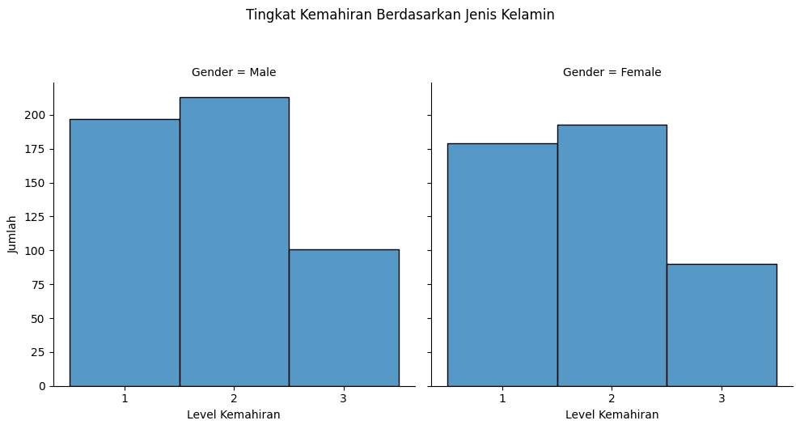
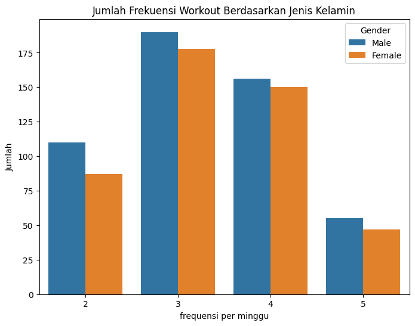
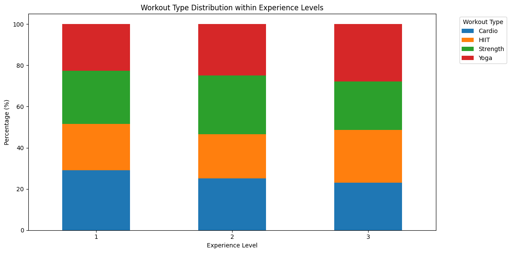
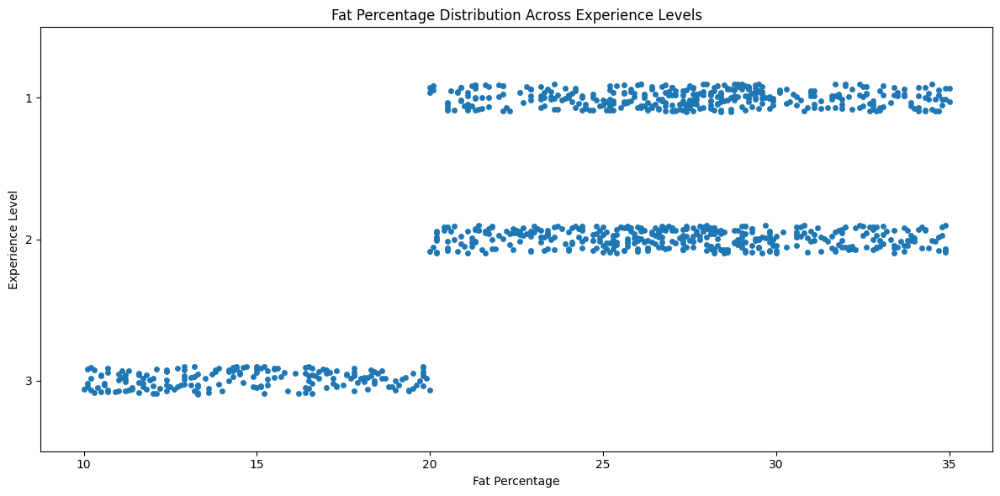
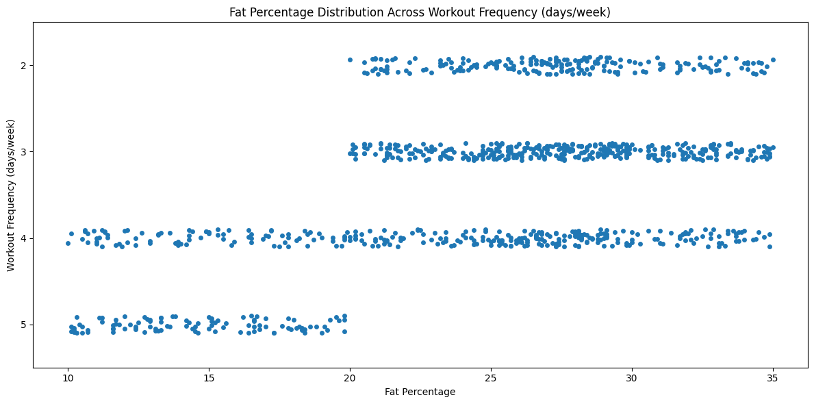
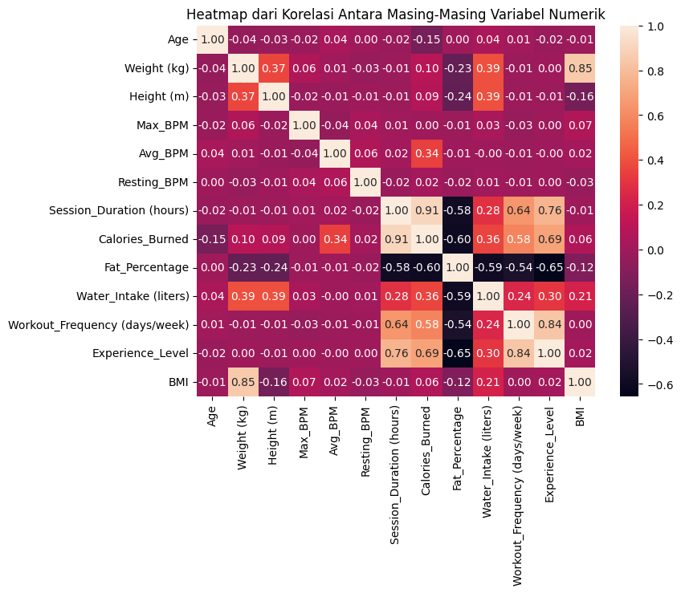
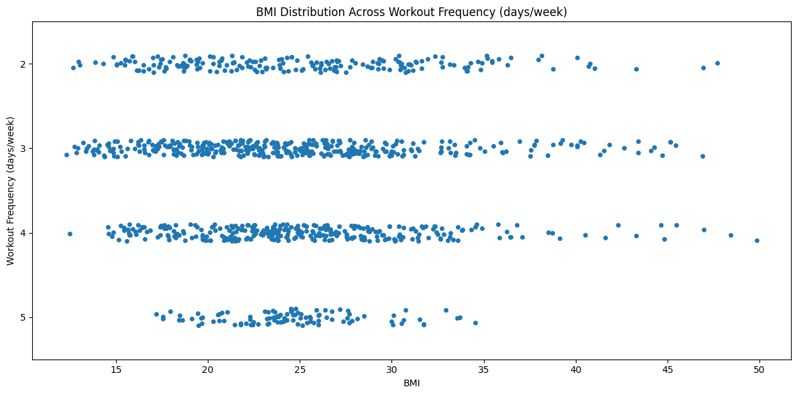
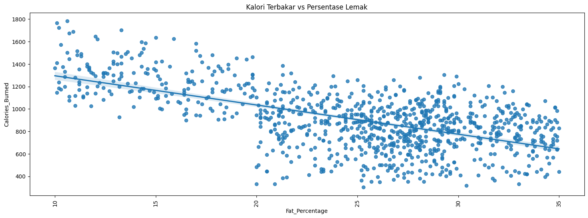
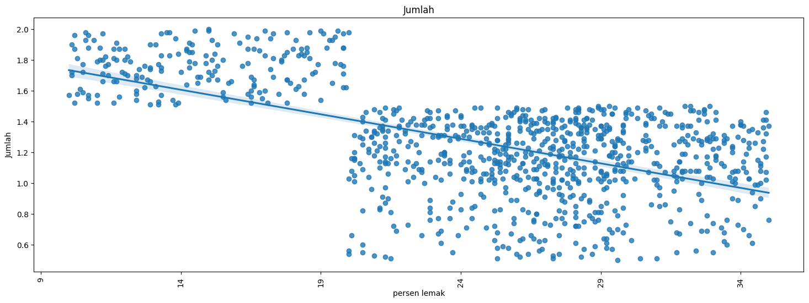

# Import Library


```python
import textwrap
import numpy as np
import pandas as pd
import seaborn as sns
import matplotlib.pyplot as plt
from xgboost import XGBClassifier
from sklearn.svm import SVC
from sklearn.tree import DecisionTreeClassifier
from sklearn.neighbors import KNeighborsClassifier
from sklearn.linear_model import LogisticRegression
from sklearn.ensemble import RandomForestClassifier
from sklearn.model_selection import GridSearchCV, RandomizedSearchCV, train_test_split
from sklearn.preprocessing import LabelEncoder, OrdinalEncoder, OneHotEncoder
from sklearn.metrics import ConfusionMatrixDisplay, accuracy_score, classification_report
```

# Data Understanding


## Data Loading


```python
import kagglehub  # Download latest version path = kagglehub.dataset_download("valakhorasani/gym-members-exercise-dataset")  print("Path to dataset files:""," path)
```

    Downloading from https://www.kaggle.com/api/v1/datasets/download/valakhorasani/gym-members-exercise-dataset?dataset_version_number=1...


    100%|██████████| 21.6k/21.6k [00:00<00:00, 8.17MB/s]

    Extracting files...
    Path to dataset files: /root/.cache/kagglehub/datasets/valakhorasani/gym-members-exercise-dataset/versions/1


    


```python
import shutil
source_path = '/root/.cache/kagglehub/datasets/valakhorasani/gym-members-exercise-dataset/versions/1/gym_members_exercise_tracking.csv'
destination_path = '/content/drive/MyDrive/Predictive/'
shutil.copy(source_path, destination_path)
```


    '/content/drive/MyDrive/Predictive/gym_members_exercise_tracking.csv'


```python
import pandas as pd
data = pd.read_csv("/content/drive/MyDrive/Predictive/gym_members_exercise_tracking.csv")
# Menampilkan ukuran data
print(data.shape)
# Melihat 5 baris pertama data
data.head()
```

<table border="1" class="dataframe">
  <thead>
    <tr style="text-align: right;">
      <th></th>
      <th>Age</th>
      <th>Gender</th>
      <th>Weight (kg)</th>
      <th>Height (m)</th>
      <th>Max_BPM</th>
      <th>Avg_BPM</th>
      <th>Resting_BPM</th>
      <th>Session_Duration (hours)</th>
      <th>Calories_Burned</th>
      <th>Workout_Type</th>
      <th>Fat_Percentage</th>
      <th>Water_Intake (liters)</th>
      <th>Workout_Frequency (days/week)</th>
      <th>Experience_Level</th>
      <th>BMI</th>
    </tr>
  </thead>
  <tbody>
    <tr>
      <th>0</th>
      <td>56</td>
      <td>Male</td>
      <td>88.3</td>
      <td>1.71</td>
      <td>180</td>
      <td>157</td>
      <td>60</td>
      <td>1.69</td>
      <td>1313.0</td>
      <td>Yoga</td>
      <td>12.6</td>
      <td>3.5</td>
      <td>4</td>
      <td>3</td>
      <td>30.20</td>
    </tr>
    <tr>
      <th>1</th>
      <td>46</td>
      <td>Female</td>
      <td>74.9</td>
      <td>1.53</td>
      <td>179</td>
      <td>151</td>
      <td>66</td>
      <td>1.30</td>
      <td>883.0</td>
      <td>HIIT</td>
      <td>33.9</td>
      <td>2.1</td>
      <td>4</td>
      <td>2</td>
      <td>32.00</td>
    </tr>
    <tr>
      <th>2</th>
      <td>32</td>
      <td>Female</td>
      <td>68.1</td>
      <td>1.66</td>
      <td>167</td>
      <td>122</td>
      <td>54</td>
      <td>1.11</td>
      <td>677.0</td>
      <td>Cardio</td>
      <td>33.4</td>
      <td>2.3</td>
      <td>4</td>
      <td>2</td>
      <td>24.71</td>
    </tr>
    <tr>
      <th>3</th>
      <td>25</td>
      <td>Male</td>
      <td>53.2</td>
      <td>1.70</td>
      <td>190</td>
      <td>164</td>
      <td>56</td>
      <td>0.59</td>
      <td>532.0</td>
      <td>Strength</td>
      <td>28.8</td>
      <td>2.1</td>
      <td>3</td>
      <td>1</td>
      <td>18.41</td>
    </tr>
    <tr>
      <th>4</th>
      <td>38</td>
      <td>Male</td>
      <td>46.1</td>
      <td>1.79</td>
      <td>188</td>
      <td>158</td>
      <td>68</td>
      <td>0.64</td>
      <td>556.0</td>
      <td>Strength</td>
      <td>29.2</td>
      <td>2.8</td>
      <td>3</td>
      <td>1</td>
      <td>14.39</td>
    </tr>
  </tbody>
</table>


## Exploratory Data Analysis


### Deskripsi Variable


```python
data.info()
```

    <class 'pandas.core.frame.DataFrame'>
    RangeIndex: 973 entries, 0 to 972
    Data columns (total 15 columns):
     #   Column                         Non-Null Count  Dtype  
    ---  ------                         --------------  -----  
     0   Age                            973 non-null    int64  
     1   Gender                         973 non-null    object 
     2   Weight (kg)                    973 non-null    float64
     3   Height (m)                     973 non-null    float64
     4   Max_BPM                        973 non-null    int64  
     5   Avg_BPM                        973 non-null    int64  
     6   Resting_BPM                    973 non-null    int64  
     7   Session_Duration (hours)       973 non-null    float64
     8   Calories_Burned                973 non-null    float64
     9   Workout_Type                   973 non-null    object 
     10  Fat_Percentage                 973 non-null    float64
     11  Water_Intake (liters)          973 non-null    float64
     12  Workout_Frequency (days/week)  973 non-null    int64  
     13  Experience_Level               973 non-null    int64  
     14  BMI                            973 non-null    float64
    dtypes: float64(7), int64(6), object(2)
    memory usage: 114.1+ KB


```python
data.describe()
```


<table border="1" class="dataframe">
  <thead>
    <tr style="text-align: right;">
      <th></th>
      <th>Age</th>
      <th>Weight (kg)</th>
      <th>Height (m)</th>
      <th>Max_BPM</th>
      <th>Avg_BPM</th>
      <th>Resting_BPM</th>
      <th>Session_Duration (hours)</th>
      <th>Calories_Burned</th>
      <th>Fat_Percentage</th>
      <th>Water_Intake (liters)</th>
      <th>BMI</th>
    </tr>
  </thead>
  <tbody>
    <tr>
      <th>count</th>
      <td>973.000000</td>
      <td>973.000000</td>
      <td>973.00000</td>
      <td>973.000000</td>
      <td>973.000000</td>
      <td>973.000000</td>
      <td>973.000000</td>
      <td>973.000000</td>
      <td>973.000000</td>
      <td>973.000000</td>
      <td>973.000000</td>
    </tr>
    <tr>
      <th>mean</th>
      <td>38.683453</td>
      <td>73.854676</td>
      <td>1.72258</td>
      <td>179.883864</td>
      <td>143.766701</td>
      <td>62.223022</td>
      <td>1.256423</td>
      <td>905.422405</td>
      <td>24.976773</td>
      <td>2.626619</td>
      <td>24.912127</td>
    </tr>
    <tr>
      <th>std</th>
      <td>12.180928</td>
      <td>21.207500</td>
      <td>0.12772</td>
      <td>11.525686</td>
      <td>14.345101</td>
      <td>7.327060</td>
      <td>0.343033</td>
      <td>272.641516</td>
      <td>6.259419</td>
      <td>0.600172</td>
      <td>6.660879</td>
    </tr>
    <tr>
      <th>min</th>
      <td>18.000000</td>
      <td>40.000000</td>
      <td>1.50000</td>
      <td>160.000000</td>
      <td>120.000000</td>
      <td>50.000000</td>
      <td>0.500000</td>
      <td>303.000000</td>
      <td>10.000000</td>
      <td>1.500000</td>
      <td>12.320000</td>
    </tr>
    <tr>
      <th>25%</th>
      <td>28.000000</td>
      <td>58.100000</td>
      <td>1.62000</td>
      <td>170.000000</td>
      <td>131.000000</td>
      <td>56.000000</td>
      <td>1.040000</td>
      <td>720.000000</td>
      <td>21.300000</td>
      <td>2.200000</td>
      <td>20.110000</td>
    </tr>
    <tr>
      <th>50%</th>
      <td>40.000000</td>
      <td>70.000000</td>
      <td>1.71000</td>
      <td>180.000000</td>
      <td>143.000000</td>
      <td>62.000000</td>
      <td>1.260000</td>
      <td>893.000000</td>
      <td>26.200000</td>
      <td>2.600000</td>
      <td>24.160000</td>
    </tr>
    <tr>
      <th>75%</th>
      <td>49.000000</td>
      <td>86.000000</td>
      <td>1.80000</td>
      <td>190.000000</td>
      <td>156.000000</td>
      <td>68.000000</td>
      <td>1.460000</td>
      <td>1076.000000</td>
      <td>29.300000</td>
      <td>3.100000</td>
      <td>28.560000</td>
    </tr>
    <tr>
      <th>max</th>
      <td>59.000000</td>
      <td>129.900000</td>
      <td>2.00000</td>
      <td>199.000000</td>
      <td>169.000000</td>
      <td>74.000000</td>
      <td>2.000000</td>
      <td>1783.000000</td>
      <td>35.000000</td>
      <td>3.700000</td>
      <td>49.840000</td>
    </tr>
  </tbody>
</table>


### Missing Value & Duplicate Data


```python
pd.DataFrame({'Nilai yang Kosong':data.isnull().sum()})
```


<table border="1" class="dataframe">
  <thead>
    <tr style="text-align: right;">
      <th></th>
      <th>Nilai yang Kosong</th>
    </tr>
  </thead>
  <tbody>
    <tr>
      <th>Age</th>
      <td>0</td>
    </tr>
    <tr>
      <th>Gender</th>
      <td>0</td>
    </tr>
    <tr>
      <th>Weight (kg)</th>
      <td>0</td>
    </tr>
    <tr>
      <th>Height (m)</th>
      <td>0</td>
    </tr>
    <tr>
      <th>Max_BPM</th>
      <td>0</td>
    </tr>
    <tr>
      <th>Avg_BPM</th>
      <td>0</td>
    </tr>
    <tr>
      <th>Resting_BPM</th>
      <td>0</td>
    </tr>
    <tr>
      <th>Session_Duration (hours)</th>
      <td>0</td>
    </tr>
    <tr>
      <th>Calories_Burned</th>
      <td>0</td>
    </tr>
    <tr>
      <th>Workout_Type</th>
      <td>0</td>
    </tr>
    <tr>
      <th>Fat_Percentage</th>
      <td>0</td>
    </tr>
    <tr>
      <th>Water_Intake (liters)</th>
      <td>0</td>
    </tr>
    <tr>
      <th>Workout_Frequency (days/week)</th>
      <td>0</td>
    </tr>
    <tr>
      <th>Experience_Level</th>
      <td>0</td>
    </tr>
    <tr>
      <th>BMI</th>
      <td>0</td>
    </tr>
  </tbody>
</table>


```python
data.duplicated().sum()
```


    0


### Outliers


```python
import seaborn as sns
import matplotlib.pyplot as plt

kolom=["Age",
       "Weight (kg)",
       "Height (m)",
       "Max_BPM",
       "Avg_BPM",
       "Resting_BPM",
       "Session_Duration (hours)",
       "Calories_Burned",
       "Fat_Percentage",
       "Water_Intake (liters)",
       "Workout_Frequency (days/week)",
       "Experience_Level",
       "BMI"]

# Membentuk plot berukuran 24 x 12
plt.figure(figsize = (24, 12))

# Membentuk plot berisi 8 subplot, dengan setiap subplot merupakan boxplot
for i in range(len(kolom)):

    # Membentuk plot dengan subplot berukuran 4 x 2
    plt.subplot(7, 2, i + 1)
    sns.boxplot(x = data[kolom[i]])
    plt.title('Boxplot dari {}'.format(kolom[i]))
    plt.tight_layout()

```


    

    


### Data Type


```python
# Assuming your DataFrame is named 'data' and the column to convert is 'Workout_Frequency (days/week)'
data['Workout_Frequency_cat'] = data['Workout_Frequency (days/week)'].astype('str')
data['Workout_Frequency_cat'] = data['Workout_Frequency_cat'].astype(object)
data['Experience_Level_cat'] = data['Experience_Level'].astype('str')
data['Experience_Level_cat'] = data['Experience_Level_cat'].astype(object)

```

### Univariate Data Analysis


```python

# Membentuk list berisi kolom-kolom numerikal (data yang bertipe float64)
kolom_numerikal = [nama_kolom for nama_kolom in data if data[nama_kolom].dtype == "float64"]

# Membentuk list berisi kolom-kolom kategorikal (data yang bertipe object)
kolom_kategorikal = [nama_kolom for nama_kolom in data if data[nama_kolom].dtype == "object"]

# Menampilkan list kolom numerikal dan kolom kategorikal
print("Kolom-kolom numerikal: ", kolom_numerikal)
print("Kolom-kolom kategorikal: ", kolom_kategorikal)
```

    Kolom-kolom numerikal:  ['Weight (kg)', 'Height (m)', 'Session_Duration (hours)', 'Calories_Burned', 'Fat_Percentage', 'Water_Intake (liters)', 'BMI']
    Kolom-kolom kategorikal:  ['Gender', 'Workout_Type', 'Workout_Frequency_cat', 'Experience_Level_cat']


```python
# Menghitung jumlah nilai yang unik/berbeda dari masing-masing variabel pada kolom kategorikal
jumlah_unik = data[kolom_kategorikal].nunique()

# Menampilkan nilai yang unik/berbeda dari masing-masing variabel pada kolom kategorikal
nilai_unik = data[kolom_kategorikal].apply(lambda x: x.unique())

# Menampilkan hasil dalam bentuk DataFrame
pd.DataFrame({"Total Nilai Berbeda": jumlah_unik, "Nilai-Nilai": nilai_unik})
```


<table border="1" class="dataframe">
  <thead>
    <tr style="text-align: right;">
      <th></th>
      <th>Total Nilai Berbeda</th>
      <th>Nilai-Nilai</th>
    </tr>
  </thead>
  <tbody>
    <tr>
      <th>Gender</th>
      <td>2</td>
      <td>[Male, Female]</td>
    </tr>
    <tr>
      <th>Workout_Type</th>
      <td>4</td>
      <td>[Yoga, HIIT, Cardio, Strength]</td>
    </tr>
    <tr>
      <th>Workout_Frequency_cat</th>
      <td>4</td>
      <td>[4, 3, 5, 2]</td>
    </tr>
    <tr>
      <th>Experience_Level_cat</th>
      <td>3</td>
      <td>[3, 2, 1]</td>
    </tr>
  </tbody>
</table>


```python

tipe_olahraga = data.Workout_Type.value_counts()
tipe_olahraga

```


<table border="1" class="dataframe">
  <thead>
    <tr style="text-align: right;">
      <th></th>
      <th>count</th>
    </tr>
    <tr>
      <th>Workout_Type</th>
      <th></th>
    </tr>
  </thead>
  <tbody>
    <tr>
      <th>Strength</th>
      <td>258</td>
    </tr>
    <tr>
      <th>Cardio</th>
      <td>255</td>
    </tr>
    <tr>
      <th>Yoga</th>
      <td>239</td>
    </tr>
    <tr>
      <th>HIIT</th>
      <td>221</td>
    </tr>
  </tbody>
</table>


#### 1.Distribusi Jenis Workout


```python
# Membuat variabel label dan size
label = tipe_olahraga.index.tolist()
size = tipe_olahraga.values.tolist()

# Membentuk pie chart untuk melihat persebaran data dari masing-masing tingkat berat badan
plt.figure(figsize = (8, 8))
plt.pie(size, labels = label, autopct = "%1.1f%%", startangle = 120, radius = 0.75)

# Menambahkan legend pada pie chart
plt.legend(loc = "upper left", bbox_to_anchor = (1, 1))

# Menambahkan judul pada plot
plt.title("Distribusi Tipe Olahraga")

# Menampilkan plot
plt.show()
```


    

    


#### 2.Jumlah Nilai Kategorikal


```python
import textwrap
data['Workout_Frequency_cat'] = data['Workout_Frequency_cat'].astype('category')
data['Experience_Level_cat'] = data['Experience_Level_cat'].astype('category')


# Membentuk plot dengan subplot sejumlah 9 berukuran 3 x 3
fig, axes = plt.subplots(2, 2, figsize = (9, 9))

# Mengubah array multi dimensi menjadi array 1 dimensi
axes = axes.flatten()


# Mendeskripsikan kolom-kolom kategorikal yang akan digunakan
deskripsi_kolom_kategorikal = ["Gender", "Jenis Workout","Frekuensi Workout","Tingkat Kemahiran"]

# Membentuk plot jumlah dalam bentuk bar plot untuk masing-masing kolom
for i, kolom in enumerate(data[kolom_kategorikal].columns):
    sns.countplot(x = kolom, data = data, ax = axes[i], hue = kolom)

    # Menambahkan judul untuk masing-masing plot
    judul = "\n".join(textwrap.wrap(f"Plot Jumlah dari {deskripsi_kolom_kategorikal[i]}", width = 40))
    axes[i].set_title(judul)
    axes[i].title.set_size(12)

    # Mengatur label x
    axes[i].tick_params(axis = "x", labelrotation = 90)
    axes[i].tick_params(axis = "both", which = "major", labelsize = 12)
    axes[i].set_xlabel("")
    axes[i].set_ylabel("Jumlah")

# Mengatur susunan agar tidak berhimpitan
plt.tight_layout()

# Menampilkan plot
plt.show()
```


    

    


#### 3.Histogram Nilai Numerik


```python
# Membentuk plot dengan subplot sejumlah 8 berukuran 2 x 4
fig, axes = plt.subplots(2, 4, figsize = (15, 8))

# Mengubah array multi dimensi menjadi array 1 dimensi
axes = axes.flatten()

# Menambahkan satuan dari masing-masing kolom
labels = ["Kilogram", "Meter", "Jam",   "Kalori", "Persen", "Liter", "Index"]

# Mendeskripsikan kolom-kolom numerikal yang akan digunakan
deskripsi_kolom_numerikal = ["Weight (kg)", "Height (m)", "Session_Duration (hours)", "Calories_Burned", "Fat_Percentage", "Water_Intake (liters)", "BMI"]

# Membentuk plot jumlah dalam bentuk histogram plot untuk masing-masing kolom
for i, kolom in enumerate(data[kolom_numerikal].columns):
    sns.histplot(data = data, x = kolom, kde = True, ax = axes[i])

    # Menambahkan judul untuk masing-masing plot
    judul = "\n".join(textwrap.wrap(f"Plot Histogram dari {deskripsi_kolom_numerikal[i]}", width = 30))
    axes[i].set_title(judul)
    axes[i].title.set_size(12)

    # Mengatur label x
    axes[i].set_xlabel(labels[i])
    axes[i].set_ylabel("Total")

# Mengatur susunan agar tidak berhimpitan
plt.tight_layout()

# Menampilkan plot
plt.show()
```


    

    


### Multivariate Data Analysis

#### 1.Distribusi Jenis Workout Berdasarkan Jenis Kelamin


```python
import seaborn as sns
import matplotlib.pyplot as plt

# Membentuk plot jumlah dalam bentuk bar plot antara tingkat berat badan dengan jenis kelamin
plt.figure(figsize=(6, 6))
g = sns.displot(x="Workout_Type", data=data, col="Gender", discrete=True)

# Menambahkan judul pada plot
g.fig.suptitle("Jumlah Masing-Masing Jenis Workout Berdasarkan Jenis Kelamin", y=1.05)

# Menambahkan label sumbu x dan y pada plot
g.set_axis_labels("Jenis Olahraga", "Jumlah")  # Setting the labels for all subplots
g.set_xticklabels(rotation=90)

plt.tight_layout()
# Menampilkan plot
plt.show()
```


    <Figure size 600x600 with 0 Axes>


    

    


#### 2.Frekuensi Workout Berdasarkan Jenis Kelamin


```python
import seaborn as sns
import matplotlib.pyplot as plt

# Converting 'Workout_Frequency (days/week)' to a categorical type

# Creating the plot
g = sns.displot(x="Workout_Frequency_cat", data=data, col="Gender", discrete=True)

# Adding the main title for the plot
g.fig.suptitle("Jumlah Masing-Masing Jenis Workout Berdasarkan Jenis Kelamin", y=1.05)


g.set_axis_labels("Frekuensi Workout", "Jumlah")

# for ax in g.axes.flat:
#     # ax.set_xticks(range(len(data['Workout_Frequency (days/week)'].cat.categories)))
#     ax.set_xticklabels(data['Workout_Frequency (days/week)'].cat.categories, rotation=90)

plt.tight_layout()
plt.show()

```


    

    


#### 3.Tingkat Kemahiran Berdasarkan Jenis Kelamin


```python
import seaborn as sns
import matplotlib.pyplot as plt

# Converting 'Workout_Frequency (days/week)' to a categorical type


# Creating the plot
g = sns.displot(x="Experience_Level_cat", data=data, col="Gender", discrete=True)

# Adding the main title for the plot
g.fig.suptitle("Tingkat Kemahiran Berdasarkan Jenis Kelamin", y=1.05)


g.set_axis_labels("Level Kemahiran", "Jumlah")

# for ax in g.axes.flat:
#     # ax.set_xticks(range(len(data['Workout_Frequency (days/week)'].cat.categories)))
#     ax.set_xticklabels(data['Workout_Frequency (days/week)'].cat.categories, rotation=90)

plt.tight_layout()
plt.show()
```


    

    


#### 4.Frekuensi Workout Berdasarkan Jenis Kelamin


```python
import pandas as pd
import matplotlib.pyplot as plt
import seaborn as sns
# Membentuk plot jumlah dalam bentuk bar plot antara tingkat berat badan dengan jenis kelamin
plt.figure(figsize = (8, 6))
sns.countplot(x = "Workout_Frequency (days/week)", data = data, hue = "Gender")

# Menambahkan judul pada plot
plt.title("Jumlah Frekuensi Workout Berdasarkan Jenis Kelamin")

# Menambahkan label sumbu x dan y pada plot
# plt.xticks(rotation = 90)
plt.xlabel("frequensi per minggu")
plt.ylabel("Jumlah")

# Menampilkan plot
plt.show()
```


    

    


#### 5.Distribusi Jenis Workout Berdasarkan Level Kemahiran


```python
import pandas as pd
import matplotlib.pyplot as plt

# Group by Experience_Level and Workout_Type, then get counts
workout_counts = data.groupby(['Experience_Level', 'Workout_Type'], observed=False).size().unstack(fill_value=0)


# Plotting
plt.figure(figsize=(12, 6))
workout_counts.plot(kind='bar', stacked=True,figsize=(12, 6), ax=plt.gca())  # Plot on current axes for proper display

# Adding title and labels
plt.title("Distribusi Jenis Workout Berdasarkan Level Kemahiran")
plt.xlabel("Level Pengalaman")
plt.ylabel("Jumlah")
plt.legend(title='Jenis Workout', bbox_to_anchor=(1.05, 1), loc='upper left')
plt.xticks(rotation=0)
plt.tight_layout()

# Show plot
plt.show()

```


    

    


#### 6.Persentase Jenis Workout Berdasarkan Level Kemahiran


```python
import seaborn as sns
import matplotlib.pyplot as plt

# Group by Experience_Level and Workout_Type, with observed=False to avoid the warning
workout_counts = data.groupby(['Experience_Level', 'Workout_Type'], observed=False).size().unstack(fill_value=0)

# Normalize to get percentages
workout_percentages = workout_counts.divide(workout_counts.sum(axis=1), axis=0) * 100

# Plotting
plt.figure(figsize=(12, 6))
workout_percentages.plot(kind='bar', stacked=True, figsize=(12, 6), ax=plt.gca())  # Use ax=plt.gca() to ensure it plots on the current axes

# Adding labels and legend
plt.title("Workout Type Distribution within Experience Levels")
plt.xlabel("Experience Level")
plt.ylabel("Percentage (%)")
plt.legend(title='Workout Type', bbox_to_anchor=(1.05, 1), loc='upper left')
plt.xticks(rotation=0)
plt.tight_layout()

plt.show()

```


    

    


#### 7.Persentase Lemak di setiap Tingkat Kemahiran


```python
import seaborn as sns
import matplotlib.pyplot as plt

# Strip plot of fat percentage against Experience_Level
plt.figure(figsize=(12, 6))
sns.stripplot(y="Experience_Level",
              x="Fat_Percentage",
              data=data,
              # jitter=True,
              # dodge=False,
              # hue="Experience_Level",  # Assigning hue to Experience_Level
              # palette="Set2",  # Using palette with hue
              # alpha=0.6
              )

# Adding titles and labels
plt.title("Fat Percentage Distribution Across Experience Levels")
plt.ylabel("Experience Level")
plt.xlabel("Fat Percentage")

# Show the plot
plt.tight_layout()
plt.show()

```


    

    


#### 8.Persentase Lemak di setiap Frekuensi Workout


```python
import seaborn as sns
import matplotlib.pyplot as plt

# Strip plot of fat percentage against Workout Frequency (days/week)
data['Workout_Frequency (days/week)'] = data['Workout_Frequency (days/week)'].astype('category')
plt.figure(figsize=(12, 6))
sns.stripplot(y="Workout_Frequency (days/week)",
              x="Fat_Percentage",
              data=data,
              # jitter=True,
              # dodge=False,
              # hue="Experience_Level",  # Optional: add hue if you want different colors for Experience Level
              # palette="Set2",  # Optional: specify palette for different hues
              # alpha=0.6
              )

# Adding titles and labels
plt.title("Fat Percentage Distribution Across Workout Frequency (days/week)")

# Setting the x and y axis labels
plt.xlabel("Fat Percentage")
plt.ylabel("Workout Frequency (days/week)")

# Customizing the x-axis ticks (limiting to 5 ticks)
plt.xticks(range(10, int(data["Fat_Percentage"].max()) + 1, 5))

# Customizing the y-axis to show category labels (if the 'Workout_Frequency' is categorical)
# Ensure the column is treated as categorical
# unique_workout_frequencies = data["Workout_Frequency (days/week)"].unique()
# plt.yticks([2,3,4,5])

# Show the plot
plt.tight_layout()
plt.show()

```


    

    


#### 9.Kalori Terbakar dibandingkan Tingkat Kemahiran


```python
import seaborn as sns
import matplotlib.pyplot as plt

# Strip plot of fat percentage against Experience_Level
plt.figure(figsize=(12, 6))
sns.stripplot(y="Experience_Level",
              x="Calories_Burned",
              data=data,
              # jitter=True,
              # dodge=False,
              # hue="Experience_Level",  # Assigning hue to Experience_Level
              # palette="Set2",  # Using palette with hue
              # alpha=0.6
              )

# Adding titles and labels
plt.title("Calories Burned Distribution Across Experience Levels")
plt.ylabel("Experience Level")
plt.xlabel("Calories Burned")

# Show the plot
plt.tight_layout()
plt.show()

```


    

    


#### 10.Heat Map


```python
# Mencari korelasi antara masing-masing variabel numerik dengan korelasi pearson
corr = data.corr(method = "pearson", numeric_only = True)

# Membentuk heatmap antara masing-masing variabel numerik dan ditampilkan dalam bentuk desimal 2 angka di belakang koma
plt.figure(figsize = (8, 6))
sns.heatmap(corr, annot = True, fmt = ".2f", annot_kws = {"size": 10})

# Menambahkan judul pada plot
plt.title("Heatmap dari Korelasi Antara Masing-Masing Variabel Numerik")

# Menampilkan plot
plt.show()

```


    

    


#### 11.Pair Plot


```python
import seaborn as sns
# Mengamati hubungan antar fitur numerik dengan fungsi pairplot()
sns.pairplot(data, diag_kind = 'kde')
```


    <seaborn.axisgrid.PairGrid at 0x7c6375e8d930>


    

    


#### 12.Kalori Terbakar di setiap Frekuensi Workout


```python
import seaborn as sns
import matplotlib.pyplot as plt

# Strip plot of fat percentage against Workout Frequency (days/week)
data['Workout_Frequency (days/week)'] = data['Workout_Frequency (days/week)'].astype('category')
plt.figure(figsize=(12, 6))
sns.stripplot(y="Workout_Frequency (days/week)",
              x="Calories_Burned",
              data=data,
              # jitter=True,
              # dodge=False,
              # hue="Experience_Level",  # Optional: add hue if you want different colors for Experience Level
              # palette="Set2",  # Optional: specify palette for different hues
              # alpha=0.6
              )

# Adding titles and labels
plt.title("Calories Burned Distribution Across Workout Frequency (days/week)")

# Setting the x and y axis labels
plt.xlabel("Calories Burned")
plt.ylabel("Workout Frequency (days/week)")

# Customizing the x-axis ticks (limiting to 5 ticks)
plt.xticks(range(250, int(data["Calories_Burned"].max()) + 1, 500))

# Customizing the y-axis to show category labels (if the 'Workout_Frequency' is categorical)
# Ensure the column is treated as categorical
# unique_workout_frequencies = data["Workout_Frequency (days/week)"].unique()
# plt.yticks([2,3,4,5])

# Show the plot
plt.tight_layout()
plt.show()

```


    

    


#### 13.Distribusi BMI di setiap Tingkat Kemahiran


```python
import seaborn as sns
import matplotlib.pyplot as plt

# Strip plot of fat percentage against Experience_Level
plt.figure(figsize=(12, 6))
sns.stripplot(y="Experience_Level",
              x="BMI",
              data=data,
              # jitter=True,
              # dodge=False,
              # hue="Experience_Level",  # Assigning hue to Experience_Level
              # palette="Set2",  # Using palette with hue
              # alpha=0.6
              )

# Adding titles and labels
plt.title("BMI Distribution Across Experience Levels")
plt.ylabel("Experience Level")
plt.xlabel("BMI")

# Show the plot
plt.tight_layout()
plt.show()

```


    

    


#### 14.Distribusi BMI di setiap Frekuensi Workout


```python
import seaborn as sns
import matplotlib.pyplot as plt

# Strip plot of fat percentage against Workout Frequency (days/week)
data['Workout_Frequency (days/week)'] = data['Workout_Frequency (days/week)'].astype('category')
plt.figure(figsize=(12, 6))
sns.stripplot(y="Workout_Frequency (days/week)",
              x="BMI",
              data=data,
              # jitter=True,
              # dodge=False,
              # hue="Experience_Level",  # Optional: add hue if you want different colors for Experience Level
              # palette="Set2",  # Optional: specify palette for different hues
              # alpha=0.6
              )

# Adding titles and labels
plt.title("BMI Distribution Across Workout Frequency (days/week)")

# Setting the x and y axis labels
plt.xlabel("BMI")
plt.ylabel("Workout Frequency (days/week)")

# Customizing the x-axis ticks (limiting to 5 ticks)
# plt.xticks(range(250, int(data["Calories_Burned"].max()) + 1, 500))

# Customizing the y-axis to show category labels (if the 'Workout_Frequency' is categorical)
# Ensure the column is treated as categorical
# unique_workout_frequencies = data["Workout_Frequency (days/week)"].unique()
# plt.yticks([2,3,4,5])

# Show the plot
plt.tight_layout()
plt.show()
```


    

    


#### 12.Perbandingan Kalori yang Terbakar di Setiap Persentase Lemak


```python
import pandas as pd
import matplotlib.pyplot as plt
import seaborn as sns
import matplotlib.ticker as ticker


# Membentuk plot jumlah dalam bentuk bar plot antara tingkat berat badan dengan jenis kelamin
plt.figure(figsize = (18, 6))
sns.regplot(x = "Fat_Percentage", data = data, y = "Calories_Burned")

# Menambahkan judul pada plot
plt.title("Kalori Terbakar vs Persentase Lemak")

# Menambahkan label sumbu x dan y pada plot
plt.xticks(rotation = 90)
# plt.yticks([1,2,3])
plt.xlabel("Fat_Percentage")
plt.ylabel("Calories_Burned")


# plt.xticks(np.arange(9, 50+ 1, 1))
# ax.set_xticks(np.arange(9, 50+ 1, 1))
# plt.xticks(range(1, 238, 10), [str(i) for i in range(12, 36, 1)])

# print(plt.xticks())

# Menampilkan plot
plt.show()
```


    

    


#### 13.Perbandingan Antara Persen Lemak dengan Durasi Workout


```python
import pandas as pd
import matplotlib.pyplot as plt
import seaborn as sns
# Membentuk plot jumlah dalam bentuk bar plot antara tingkat berat badan dengan jenis kelamin
plt.figure(figsize = (18, 6))
sns.regplot(x = "Fat_Percentage", data = data, y = "Session_Duration (hours)")

# Menambahkan judul pada plot
plt.title("Jumlah")

# Menambahkan label sumbu x dan y pada plot
plt.xticks(rotation = 90)
plt.xticks(np.arange(9, data["Fat_Percentage"].max() + 1, 5))
plt.xlabel("persen lemak")
plt.ylabel("Jumlah")

# Menampilkan plot
plt.show()
```


    

    


# Data Preparation


```python
from sklearn.preprocessing import StandardScaler, LabelEncoder
# Create copy of dataframe
data_processed = data.copy()

data_processed.drop('Workout_Frequency_cat', axis=1, inplace=True)
data_processed.drop('Experience_Level_cat', axis=1, inplace=True)
# Label encode categorical variables
le = LabelEncoder()
categorical_cols = ['Gender', 'Workout_Type', 'Workout_Frequency (days/week)', 'Experience_Level']

for col in categorical_cols:
    if col in data_processed.columns:
        data_processed[col] = le.fit_transform(data_processed[col])

# Scale numerical features
scaler = StandardScaler()
numerical_cols = data_processed.select_dtypes(include=[np.number]).columns
data_processed[numerical_cols] = scaler.fit_transform(data_processed[numerical_cols])


from sklearn.model_selection import train_test_split
from sklearn.preprocessing import StandardScaler, LabelEncoder
from sklearn.ensemble import RandomForestRegressor
from sklearn.metrics import mean_squared_error, r2_score


# Prepare features and target
X = data_processed.drop('Calories_Burned', axis=1)
y = data_processed['Calories_Burned']

# Split data
X_train, X_test, y_train, y_test = train_test_split(X, y,
                                                    test_size=0.2,
                                                    random_state=42)
```

#Modelling & Evaluation

## Random Forest


```python


# Train model
modelRF = RandomForestRegressor(n_estimators=100, random_state=42)
modelRF.fit(X_train, y_train)
```


```python
from sklearn.metrics import mean_absolute_error, mean_squared_error, r2_score, explained_variance_score
import numpy as np

# Make predictions
y_pred = modelRF.predict(X_test)

# Evaluate model
print("\nModel Performance:")
print(f"R2 Score: {r2_score(y_test, y_pred):.4f}")
print(f"RMSE: {np.sqrt(mean_squared_error(y_test, y_pred)):.4f}")
print(f"MAE: {mean_absolute_error(y_test, y_pred):.4f}")
print(f"MSE: {mean_squared_error(y_test, y_pred):.4f}")
print(f"Explained Variance Score: {explained_variance_score(y_test, y_pred):.4f}")

# Adjusted R2
n = len(y_test)
p = X_test.shape[1]  # Number of features
r2_adj = 1 - (1 - r2_score(y_test, y_pred)) * (n - 1) / (n - p - 1)
print(f"Adjusted R2: {r2_adj:.4f}")
```

    
    Model Performance:
    R2 Score: 0.9731
    RMSE: 0.1738
    MAE: 0.1323
    MSE: 0.0302
    Explained Variance Score: 0.9733
    Adjusted R2: 0.9710


## KNN


```python
from sklearn.neighbors import KNeighborsRegressor
from sklearn.metrics import mean_squared_error

modelknn = KNeighborsRegressor(n_neighbors=10)
modelknn.fit(X_train, y_train)
```

        XGBRegressor(base_score=None, booster=None, callbacks=None,
                     colsample_bylevel=None, colsample_bynode=None,
                     colsample_bytree=0.8, device=None, early_stopping_rounds=None,
                     enable_categorical=False, eval_metric=None, feature_types=None,
                     gamma=None, grow_policy=None, importance_type=None,
                     interaction_constraints=None, learning_rate=0.1, max_bin=None,
                     max_cat_threshold=None, max_cat_to_onehot=None,
                     max_delta_step=None, max_depth=6, max_leaves=None,
                     min_child_weight=None, missing=nan, monotone_constraints=None,
                     multi_strategy=None, n_estimators=100, n_jobs=None,
                     num_parallel_tree=None, random_state=None, ...)


```python
from sklearn.metrics import mean_absolute_error, mean_squared_error, r2_score, explained_variance_score
import numpy as np

# Make predictions
y_pred = xgboost.predict(X_test)

# Evaluate model
print("\nModel Performance:")
print(f"R2 Score: {r2_score(y_test, y_pred):.4f}")
print(f"RMSE: {np.sqrt(mean_squared_error(y_test, y_pred)):.4f}")
print(f"MAE: {mean_absolute_error(y_test, y_pred):.4f}")
print(f"MSE: {mean_squared_error(y_test, y_pred):.4f}")
print(f"Explained Variance Score: {explained_variance_score(y_test, y_pred):.4f}")

# Adjusted R2
n = len(y_test)
p = X_test.shape[1]  # Number of features
r2_adj = 1 - (1 - r2_score(y_test, y_pred)) * (n - 1) / (n - p - 1)
print(f"Adjusted R2: {r2_adj:.4f}")
```

    
    Model Performance:
    R2 Score: 0.9812
    RMSE: 0.1452
    MAE: 0.1044
    MSE: 0.0211
    Explained Variance Score: 0.9813
    Adjusted R2: 0.9798


    

